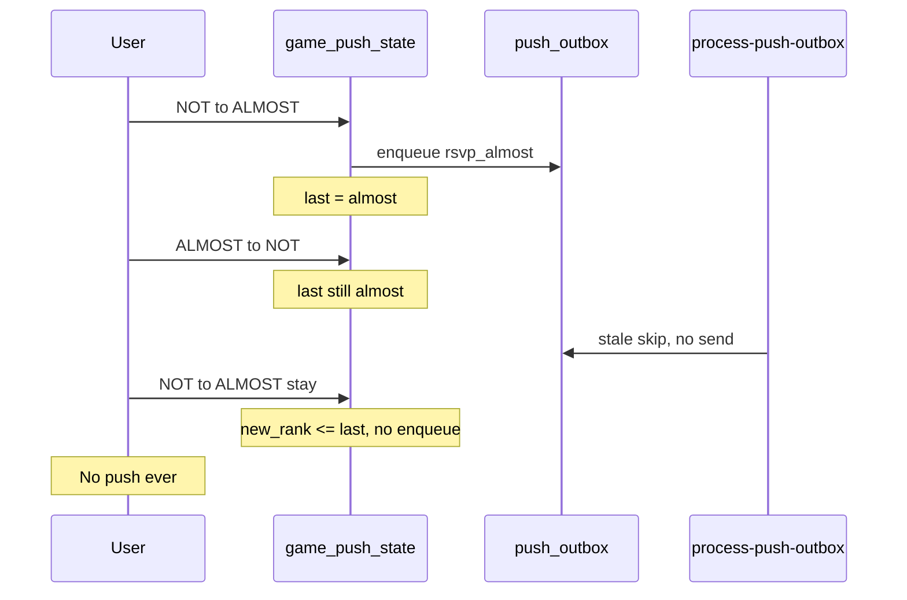

# Badge milestone re-push: Option A vs B

## The gap we're fixing

Today `last_badge_milestone` / `last_checkin_badge_milestone` are **high-water marks** — they only move up on enqueue, never down when headcount drops.



---

## Option A — Reset `last_*` on downgrade (chosen)

**Rule:** When computed milestone **rank drops**, sync `last_*_badge_milestone` down to the current tier. **No push on downgrade.** Upgrade enqueue unchanged (`new_rank > last_rank`).

### Behavior (example)

| Step | Headcount tier | `last_*` after | Enqueue? | Push? |
|------|----------------|----------------|----------|-------|
| NOT → ALMOST | almost | almost | `rsvp_almost` | if still at ALMOST at drain |
| ALMOST → NOT | not | **reset to not** | no | — |
| Stale drain at NOT | not | not | — | skipped |
| NOT → ALMOST (stay) | almost | almost | **yes** (1 > 0) | yes |

GAME ON → ALMOST: `last` resets to `almost`, **no push** (downgrade is silent).

### What changes in code

Single place per track in [`supabase/schema.sql`](../supabase/schema.sql):

- [`try_enqueue_rsvp_badge_upgrade`](../supabase/schema.sql) and [`try_enqueue_checkin_badge_upgrade`](../supabase/schema.sql)

Suggested flow inside `try_enqueue_*`:

```
compute v_new_milestone, v_new_rank, v_last_rank

IF v_new_rank < v_last_rank THEN
  UPDATE last_* = v_new_milestone
  DELETE pending outbox rows for this game with rank > v_new_rank
  RETURN FALSE
END IF

IF v_new_rank > v_last_rank THEN
  -- existing upgrade + supersede + enqueue path
END IF
```

**Files:** migration `048_badge_downgrade_reset.sql`, sync `supabase/schema.sql`, extend `scripts/verify-3c-checkin-badge.mjs` or add `verify-badge-downgrade-reset.mjs`.

**No changes** to edge functions, push copy, event types, or Phase 1 client observed suppression.

---

## Option B — Push on every tier change (not chosen)

**Rule:** Whenever `v_new_milestone !== last_*`, update `last_*` and enqueue for the **new** tier (including downgrades).

Rejected because: no `not` event type, misleading downgrade copy, oscillation spam, inverted supersede logic, larger test matrix. Only worth it if product explicitly wants downgrade OS notifications.

---

## Side-by-side summary

| Criterion | **Option A** (reset on downgrade) | **Option B** (push every change) |
|-----------|-----------------------------------|----------------------------------|
| **Simpler design?** | **Yes** | No |
| **Fixes stale re-cross gap?** | Yes | Yes (if downgrades reset `last`) |
| **Pushes on GAME ON → ALMOST?** | No (intentional) | Yes (noisy / confusing copy) |
| **New infrastructure** | None | Events + copy + policy |
| **Risk to existing pushes** | Low | Medium |

---

## Implementation checklist

1. Migration `048_badge_downgrade_reset.sql` — update `try_enqueue_rsvp_badge_upgrade` and `try_enqueue_checkin_badge_upgrade`.
2. On `v_new_rank < v_last_rank`: set `last_* = v_new_milestone`; `DELETE` unprocessed badge outbox rows for that game with event rank > `v_new_rank`.
3. Keep `v_new_rank > v_last_rank` enqueue path unchanged.
4. Sync `supabase/schema.sql`.
5. Add verify scenario: ALMOST → enqueue → NOT → `last_* = not` → ALMOST → enqueue again.
6. Deploy: migration only (no edge/client deploy).

### Out of scope

- Downgrade push notifications (Option B)
- Resetting `last_*` only after stale drain

---

## Risks (Option A)

| Risk | Severity | Mitigation |
|------|----------|------------|
| **Re-push after oscillation** | Low–medium | Stale-at-drain + Phase 1 client suppression |
| **GO → ALMOST silent** | Low (product) | In-app badge updates; intentional |
| **Pending row cleanup** | Low | DELETE higher-tier pending rows on downgrade |
| **Surge tier downgrades** | Low | Same oscillation bounds |
| **Phase 1 observed suppression** | Low | Correct for users who already saw tier |
| **Hot-path latency** | Very low | Single UPDATE/DELETE in existing transaction |
| **Verify / regression** | Low | Update verify-3c / new verify script |
| **Migration deploy** | Low | Rollback = restore prior `try_enqueue_*` functions |

**Overall risk: Low.** Failure modes are mostly **extra** notifications, not missing safety.

### What Option A does not risk

- Foreground push skip, chatter, phase_live, cancel pipelines
- New event types or copy
- Upgrade coalescing / winning-row logic on drain
