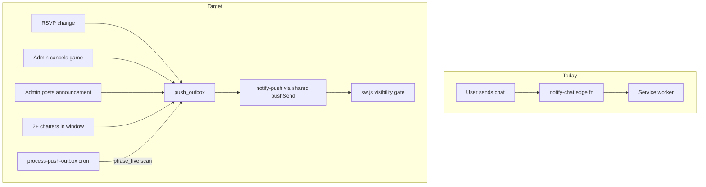

# Intent-aligned push notification refactor

## Current state

Push today is **chat-only** and **client-driven**:

- Subscriptions: `[push_subscriptions](supabase/schema.sql)` (per `group_id`, `notifications_enabled` bell flag)
- Sender invokes `[notify-chat](supabase/functions/notify-chat/index.ts)` after every message in `[usePresence.js](src/hooks/usePresence.js)`
- One notification per message with sender name + message body
- No pushes for RSVP/badge flips, cancellations, announcements, or phase transitions



## Design decisions

- **One bell** controls all push types (game updates, chatter summary, announcements, cancellations)
- **Announcements are per-game** (scoped to `game_id` + current weekly `cycle_at`)
- **Chat** — one generic chatter push when **2+ distinct senders** in 30 min, **1-hour cooldown** between chatter pushes
- **No `phase_starting_soon` push** — in-app UI only; only `phase_live` is pushed at game start
- **Announcement UI** — banner below game card; admin `+` expands inline below card
- **Group limits** — max **7 games** per group; **one game per weekday**; gray out taken days in create form
- **Foreground suppression** — SW visibility gate in `[src/sw.js](src/sw.js)`; no heartbeat / polling
- **Single cron** — one `process-push-outbox` job drains the outbox and scans for `phase_live` (no second edge function or schedule)
- **Push copy in SQL** — triggers/RPC build title/body/tag/url in `enqueue_push_event`; client only needs `[gameBadge.js](src/utils/gameBadge.js)` for UI badges

## Notification catalog

**Global suppression (client-side):** in `[src/sw.js](src/sw.js)`, skip `showNotification()` when any window client has `visibilityState === 'visible'`.

Badge pushes do **not** exclude the RSVP actor on the server.

| Event            | When                                              | Body (plain language)                                  | Tag                            | Server exclude    |
| ---------------- | ------------------------------------------------- | ------------------------------------------------------ | ------------------------------ | ----------------- |
| `badge_almost`   | RSVP tier crosses into ALMOST during pregame      | `{game}` — Almost there — need N more                  | `disc-check-badge-{gameId}`    | —                 |
| `badge_go`       | RSVP tier crosses into GO during pregame          | `{game}` — Game on. See you there!                     | same                           | —                 |
| `phase_live`     | Scheduled start reached (once per cycle)          | `{game}` — Game is live — tap I'm here when you arrive | `disc-check-phase-{gameId}`    | —                 |
| `game_cancelled` | `status` → `cancelled`                            | `{game}` — Cancelled this week                         | `disc-check-cancel-{gameId}`   | —                 |
| `announcement`   | Admin posts per-game message                      | `{game}` — {preview}                                   | `disc-check-announce-{gameId}` | `p_subscriber_id` |
| `chat_chatter`   | 2+ senders in 30 min; ≥1h since last chatter push | `{group}` — There's some chatter — come say hi         | `disc-check-chatter-{groupId}` | `NEW.sender_id`   |

**`phase_live` timing:** enqueued by the cron processor when start time has passed; may arrive up to **~2 minutes** after start (acceptable for v1).

**Out of scope for v1:** live check-in badge pushes, badge downgrades on RSVP cancel, `game_calls` / host override.

Pregame headcount = `sum(1 + plus_ones)` from `rsvps`. Badge tiers match `[StatusBadge.jsx](src/components/games/StatusBadge.jsx)` via shared `[gameBadge.js](src/utils/gameBadge.js)`.

---

## Phase 1 — Unified push infrastructure

### 1a. Edge functions + shared send module

- **`supabase/functions/_shared/pushSend.ts`** — VAPID setup, subscription lookup, exclude list, stale-endpoint cleanup (extracted from `[notify-chat](supabase/functions/notify-chat/index.ts)`)
- **`supabase/functions/notify-push/index.ts`** — thin POST handler; calls `pushSend` with `{ groupId, title, body, tag, url, excludeSubscriberIds? }`
- **Remove** `[notify-chat](supabase/functions/notify-chat/index.ts)`

### 1b. Client push library

Refactor `[src/lib/push.js](src/lib/push.js)`:

- Remove `notifyChatPush` entirely
- Add `buildGameDeepLink(groupId, gameId)` → `/groups/{groupId}?game={gameId}`
- Keep subscription CRUD unchanged

### 1c. Deep links (fix pathname-only bug)

`[useServiceWorkerNavigation.js](src/hooks/useServiceWorkerNavigation.js)` currently drops query strings:

```javascript
// Before: pathname only — loses ?game=
navigate(pathname);

// After: preserve search
const url = new URL(data.url || "/", window.location.origin);
navigate({ pathname: url.pathname, search: url.search });
```

`[GroupGamesScreen.jsx](src/screens/GroupGamesScreen.jsx)`:

- Hold a `ref` on `[GameCardsCarousel](src/components/games/GameCardsCarousel.jsx)` (already exposes `scrollToSlide` via `useImperativeHandle`)
- On mount / when `groupGames` + `?game=` query are ready, find index by `game.id` and call `scrollToSlide(index, "auto")`
- Clear `?game=` from URL after focusing (optional `replace` navigation) so refresh doesn't re-scroll

### 1d. Bell UX

Update `[GroupChatPushButton.jsx](src/components/games/GroupChatPushButton.jsx)`: "Game alerts on/off"; dispatch `disc-check-push-changed`; update `[useChatAlerts.js](src/hooks/useChatAlerts.js)` listener.

### 1e. SW visibility gate

Update `[src/sw.js](src/sw.js)` `push` handler — `clients.matchAll` → skip `showNotification` when any client is `visible`. No `last_active_at`, no client polling.

---

## Phase 2 — Server-side events + outbox

### 2a. Migration `026_push_events.sql`

**Tables:**

```sql
game_push_state (game_id, cycle_at, …)  -- see v2 rollout
chat_push_state (group_id, window_senders JSONB, distinct_sender_count, last_push_at, updated_at)
push_outbox (id, group_id, game_id, event_type, payload JSONB,
             exclude_subscriber_ids TEXT[], created_at, processed_at)
```

**SQL helpers (reuse existing primitives):**

| Function                          | Purpose                                                                                                                                                                                                                                               |
| --------------------------------- | ----------------------------------------------------------------------------------------------------------------------------------------------------------------------------------------------------------------------------------------------------- |
| `compute_rsvp_headcount(game_id)` | `sum(1 + plus_ones)` from `rsvps`                                                                                                                                                                                                                     |
| `compute_rsvp_badge(game_id)`     | `'not' \| 'almost' \| 'go'`                                                                                                                                                                                                                           |
| `is_rsvp_open_for_game(game_id)`  | Mirrors JS `[isRsvpOpen](src/utils/gameSchedule.js)`: `NOT is_game_live(...)` and not in ended window (`occurrence + 3h` .. `occurrence + 12h`), and **not cycle-stale** (`games.rsvp_cycle_at` matches `get_current_occurrence_start` for that game) |
| `enqueue_push_event(...)`         | Builds **full payload** (title, body, tag, url) per event type; inserts into `push_outbox`                                                                                                                                                            |

Push title/body/tag/url are assembled **inside SQL** `enqueue_push_event` — no separate `pushCopy.js` on the client.

Deep link URLs use `/groups/{groupId}?game={gameId}` for game-scoped events; `/groups/{groupId}` for chatter.

### 2b. RSVP badge trigger

`AFTER INSERT OR UPDATE OR DELETE ON rsvps`:

1. Skip if `NOT is_rsvp_open_for_game(game_id)`
2. Compute new badge tier; compare to `game_push_state.last_rsvp_badge` for current `cycle_at`
3. On upgrade only (`not→almost`, `almost→go`) → enqueue `badge_almost` or `badge_go`
4. Upsert `game_push_state`

### 2c. Game cancelled trigger

`AFTER UPDATE OF status ON games` when `open` → `cancelled` → enqueue `game_cancelled`.

### 2d. Chat chatter trigger

**Authoritative spec:** [phase-4a-chat-push-state-plan.md](phase-4a-chat-push-state-plan.md) + [intent-aligned-push-refactor-v2-rollout.md](intent-aligned-push-refactor-v2-rollout.md) Phase 4.

`AFTER INSERT ON group_chat_messages` only — maintain incremental `chat_push_state` (no `COUNT(DISTINCT)` over messages):

1. Prune `window_senders` older than 30 min; **dedupe by `sender_id`** (repeat messages refresh `at` only; cap distinct senders, not raw events)
2. **4a:** update state only — no outbox
3. **4b:** if distinct ≥ 2 and `last_push_at` NULL or > 1 hour ago → enqueue `chat_chatter` with `exclude_subscriber_ids = ARRAY[NEW.sender_id]`; set `last_push_at`
4. `notifyChatPush` already removed (Phase 1)

### 2e. Single processor + cron (merged Phase 4)

**One** edge function `[supabase/functions/process-push-outbox/index.ts](supabase/functions/process-push-outbox/index.ts)`:

1. **Drain outbox** — fetch unprocessed rows (batch limit); call shared `pushSend`; mark `processed_at`
2. **`phase_live` scan** — for each `open` game where `is_game_live(weekday, start_time, timezone)` and `game_push_state.last_phase` ≠ `'live'` for current cycle → enqueue `phase_live`; upsert `game_push_state`

**One** Supabase cron: **every 2 minutes** (balances badge/chatter latency vs free-tier invocation count).

Document in `[.env.example](.env.example)`: cron setup, `notify-push` + `process-push-outbox` secrets; **remove** `notify-chat` references.

---

## Phase 3 — Per-game announcements

### 3a. Migration `027_game_announcements.sql`

```sql
game_announcements (
  id BIGSERIAL PRIMARY KEY,
  game_id TEXT REFERENCES games(id) ON DELETE CASCADE,
  cycle_at TIMESTAMPTZ NOT NULL,
  message TEXT NOT NULL,
  posted_at TIMESTAMPTZ DEFAULT NOW(),
  UNIQUE (game_id, cycle_at)
)
```

Add to `supabase_realtime` publication.

**RPC** `admin_post_game_announcement(p_secret, p_game_id, p_message, p_subscriber_id TEXT)`:

- Verify group admin
- Upsert for current cycle
- Enqueue `announcement` with `exclude_subscriber_ids = ARRAY[p_subscriber_id]` (presence session id from client)

### 3b. App data

Extend `[fetchAppData](src/lib/data.js)` to load `game_announcements` and filter rows to each game's **display cycle** (same pattern as check-ins/guests in `fetchAppData`). Subscribe via Realtime in `[useAppData.js](src/hooks/useAppData.js)`.

### 3c. UI — below game card

Slide stack in `[GroupGamesScreen.jsx](src/screens/GroupGamesScreen.jsx)` `renderSlide`:

- `GameCommitCard`
- `GameAnnouncementBanner` (when message exists for cycle)
- `GameAnnouncementComposer` — admin-only subtle `+`; expands inline to textarea + Post/Cancel

`[GameAnnouncementComposer](src/components/games/GameAnnouncementComposer.jsx)` calls RPC with admin secret + `presence.self.id` as `p_subscriber_id`.

---

## Phase 4 — Shared badge utility (UI only)

Extract `[src/utils/gameBadge.js](src/utils/gameBadge.js)`:

- `getGameBadgeVariant({ count, target, cancelled })`
- Used by `[StatusBadge.jsx](src/components/games/StatusBadge.jsx)` only

No `pushCopy.js` — push strings live in SQL `enqueue_push_event`.

---

## Phase 5 — Group game constraints

### 5a. Migration `028_group_game_limits.sql`

**Pre-flight:** before adding `UNIQUE (group_id, weekday)`, detect duplicates:

```sql
SELECT group_id, weekday, COUNT(*) FROM games GROUP BY 1, 2 HAVING COUNT(*) > 1;
```

If any rows exist, fail migration with clear error (or resolve manually in seed/dev). Prevents silent constraint failure on deploy.

Then:

```sql
ALTER TABLE games ADD CONSTRAINT games_group_weekday_unique UNIQUE (group_id, weekday);
```

Update `[admin_upsert_game](supabase/migrations/024_groups.sql)`:

- INSERT: reject if group has ≥ 7 games
- Weekday conflicts: friendly `RAISE EXCEPTION` message on unique violation

### 5b. `SelectField` + `GameFormModal`

Extend `[SelectField.jsx](src/components/ui/SelectField.jsx)`:

- Support `option.disabled` — grayed style, skip in `selectOption` and keyboard selection

`[GameFormModal.jsx](src/components/games/GameFormModal.jsx)`:

- Accept `groupGames` from `[App.jsx](src/App.jsx)`
- Mark weekdays taken by sibling games as `disabled` (current game's day stays enabled on edit)

### 5c. Add-game affordance

`[AppHeader.jsx](src/components/layout/AppHeader.jsx)`: disable Add game at 7 games; hint "Maximum 7 games per group".

---

## Files to touch (summary)

| Area           | Files                                                                                                                                                                                                                                                                                                                                            |
| -------------- | ------------------------------------------------------------------------------------------------------------------------------------------------------------------------------------------------------------------------------------------------------------------------------------------------------------------------------------------------ |
| Edge functions | `_shared/pushSend.ts`, `notify-push`, `process-push-outbox`; remove `notify-chat`                                                                                                                                                                                                                                                                |
| DB             | `026_push_events.sql`, `027_game_announcements.sql`, `028_group_game_limits.sql`, `schema.sql`                                                                                                                                                                                                                                                   |
| Client push    | `[push.js](src/lib/push.js)`, `[usePresence.js](src/hooks/usePresence.js)`, `[sw.js](src/sw.js)`                                                                                                                                                                                                                                                 |
| Navigation     | `[useServiceWorkerNavigation.js](src/hooks/useServiceWorkerNavigation.js)`, `[GroupGamesScreen.jsx](src/screens/GroupGamesScreen.jsx)`                                                                                                                                                                                                           |
| Data           | `[data.js](src/lib/data.js)`, `[useAppData.js](src/hooks/useAppData.js)`                                                                                                                                                                                                                                                                         |
| UI             | `[GroupChatPushButton.jsx](src/components/games/GroupChatPushButton.jsx)`, `GameAnnouncementBanner.jsx`, `GameAnnouncementComposer.jsx`, `[GameFormModal.jsx](src/components/games/GameFormModal.jsx)`, `[SelectField.jsx](src/components/ui/SelectField.jsx)`, `[AppHeader.jsx](src/components/layout/AppHeader.jsx)`, `[App.jsx](src/App.jsx)` |
| Utils          | `[gameBadge.js](src/utils/gameBadge.js)`, `[StatusBadge.jsx](src/components/games/StatusBadge.jsx)`                                                                                                                                                                                                                                              |
| Docs           | `[.env.example](.env.example)`                                                                                                                                                                                                                                                                                                                   |

---

## Test plan

1. **Bell unified** — one toggle gates all push types
2. **Badge flip** — pregame only; `badge_go` reads "Game on. See you there!"; no push during live/ended/stale cycle
3. **SW visibility gate** — foreground: no OS banner; background/closed: banner shows
4. **Chatter** — 2+ senders → one push; none within 1 hour; latest sender excluded server-side
5. **Cancel** — cancelled game notifies subscribers (background)
6. **Announcement** — inline `+` post; banner below card; admin `p_subscriber_id` excluded when backgrounded
7. **Phase live** — one push per cycle; may lag up to ~2 min after start; no starting-soon push
8. **Deep link** — tap notification → `/groups/{id}?game={id}` → carousel focuses correct card; query preserved in navigation
9. **Group limits** — 8th game blocked; duplicate weekday blocked; disabled days in dropdown
10. **Migration 028** — fails loudly if duplicate weekdays exist in data
11. **Regression** — chat works in-app; no per-message push; no `notify-chat` references
