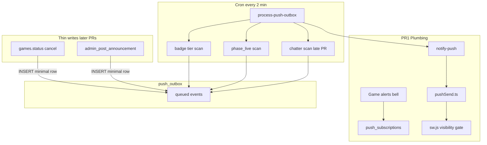

# Incremental push refactor (derisked v2)

Reference: archived spec in [intent-aligned-push-refactor-plan.md](intent-aligned-push-refactor-plan.md), lessons from revert + [scripts/supabase-rollback-push-plan.sql](../scripts/supabase-rollback-push-plan.sql).

## Goals

- Ship **small PRs** with independent rollback and clear pass/fail tests.
- **Remove per-message chat push in PR 1** ([`notifyChatPush`](../src/lib/push.js) + [`notify-chat`](../supabase/functions/notify-chat/index.ts)); keep bell + `push_subscriptions` for future **game alerts**.
- Defer **`chat_chatter` summary** to a **late optional chunk**.
- Split **announcements**: in-app UI first, push later.
- Avoid v1 performance traps: **no heavy SQL on RSVP/chat write path**, **no new full-`fetchAppData` Realtime subscription**.

## Risk levels

| Level | Meaning |
|-------|---------|
| **Low** | Small diff, no DB write-path changes, easy rollback, unlikely to affect page responsiveness |
| **Low–Medium** | Noticeable product or ops change, but limited blast radius or rare code paths |
| **Medium** | Touches hot paths, new cron/scan work, or UI layout; needs staging + latency checks |
| **Medium–High** | Optional/deferred; reintroduces chat-related push logic |

### PR risk summary

| PR | Risk | Primary concern |
|----|------|-----------------|
| PR1 | Low–Medium | Removes per-message chat push; edge function swap |
| PR2 | Low | Idle DB + cron only |
| PR3 | Low–Medium | First live game push; thin DB trigger on admin cancel |
| PR4 | Low | Cron-only scan; no write triggers |
| PR5 | Medium | Cron badge scan; must not regress RSVP feel |
| PR6 | Medium | Announcement UI + Realtime; carousel layout |
| PR7 | Low–Medium | Push on admin post; RPC change only |
| PR8 | Low–Medium | Schema constraint; admin create/edit only |
| PR9 | Medium | Optional chatter summary; chat activity path |

## Architecture (v2)



**Key change from v1:** badge, `phase_live`, and `chat_chatter` are **cron-computed** (or enqueue minimal hints), not synchronous triggers on `rsvps` / `group_chat_messages`.

---

## PR 1 — Plumbing + remove chat push (ship first)

**Risk: Low–Medium** — Removes a user-visible behavior (per-message chat push) and swaps edge functions; no DB migrations. Rollback is redeploy `notify-chat` + restore client invoke.

**User-visible:** no more OS notification per chat message. Bell remains; copy becomes “Game alerts.” No game pushes yet (acceptable empty state).

### Client

| Change | Files |
|--------|-------|
| Remove `notifyChatPush` call | [src/hooks/usePresence.js](../src/hooks/usePresence.js) |
| Delete `notifyChatPush`; add `buildGameDeepLink` | [src/lib/push.js](../src/lib/push.js) |
| Rename bell copy; dispatch `disc-check-push-changed` | [src/components/games/GroupChatPushButton.jsx](../src/components/games/GroupChatPushButton.jsx) |
| Listen for `disc-check-push-changed` | [src/hooks/useChatAlerts.js](../src/hooks/useChatAlerts.js) |
| SW: skip `showNotification` when any client `visible` | [src/sw.js](../src/sw.js) |
| Deep link: preserve `?game=` on notification open | [src/hooks/useServiceWorkerNavigation.js](../src/hooks/useServiceWorkerNavigation.js) |
| Shared badge tier helper (UI only) | new [src/utils/gameBadge.js](../src/utils/gameBadge.js), [src/components/games/StatusBadge.jsx](../src/components/games/StatusBadge.jsx) |

### Edge

- Add [supabase/functions/_shared/pushSend.ts](../supabase/functions/_shared/pushSend.ts) (extract VAPID send + exclude list from current `notify-chat`).
- Add [supabase/functions/notify-push/index.ts](../supabase/functions/notify-push/index.ts) (thin POST → `pushSend`).
- **Delete** [supabase/functions/notify-chat/index.ts](../supabase/functions/notify-chat/index.ts) after extraction.
- Deploy `notify-push`; remove `notify-chat` from Supabase.

### Docs

- Update [.env.example](../.env.example): `notify-push` secrets; remove `notify-chat`.

### Verify

- Chat works in-app; **no** per-message push (foreground or background).
- Bell on/off still registers `push_subscriptions`.
- Manual `notify-push` POST (service role) delivers one test notification when bell on.
- SW visibility gate: no banner when PWA foreground.

### Rollback

- Restore `notify-chat` + `notifyChatPush` invocation; redeploy.

---

## PR 2 — Outbox infrastructure (idle)

**Risk: Low** — New tables, functions, and cron with no write triggers; outbox empty in normal use. Main ops risk is misconfigured cron (fixable without app deploy).

**No write triggers.** Cron runs but outbox stays empty except manual tests.

### Migration `030_push_outbox.sql` (use **030+** — 026–029 exist in remote migration history)

- Tables: `push_outbox`, `game_push_state`, `chat_push_state`
- SQL: `enqueue_push_event(...)` (full title/body/tag/url copy from v1 spec)
- **No** triggers on `rsvps`, `games`, `group_chat_messages` yet

### Edge + cron

- [supabase/functions/process-push-outbox/index.ts](../supabase/functions/process-push-outbox/index.ts): drain outbox → `pushSend`
- Migration `031_push_outbox_cron.sql`: schedule `disc-check-process-push-outbox` every 2 min (mirror prior [029 pattern](../scripts/supabase-rollback-push-plan.sql) with vault secret)

### Scripts

- Add `scripts/supabase-rollback-030-push-outbox.sql` (unschedule cron, drop tables/functions)

### Verify

- RSVP/chat latency unchanged vs PR1 baseline.
- Cron logs show `processed: 0` runs.
- Manual SQL `enqueue_push_event` → notification in background.

---

## PR 3 — First game event: `game_cancelled`

**Risk: Low–Medium** — First end-to-end game push; thin trigger on rare admin `status` change only. Low write-path cost; validates full pipeline before hotter events.

Low-frequency, easy to test; proves end-to-end.

### Migration `032_game_cancelled_push.sql`

- **Thin trigger** on `games` `AFTER UPDATE OF status` when `open` → `cancelled`:
  - Only `PERFORM enqueue_push_event('game_cancelled', ...)`
  - No extra aggregates

### Verify

- Admin cancels game → one push per subscriber (background).
- In-app cancel UI unchanged.

### Rollback

- Drop trigger only; outbox infra remains.

---

## PR 4 — `phase_live` (cron-only)

**Risk: Low** — Cron scan only; no triggers on RSVP or chat. ~2 min delivery lag is acceptable; duplicate-push guard via `game_push_state`.

No RSVP triggers.

### Migration `033_phase_live_cron.sql`

- `enqueue_phase_live_events()` — scan open games where `is_game_live(...)` and `game_push_state.last_phase` ≠ `live` for current cycle
- Called from existing `process-push-outbox` (already designed in v1)

### Verify

- Near game start, one “Game is live” push per cycle (~2 min lag acceptable).
- No duplicate pushes same cycle.

---

## PR 5 — Badge pushes (`badge_almost` / `badge_go`) — cron-based

**Risk: Medium** — Highest routine load in the push pipeline: cron scans games + RSVP headcounts every 2 min. Must confirm RSVP/chat UI stays snappy (v1 failed here with sync triggers).

**Critical derisk vs v1:** do **not** attach heavy `trg_rsvps_push_badge` on every RSVP write.

### Migration `034_badge_push_cron.sql`

- Cron function (or extend processor): for each pregame-open game, compute headcount + badge tier via SQL helpers (`compute_rsvp_headcount`, `compute_rsvp_badge`, `is_rsvp_open_for_game`)
- Compare to `game_push_state.last_rsvp_badge`; on **upgrade only** enqueue `badge_almost` / `badge_go`
- Upsert `game_push_state`

### Verify

- RSVP tap feels instant (same as before PR5).
- Badge flip push arrives within ~2 min in background.
- No push during live/ended/stale cycle.

---

## PR 6 — Announcements in-app only (no push)

**Risk: Medium** — New table, RPC, Realtime, and carousel UI. Mitigated by focused-slide-only layout and no full-`fetchAppData` subscription (v1 regression source).

Avoid v1 carousel/slide-stack regression.

### Migration `035_game_announcements.sql`

- `game_announcements` table + RLS + Realtime publication
- RPC `admin_post_game_announcement` — **upsert only**, no `enqueue_push_event` yet

### Client (performance-safe)

- Load announcements via **scoped fetch** in [src/lib/data.js](../src/lib/data.js) (can extend `fetchAppData` once, but **do not** add a 7th debounced full-refetch subscription)
- Prefer: Realtime handler patches a small `announcements` map for changed `game_id` only, or refetch single game row on admin post
- UI: banner + admin composer on **focused carousel slide only** (not inside every slide) — [src/screens/GroupGamesScreen.jsx](../src/screens/GroupGamesScreen.jsx)

### Verify

- Admin posts → banner on focused game; no carousel button regressions (Chrome mobile).
- No new push on post.

---

## PR 7 — Announcement push

**Risk: Low–Medium** — Small RPC extension; push only on infrequent admin post. Depends on PR6 UI being stable.

### Migration `036_announcement_push.sql`

- Extend `admin_post_game_announcement` to `enqueue_push_event('announcement', ...)` with `exclude_subscriber_ids = ARRAY[p_subscriber_id]`

### Verify

- Non-admin with bell on gets push; posting admin excluded when backgrounded.

---

## PR 8 — Group limits (orthogonal)

**Risk: Low–Medium** — DB unique constraint can fail deploy if duplicate weekdays exist; admin-only UX changes. No impact on player hot paths.

Can ship anytime after PR1; no push dependency.

### Migration `037_group_game_limits.sql`

- `UNIQUE (group_id, weekday)`, max 7 games in `admin_upsert_game`
- [src/components/ui/SelectField.jsx](../src/components/ui/SelectField.jsx) `option.disabled`
- [src/components/games/GameFormModal.jsx](../src/components/games/GameFormModal.jsx), [src/components/layout/AppHeader.jsx](../src/components/layout/AppHeader.jsx)

---

## PR 9 — `chat_chatter` summary (optional, late)

**Risk: Medium** — Reintroduces chat-related push (summary only). Prefer cron scan; avoid v1 per-insert `COUNT(DISTINCT)` trigger. Defer until PR5–7 are stable in prod.

Only after PR5–7 stable. **Cron-based**, not per-insert trigger.

### Migration `038_chat_chatter_cron.sql`

- Cron scans groups: distinct senders in 30 min ≥ 2, `chat_push_state.last_push_at` > 1h → enqueue `chat_chatter` with sender exclude list built from recent messages
- Alternatively maintain `chat_push_state.sender_count` via **light** insert trigger (single counter bump, no `COUNT(DISTINCT)` scan)

### Verify

- 2+ senders → at most one push/hour; no per-message spam.

---

## Cross-cutting rules (every PR)

1. **One behavior change per PR** where possible.
2. **Per-PR rollback SQL** alongside forward migration (template: [scripts/supabase-rollback-push-plan.sql](../scripts/supabase-rollback-push-plan.sql)).
3. **Measure RSVP + chat latency** before/after any migration touching writes.
4. **Staging Supabase project** recommended for PR2+ before prod.
5. **Do not bundle** group limits, announcements UI, and push triggers in one PR.

## Suggested release order

```text
PR1 → PR2 → PR3 → PR4 → PR5 → PR6 → PR7
PR8 anytime after PR1
PR9 optional last
```

## Rollback script map

| PR | Forward migration | Rollback script |
|----|-------------------|-----------------|
| PR2 | `030_push_outbox.sql`, `031_push_outbox_cron.sql` | `scripts/supabase-rollback-030-push-outbox.sql` |
| PR3 | `032_game_cancelled_push.sql` | Drop trigger in per-PR rollback |
| PR4 | `033_phase_live_cron.sql` | Drop cron function hook in per-PR rollback |
| PR5 | `034_badge_push_cron.sql` | Drop badge scan in per-PR rollback |
| PR6 | `035_game_announcements.sql` | Drop table/RPC in per-PR rollback |
| PR7 | `036_announcement_push.sql` | Revert RPC to PR6 version |
| PR8 | `037_group_game_limits.sql` | Drop constraint + revert RPC |
| PR9 | `038_chat_chatter_cron.sql` | Drop chatter scan in per-PR rollback |

Full v1 rollback reference: [scripts/supabase-rollback-push-plan.sql](../scripts/supabase-rollback-push-plan.sql).

## Out of scope (unchanged from v1)

- `phase_starting_soon` push
- Badge downgrade on RSVP cancel
- `game_calls` / host override
