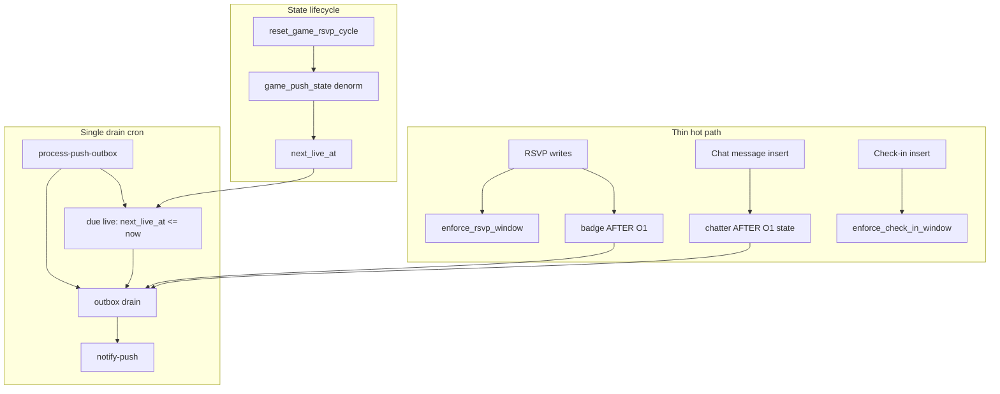

# Incremental push refactor (derisked v2)

Reference: archived spec in [intent-aligned-push-refactor-plan.md](intent-aligned-push-refactor-plan.md), lessons from revert + [scripts/supabase-rollback-push-plan.sql](../scripts/supabase-rollback-push-plan.sql).

## Goals

- Organize by **feature phase** — each phase is **end-to-end testable** before moving on.
- Keep **RSVP and check-in transactions thin**; offload push work to outbox + async drain.
- **Event-based badge push** on RSVP tier upgrade (not badge cron scan).
- **Phase 1** chat removal → **Phase 2** pregame (cancel + badge) → **Phase 3** live → **Phase 4** chatter → **Phase 5** announcements.
- Prefer **event-driven or precomputed-time discovery** over scanning all games/groups; **one drain cron** for delivery only.
- Avoid v1 traps: no `SUM` / `COUNT(DISTINCT)` on hot paths, no push logic on `name`-only updates, no full-`fetchAppData` subscription for announcements.
- **Baseline hygiene (pre-push):** single occurrence computation per enforce write; atomic `game_push_state` reset on cycle rollover; narrow check-in/guest UPDATE triggers.
- **Client hygiene (orthogonal):** replace full `fetchAppData()` after RSVP/check-in with scoped fetch or Realtime + optimistic state where safe.

## Push discovery model (one processor)

All features share **one** `process-push-outbox` run every 1–2 min. Each tick:

1. **Drain** queued `push_outbox` rows → `notify-push`
2. **Due live pushes** — `game_push_state.next_live_at <= now()` (indexed, no `is_game_live` scan)
3. *(Optional fallback only)* reconcile badge/chatter state if event path missed a row

| Feature | Discovery (ideal) | Delivery |
|---------|-------------------|----------|
| Badge | RSVP AFTER trigger, O(1) headcount delta | Drain cron |
| Cancel | `games` status trigger | Drain cron |
| Live | **Precomputed `next_live_at`** due on drain tick | Drain cron |
| Chatter | **Chat AFTER INSERT**, O(1) `chat_push_state` update | Drain cron |
| Announcements | Admin RPC | Drain cron |

**Do not** add separate cron jobs per feature. **Do not** use per-game one-shot pg_cron schedules (high ops cost for weekly recurrence + admin edits).

## Hot-path design principles

RSVP and live check-in are tap-and-expect-instant actions. Everything below applies **before** adding badge push.

### What stays on the write path (minimal)

| Path | Allowed work | Why |
|------|----------------|-----|
| **RSVP** `enforce_rsvp_window` (BEFORE) | One `games` row read; **one** `get_current_occurrence_start`; cycle + lock from that timestamp | Product rules — must block invalid RSVPs |
| **Check-in** `enforce_check_in_window` (BEFORE) | One `games` row read; **one** occurrence; live + cycle from that timestamp | Product rules — check-in only while live |
| **Badge push** (AFTER, Phase 2b-iii) | O(1) `game_push_state` delta; tier compare; **stub** outbox row on upgrade only — **no `games` read** | Event-driven; denormalized state |
| **Chatter push** (AFTER, Phase 4) | Bounded `chat_push_state` update; stub outbox only when threshold + cooldown pass | No `COUNT(DISTINCT)` per message |

### What must be offloaded (never on RSVP/check-in/chat send transaction)

- Web Push / `notify-push` calls
- `SUM(1 + plus_ones)` over all `rsvps` per tap
- `COUNT(DISTINCT sender_id)` over `group_chat_messages` per tap
- `is_rsvp_open_for_game` chains when BEFORE enforce already proved pregame
- `is_game_live` scans over all games (use `next_live_at` due check instead)
- **Full push copy** (title/body/tag/url) — materialize on drain, not in triggers
- **Second `games` SELECT** in badge AFTER trigger (denormalize onto `game_push_state` instead)
- Full client `fetchAppData()` after every RSVP/check-in (see Client hot path below)

### Enforce trigger deduplication (migration `033`, Phase 2b-i)

Today `enforce_rsvp_window` calls `get_current_occurrence_start`, then `is_rsvp_locked` which calls it **again**. Check-in does the same via `is_game_live` + a separate cycle compare.

**Refactor both enforce functions** to compute occurrence once and derive rules inline:

```sql
-- RSVP: after loading games row
v_occurrence := get_current_occurrence_start(v_weekday, v_start_time, v_timezone, NOW());
-- cycle stale check: v_stored_cycle IS DISTINCT FROM v_occurrence
-- locked while live: NOW() >= v_occurrence AND NOW() < v_occurrence + INTERVAL '12 hours'

-- Check-in: same v_occurrence
-- live window: NOW() >= v_occurrence AND NOW() < v_occurrence + INTERVAL '3 hours'
-- cycle match: NEW.cycle_at IS DISTINCT FROM v_occurrence → reject
```

Same product rules; fewer function calls. Cools RSVP/check-in **before** badge push lands.

### Trigger hygiene (migration `033_hot_path_triggers.sql`, Phase 2b-i)

**RSVP `rsvps_enforce_window`** — narrow UPDATE firing + deduped occurrence math:

```sql
BEFORE INSERT OR DELETE ON rsvps
BEFORE UPDATE OF plus_ones, bringing_kit, game_id, user_id ON rsvps
```

Skips [renameRsvps](../src/lib/data.js) (`UPDATE name` only), which today re-fires enforce across every row.

**Badge `rsvps_push_badge`** — separate AFTER trigger, headcount columns only:

```sql
AFTER INSERT OR DELETE ON rsvps
AFTER UPDATE OF plus_ones ON rsvps
```

**Check-in** — narrow UPDATE (same name-only problem via [renameRsvps](../src/lib/data.js)):

```sql
BEFORE INSERT OR DELETE ON game_check_ins
BEFORE UPDATE OF plus_ones, bringing_kit, game_id, user_id, cycle_at ON game_check_ins
```

**Guests** — narrow UPDATE on `game_guests` if name-only updates exist. **No push trigger** on check-in or guests; live push uses `next_live_at` on drain tick.

**Chat** (Phase 4) — separate AFTER INSERT trigger on `group_chat_messages` only (see Phase 4).

### `game_push_state` lifecycle (denormalize + atomic cycle reset)

Extend `game_push_state` (PK `game_id`, `cycle_at`) with push-hot fields copied from `games` when the row is created or reset:

| Column | Purpose |
|--------|---------|
| `rsvp_headcount` | Incremental headcount (O(1) delta) |
| `last_rsvp_badge` | `'not' \| 'almost' \| 'go'` for upgrade-only compare |
| `last_phase` | Live push dedup per cycle |
| `next_live_at` | Precomputed live push time |
| `group_id` | Outbox routing — no `games` read in badge trigger |
| `target` | Tier thresholds — no `games` read in badge trigger |
| `game_status` | Short-circuit badge when `'cancelled'` |

**Initialize or reset in one place** — extend [reset_game_rsvp_cycle](../supabase/schema.sql) (called from `reset_stale_game_cycles`) to upsert the new-cycle row:

```sql
-- After DELETE rsvps / check-ins / guests and UPDATE games.rsvp_cycle_at
INSERT INTO game_push_state (game_id, cycle_at, group_id, target, game_status,
  rsvp_headcount, last_rsvp_badge, last_phase, next_live_at, updated_at)
VALUES (p_game_id, p_cycle, v_group_id, v_target, v_status,
  0, NULL, NULL, p_cycle, NOW())
ON CONFLICT (game_id, cycle_at) DO UPDATE SET
  rsvp_headcount = 0, last_rsvp_badge = NULL, last_phase = NULL,
  next_live_at = EXCLUDED.next_live_at, target = EXCLUDED.target,
  game_status = EXCLUDED.game_status, updated_at = NOW();
```

Also refresh `group_id`, `target`, `game_status`, `next_live_at` on `admin_upsert_game` and when status → `cancelled` (clear/skip `next_live_at`).

Avoids lazy-init races on “first RSVP of cycle”; badge trigger only touches `game_push_state` + outbox.

### Incremental headcount (replaces `compute_rsvp_headcount` on hot path)

On each headcount-changing RSVP (AFTER trigger):

- INSERT: `+ (1 + NEW.plus_ones)`
- DELETE: `- (1 + OLD.plus_ones)` (no downgrade push; still update count + `last_rsvp_badge`)
- UPDATE `plus_ones`: delta only

Derive tier from `rsvp_headcount` + denormalized `target` (same rules as [gameBadge.js](../src/utils/gameBadge.js)).

**Early exits (common path):**

- `game_status = 'cancelled'` → return immediately
- After delta: if `last_rsvp_badge = 'go'` and new count still `>= target` → update count only, no tier math, no enqueue
- Enqueue **upgrade only** → stub outbox row (`badge_almost` \| `badge_go`)

Optional nightly or cron **reconcile** `SUM(rsvps)` vs `rsvp_headcount` (off hot path) if paranoid about drift.

### Thin outbox enqueue (Phase 2a — `030`)

Triggers and RPCs insert a **minimal** `push_outbox` row:

```sql
-- Stub only on write path
(group_id, game_id, event_type, exclude_subscriber_ids)
-- payload JSONB NULL or { "materialize": true }
```

**Materialize** title/body/tag/url in `process-push-outbox` (or `notify-push`) when draining — copy lives in one place (SQL or shared TS), latency does not block taps. Profile on staging; if stub + drain is still heavy, keep copy in SQL but only on drain path.

### Client hot path (orthogonal — anytime after Phase 1, ideally before Phase 2b-iii)

Today [upsertRsvp](../src/lib/data.js) / [upsertCheckIn](../src/lib/data.js) await full [fetchAppData](../src/lib/data.js) (groups, games, **all** RSVPs, check-ins, guests). UI already optimizes locally in [useAppData.js](../src/hooks/useAppData.js) before persist; the refetch often dominates perceived latency.

**Ideal:** after successful RSVP/check-in write, either:

- Return **scoped** data for the affected game only, or
- Skip refetch and rely on existing Realtime subscriptions + optimistic local state

Do **not** add new full-refetch paths. Announcements (Phase 5) use scoped fetch per plan. Gate RSVP latency tests on staging with this improvement when feasible.

### Async delivery (still cron, not RSVP-blocking)

`process-push-outbox` cron every 2 min drains `push_outbox` → `notify-push`. Badge is **discovered on RSVP**; **delivered** async (typically seconds to ~2 min). Acceptable tradeoff to keep RSVP thin.

**Fallback:** if staging shows RSVP regression after Phase 2b-iii, drop badge enqueue and revert to badge **cron scan** without removing 2b-ii state or outbox infra.

## Feature phases at a glance

| Phase | Feature | E2E pass criterion |
|-------|---------|-------------------|
| **1** | Chat push removal | Send chat → no OS notification; bell still registers subscriptions |
| **2a** | Game cancelled push | Admin cancels game → subscriber gets one push (background) |
| **2b** | Pregame badge push *(3 PRs: 2b-i → 2b-ii → 2b-iii)* | RSVP crosses almost/go tier → push after drain (not per-message delay on RSVP UI) |
| **3** | Live game push | `next_live_at` due → “Game is live” once per cycle (≤ drain interval lag) |
| **4** | Chat chatter push *(2 PRs: 4a → 4b)* | 2+ senders in 30 min → ≤1 summary push/hour; chat send stays instant |
| **5** | Announcements *(2 PRs: 5a → 5b)* | Admin posts → banner on focused game + OS push to subscribers |

**Orthogonal (anytime after Phase 2a):** group limits; **client scoped fetch** (recommended before **2b-iii**).

### Release order

```text
1 → 2a → 2b-i → 2b-ii → [client fetch] → 2b-iii → 3 → 4a → 4b → 5a → 5b

           └─ pregame badge stack ─┘              └─ chatter stack ─┘

Orthogonal: group limits anytime after 2a
```

### PR sub-phases (isolate risky hot-path changes)

Split **medium-risk** phases so each PR changes **one layer**: hygiene → state → enqueue. Do **not** split Phases 1, 2a, or 3 further (already small or low-risk).

| PR | Ships | Risk | Gate before next PR |
|----|--------|------|---------------------|
| **2b-i** | `033` — deduped enforce + narrow RSVP/check-in/guest UPDATE triggers | **Low** | RSVP/check-in latency unchanged or better; `renameRsvps` skips enforce |
| **2b-ii** | `034` — `game_push_state` denorm + `reset_game_rsvp_cycle` hooks; optional headcount-only AFTER (**no enqueue**) | **Low–Medium** | Cycle reset creates correct rows; headcount matches RSVPs |
| **2b-iii** | `035` — badge AFTER trigger + stub enqueue | **Medium** | **RSVP latency gate** + badge E2E |
| **4a** | `037` — `chat_push_state` + AFTER INSERT state-only trigger | **Low–Medium** | Chat send instant; window state correct |
| **4b** | `038` — enqueue branch on chatter trigger | **Medium** | **Chat latency gate** + chatter E2E |
| **5a** | `039` — announcements table + banner/composer UI | **Low–Medium** | Banner E2E; no push yet |
| **5b** | `040` — announcement push RPC | **Low** | Admin post → banner + OS push |

**Dependency rule:** 2b-iii requires 2b-ii (`game_push_state` exists). 2b-i should ship before 2b-iii (isolates enforce regressions). 4b requires 4a.

## Risk levels

| Phase | Risk | Primary concern |
|-------|------|-----------------|
| 1 | Low–Medium | Stops chat push; deletes `notify-chat` |
| 2a | Low–Medium | First push pipeline + cancel trigger |
| 2b-i | Low | Enforce refactor — no new push behavior |
| 2b-ii | Low–Medium | State lifecycle — writes on cycle reset, optional headcount maintenance |
| 2b-iii | Medium | Badge enqueue on RSVP — **RSVP latency gate** |
| 3 | Low | `next_live_at` due check on drain (not full-game scan) |
| 4a | Low–Medium | Chat state on insert — no notifications yet |
| 4b | Medium | Chatter enqueue — **chat send latency gate** |
| 5a | Low–Medium | Carousel banner UI |
| 5b | Low | Admin-only announcement push RPC |

## Architecture (v2)



**Key changes:** deduped enforce math; badge reads only `game_push_state`; stub outbox on write; no full-game scans; no `COUNT(DISTINCT)` on chat; **one drain** materializes copy + delivers + due live checks.

---

## Phase 1 — Chat push removal

**Risk: Low–Medium**

**Ship:** stop per-message push; rename bell to “Game alerts”; delete `notify-chat`. Subscriptions still register; nothing auto-sends until Phase 2a.

### Changes

| Area | What |
|------|------|
| Client | Remove `notifyChatPush` from [usePresence.js](../src/hooks/usePresence.js) and [push.js](../src/lib/push.js) |
| Client | Bell copy + `disc-check-push-changed` in [GroupChatPushButton.jsx](../src/components/games/GroupChatPushButton.jsx), [useChatAlerts.js](../src/hooks/useChatAlerts.js) |
| Edge | Delete [notify-chat](../supabase/functions/notify-chat/index.ts) from repo + Supabase |

### E2E test

- [ ] Chat works in-app; **no** per-message push
- [ ] Bell shows “Game alerts”; on/off updates `push_subscriptions`
- [ ] RSVP/check-in latency unchanged vs baseline
- [ ] `notify-chat` absent from Supabase

### Rollback

Restore `notifyChatPush` + bell copy; redeploy `notify-chat` + Vercel.

---

## Phase 2 — Pregame status pushes

### Phase 2a — Game cancelled (+ shared push infrastructure)

**Risk: Low–Medium**

**Ship:** `notify-push`, outbox, drain cron, and first auto-push (`game_cancelled`). Check-in path untouched.

| Area | What |
|------|------|
| Edge | [pushSend.ts](../supabase/functions/_shared/pushSend.ts), [notify-push](../supabase/functions/notify-push/index.ts), [process-push-outbox](../supabase/functions/process-push-outbox/index.ts) |
| DB | `032_push_outbox.sql` — outbox + stub `enqueue_push_event` |
| DB | `033_game_cancelled_push.sql` — thin `games` status trigger → stub outbox only |
| DB | `034_push_outbox_cron.sql` — drain cron **materializes copy** then calls `notify-push` |
| Client | `buildGameDeepLink`, SW gate, deep links, [gameBadge.js](../src/utils/gameBadge.js) |
| Docs | [.env.example](../.env.example), [phase-2a-cancel-push-runbook.md](phase-2a-cancel-push-runbook.md) |

#### E2E test

See [phase-2a-cancel-push-runbook.md](phase-2a-cancel-push-runbook.md) for step-by-step verification, SQL queries, and troubleshooting.

- [ ] Manual `notify-push` + manual `enqueue_push_event` work
- [ ] **Admin cancel → push (background)**
- [ ] RSVP/check-in latency unchanged

---

### Phase 2b — Pregame badge (three PRs)

**Ship:** event-based badge via incremental headcount. **No badge cron scan.** Split so enforce hygiene and state lifecycle land before enqueue-on-RSVP.

---

#### Phase 2b-i — Enforce hygiene only

**Risk: Low** · **Migration:** `033_hot_path_triggers.sql`

| Area | What |
|------|------|
| DB | Deduped `enforce_rsvp_window` + `enforce_check_in_window` (single occurrence per write) |
| DB | Narrow UPDATE on `rsvps`, `game_check_ins`, `game_guests` (skip name-only [renameRsvps](../src/lib/data.js)) |

**No** `game_push_state` changes. **No** badge trigger. **No** new push behavior.

##### E2E test

- [ ] RSVP/check-in latency unchanged or improved vs baseline
- [ ] `renameRsvps` does **not** fire RSVP or check-in enforce triggers
- [ ] Invalid RSVP/check-in still rejected correctly

##### Rollback

Revert enforce functions + trigger definitions to pre-033.

---

#### Phase 2b-ii — Push state lifecycle (no enqueue)

**Risk: Low–Medium** · **Migration:** `034_game_push_state_lifecycle.sql`

| Area | What |
|------|------|
| DB | Extend `game_push_state`: `rsvp_headcount`, `group_id`, `target`, `game_status`, `last_rsvp_badge` (see lifecycle section) |
| DB | Atomic upsert in `reset_game_rsvp_cycle`; refresh on `admin_upsert_game` + cancel |
| DB | Optional: `trg_rsvps_maintain_headcount` AFTER trigger — O(1) delta + `last_rsvp_badge` update **only**, no outbox insert |

##### E2E test

- [ ] Weekly cycle reset creates/zeros correct `game_push_state` row per game
- [ ] `rsvp_headcount` matches `SUM(1 + plus_ones)` (spot-check or off-path reconcile)
- [ ] RSVP latency still passes gate (headcount maintenance is cheap)

##### Rollback

Drop headcount trigger if present; leave or drop `game_push_state` columns (forward-only OK if 2b-iii not shipped).

---

#### Phase 2b-iii — Badge enqueue

**Risk: Medium** · **Migration:** `035_badge_push_trigger.sql`

| Area | What |
|------|------|
| DB | `trg_rsvps_push_badge` (or extend maintain trigger): upgrade-only stub enqueue; early exits; **no `games` SELECT** |
| Client | *(orthogonal, recommended before this PR)* scoped post-RSVP fetch — see Client hot path |

##### RSVP latency gate (required before prod)

On staging, compare **before/after** 2b-iii:

- [ ] RSVP upsert/cancel UI feels instant (subjective + no new errors)
- [ ] Check-in tap latency unchanged
- [ ] Badge trigger does not `SELECT` from `games`

##### E2E test

- [ ] **RSVP crosses almost or go → one badge push** (after outbox drain)
- [ ] No badge push when tier unchanged (extra RSVP at same tier)
- [ ] No badge push during live/ended/cancelled game
- [ ] No duplicate push same tier/cycle

##### Rollback

Drop badge enqueue from trigger (keep headcount maintenance from 2b-ii). Fallback: badge cron scan on processor without removing outbox.

**Phase 2 complete** when 2a + 2b-i/ii/iii E2E and **2b-iii** latency gate pass.

---

## Phase 3 — Live game status push

**Risk: Low**

**Ship:** precomputed schedule + due check on existing drain tick — **not** `is_game_live()` scan of all games, **not** per-game pg_cron jobs, **not** on check-in writes.

### How `next_live_at` is set

Write `game_push_state.next_live_at = get_current_occurrence_start(weekday, start_time, timezone)` when:

- **Cycle reset** — `reset_game_rsvp_cycle` upserts new-cycle `game_push_state` (see lifecycle section)
- Game created/updated ([admin_upsert_game](../supabase/schema.sql))
- After a live push fires → schedule **next** occurrence for the following cycle
- Status → `cancelled` → clear or skip `next_live_at` on current-cycle row

### Drain tick (inside `process-push-outbox`)

```sql
-- Pseudocode: indexed lookup, not scan all games
WHERE next_live_at <= now()
  AND last_phase IS DISTINCT FROM 'live'
  AND cycle_at = current_cycle_for_game
→ stub enqueue `phase_live` (copy materialized on drain)
→ last_phase := 'live'
```

| Area | What |
|------|------|
| DB | `036_phase_live_scheduled.sql` — `next_live_at` due-live step in processor (lifecycle hooks largely from 2b-ii; extend if needed) |

Lag is at most one drain interval (~2 min), same as before, but **DB work per tick is O(due games)** not O(all open games).

#### E2E test

- [ ] At scheduled start → one “Game is live” push per cycle
- [ ] Admin changes `start_time` → `next_live_at` updates; push follows new time
- [ ] Cancelled game → no live push
- [ ] Check-in during live window still instant
- [ ] Deep link `?game=` works

#### Rollback

Drop `next_live_at` logic from processor; remove schedule hooks.

---

## Phase 4 — Chat chatter summary push (two PRs)

**Ship:** event-driven discovery on message insert — **no** group-wide cron scan, **no** v1 `COUNT(DISTINCT)` trigger.

### `chat_push_state` (per `group_id`) — shared by 4a + 4b

Maintain incrementally on each `group_chat_messages` INSERT:

- Prune senders older than 30 min from a bounded in-row structure (JSONB array of `{sender_id, at}`; **cap entries** e.g. last 50 events in window)
- If new sender in window → increment distinct count
- **Fast path:** after prune, if distinct `< 2` → return (no cooldown/outbox work)

---

#### Phase 4a — Chat state only (no push)

**Risk: Low–Medium** · **Migration:** `037_chat_push_state.sql`

| Area | What |
|------|------|
| DB | `chat_push_state` columns + AFTER INSERT trigger: update window state **only** — no outbox |

##### E2E test

- [ ] Send message feels instant vs baseline
- [ ] No OS push of any kind
- [ ] State reflects 2+ distinct senders in 30 min window (inspect row or logs)

##### Rollback

Drop state trigger; keep table.

---

#### Phase 4b — Chatter enqueue

**Risk: Medium** · **Migration:** `038_chat_chatter_enqueue.sql`

| Area | What |
|------|------|
| DB | Extend chatter trigger: if distinct ≥ 2 and `now() - last_push_at > 1h` → stub outbox `chat_chatter`; set `last_push_at` |

**Optional fallback:** processor reconcile for missed groups (off hot path).

##### Chat latency gate (required before prod)

- [ ] Send message still feels instant vs baseline
- [ ] No per-message OS push

##### E2E test

- [ ] 2+ distinct senders in 30 min → ≤1 summary push/hour
- [ ] Single sender → no chatter push
- [ ] Cooldown respected across bursts

##### Rollback

Remove enqueue branch from trigger; 4a state maintenance remains.

**Phase 4 complete** when 4a + 4b E2E and **4b** latency gate pass.

---

## Phase 5 — Announcements (two PRs)

---

#### Phase 5a — Banner UI

**Risk: Low–Medium** · **Migration:** `039_game_announcements.sql`

| Area | What |
|------|------|
| DB | `game_announcements` table + Realtime publication |
| Client | Focused-slide banner + composer in [GroupGamesScreen.jsx](../src/screens/GroupGamesScreen.jsx); scoped fetch — no 7th full-refetch subscription |

##### E2E test

- [ ] Admin post → banner appears on focused game slide
- [ ] No carousel regressions; **no** OS push yet

##### Rollback

Drop table + UI.

---

#### Phase 5b — Announcement push

**Risk: Low** · **Migration:** `040_announcement_push.sql`

| Area | What |
|------|------|
| DB | `admin_post_game_announcement` RPC → stub outbox `announcement` |

##### E2E test

- [ ] Admin post → banner + OS push

##### Rollback

Drop RPC enqueue; banner from 5a remains.

**Phase 5 complete** when 5a + 5b E2E pass.

---

## Orthogonal — Group limits

**Risk: Low–Medium** — anytime after Phase 2a.

| Area | What |
|------|------|
| DB | `041_group_game_limits.sql` |

---

## Orthogonal — Client post-write fetch (RSVP / check-in)

**Risk: Low** — anytime after Phase 1; **recommended before Phase 2b-iii** so RSVP latency gates measure the real user path.

| Area | What |
|------|------|
| Client | [data.js](../src/lib/data.js) — `upsertRsvp`, `cancelRsvp`, `upsertCheckIn`, `cancelCheckIn` return scoped data or void; caller applies patch |
| Client | [useAppData.js](../src/hooks/useAppData.js) — keep optimistic local update; merge Realtime deltas; avoid full `fetchAppData()` on every tap |

#### E2E test

- [ ] RSVP/check-in UI still correct for other users via Realtime
- [ ] No regression when offline / Realtime delayed (define fallback: single-game refetch or retry)

#### Rollback

Restore `return fetchAppData()` on write helpers.

---

## Cross-cutting rules

1. **Do not start the next PR/sub-phase** until that PR’s E2E passes; **2b-iii** and **4b** additionally require latency gates on staging.
2. **Hot path rule:** triggers on `rsvps`, `game_check_ins`, or `group_chat_messages` must be O(1) or bounded — never full-table aggregates.
3. **Enforce rule:** one `get_current_occurrence_start` per enforce invocation — no nested `is_rsvp_locked` / `is_game_live` recompute.
4. **State rule:** `game_push_state` is the single source for badge hot path; reset atomically on cycle rollover; denormalize `group_id`, `target`, `game_status`.
5. **Outbox rule:** stub row on write; materialize push copy on drain — never block taps on string formatting.
6. **Discovery rule:** use events or precomputed `next_*_at` due checks — not scans of all games/groups.
7. **One drain cron** for delivery + due live; no per-feature cron jobs.
8. **Name-only UPDATE** must not fire enforce or push triggers (RSVP, check-in, guests).
9. **Per-phase rollback SQL** alongside forward migrations.
10. **Staging Supabase** required before Phase 2a; **latency gates** for **2b-iii** (RSVP) and **4b** (chat).
11. **Sub-phase rule:** one layer per PR — hygiene, then state, then enqueue — for medium-risk hot paths.

## Migration / rollback map

| PR / phase | Migration | Rollback |
|------------|-----------|----------|
| 2a | `030`, `031`, `032` | `scripts/supabase-rollback-030-push-outbox.sql` + drop cancel trigger |
| 2b-i | `033` | Revert enforce functions + trigger definitions |
| 2b-ii | `034` | Drop headcount trigger; optional column rollback |
| 2b-iii | `035` | Drop badge enqueue; keep 2b-ii state |
| 3 | `036` | Drop due-live step in processor |
| 4a | `037` | Drop state-only chatter trigger |
| 4b | `038` | Remove enqueue branch from chatter trigger |
| 5a | `039` | Drop `game_announcements` + UI |
| 5b | `040` | Drop announcement RPC enqueue |
| Group limits | `041` | Drop constraint + revert RPC |

Use **030+** (026–029 in remote history). One migration file per deployable sub-phase where possible.

## Out of scope

- `phase_starting_soon` push
- Badge downgrade push on RSVP cancel
- Push triggers on `game_check_ins` (live uses `next_live_at`, not check-in)
- Per-game one-shot pg_cron schedules
- Full-game `is_game_live` / badge scans on drain tick (except optional off-path reconcile)
- `game_calls` / host override
