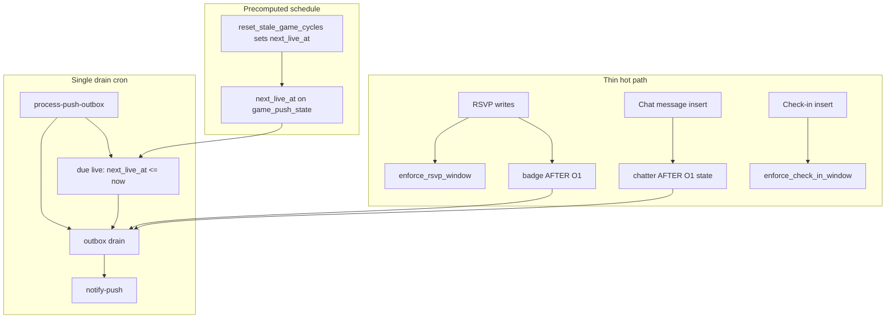

# Incremental push refactor (derisked v2)

Reference: archived spec in [intent-aligned-push-refactor-plan.md](intent-aligned-push-refactor-plan.md), lessons from revert + [scripts/supabase-rollback-push-plan.sql](../scripts/supabase-rollback-push-plan.sql).

## Goals

- Organize by **feature phase** — each phase is **end-to-end testable** before moving on.
- Keep **RSVP and check-in transactions thin**; offload push work to outbox + async drain.
- **Event-based badge push** on RSVP tier upgrade (not badge cron scan).
- **Phase 1** chat removal → **Phase 2** pregame (cancel + badge) → **Phase 3** live → **Phase 4** chatter → **Phase 5** announcements.
- Prefer **event-driven or precomputed-time discovery** over scanning all games/groups; **one drain cron** for delivery only.
- Avoid v1 traps: no `SUM` / `COUNT(DISTINCT)` on hot paths, no push logic on `name`-only updates, no full-`fetchAppData` subscription for announcements.

## Push discovery model (one processor)

All features share **one** `process-push-outbox` run every 1–2 min. Each tick:

1. **Drain** queued `push_outbox` rows → `notify-push`
2. **Due live pushes** — `game_push_state.next_live_at <= now()` (indexed, no `is_game_live` scan)
3. *(Optional fallback only)* reconcile badge/chatter state if event path missed a row

| Feature | Discovery (ideal) | Delivery |
|---------|-------------------|----------|
| Badge | RSVP AFTER trigger, O(1) headcount delta | Drain cron |
| Cancel | `games` status trigger | Drain cron |
| Live | **Precomputed `next_live_at`** due on drain tick | Drain cron |
| Chatter | **Chat AFTER INSERT**, O(1) `chat_push_state` update | Drain cron |
| Announcements | Admin RPC | Drain cron |

**Do not** add separate cron jobs per feature. **Do not** use per-game one-shot pg_cron schedules (high ops cost for weekly recurrence + admin edits).

## Hot-path design principles

RSVP and live check-in are tap-and-expect-instant actions. Everything below applies **before** adding badge push.

### What stays on the write path (minimal)

| Path | Allowed work | Why |
|------|----------------|-----|
| **RSVP** `enforce_rsvp_window` (BEFORE) | One `games` row read; cycle + `is_rsvp_locked` checks | Product rules — must block invalid RSVPs |
| **Check-in** `enforce_check_in_window` (BEFORE) | One `games` row read; `is_game_live` + cycle match | Product rules — check-in only while live |
| **Badge push** (AFTER, Phase 2b) | O(1) headcount delta; tier compare; **one** outbox insert on upgrade only | Event-driven; no aggregate scan |
| **Chatter push** (AFTER, Phase 4) | O(1) update to `chat_push_state`; enqueue only when threshold + cooldown pass | No `COUNT(DISTINCT)` per message |

### What must be offloaded (never on RSVP/check-in/chat send transaction)

- Web Push / `notify-push` calls
- `SUM(1 + plus_ones)` over all `rsvps` per tap
- `COUNT(DISTINCT sender_id)` over `group_chat_messages` per tap
- `is_rsvp_open_for_game` chains when BEFORE enforce already proved pregame
- `is_game_live` scans over all games (use `next_live_at` due check instead)
- `enqueue_push_event` full copy build if it adds measurable latency (profile on staging)
- Client `fetchAppData()` after RSVP (already today — do not add more)

### Trigger hygiene (migration `033_hot_path_triggers.sql`, ship with Phase 2b)

**RSVP `rsvps_enforce_window`** — narrow UPDATE firing:

```sql
BEFORE INSERT OR DELETE ON rsvps
BEFORE UPDATE OF plus_ones, bringing_kit, game_id, user_id ON rsvps
```

Skips [renameRsvps](../src/lib/data.js) (`UPDATE name` only), which today re-fires enforce + would re-fire badge logic across every row.

**Badge `rsvps_push_badge`** — separate AFTER trigger, headcount columns only:

```sql
AFTER INSERT OR DELETE ON rsvps
AFTER UPDATE OF plus_ones ON rsvps
```

**Check-in** — leave `enforce_check_in_window` as-is (already one game read + live check). **No push trigger on `game_check_ins`**; live push fires from precomputed `next_live_at` on drain tick.

**Chat** (Phase 4) — separate AFTER INSERT trigger on `group_chat_messages` only; maintain rolling window state in `chat_push_state` (prune expired senders, bump distinct count in O(window size)), enqueue `chat_chatter` when ≥2 distinct senders in 30 min and `last_push_at` > 1h ago.

### Incremental headcount (replaces `compute_rsvp_headcount` on hot path)

Store `rsvp_headcount` on `game_push_state` (per `game_id` + `cycle_at`). On each headcount-changing RSVP:

- INSERT: `+ (1 + NEW.plus_ones)`
- DELETE: `- (1 + OLD.plus_ones)` (no downgrade push; still update count + `last_rsvp_badge` for accuracy)
- UPDATE `plus_ones`: delta only

Derive tier from cached count + `games.target` inline (same rules as [gameBadge.js](../src/utils/gameBadge.js)). **Upgrade only** → `enqueue_push_event('badge_almost' | 'badge_go', ...)`.

Optional nightly or cron **reconcile** `SUM` vs cache (off hot path) if paranoid about drift.

### Async delivery (still cron, not RSVP-blocking)

`process-push-outbox` cron every 2 min drains `push_outbox` → `notify-push`. Badge is **discovered on RSVP**; **delivered** async (typically seconds to ~2 min). Acceptable tradeoff to keep RSVP thin.

**Fallback:** if staging shows RSVP regression after Phase 2b, drop badge AFTER trigger and revert to badge **cron scan** (v2 original) without removing outbox infra.

## Feature phases at a glance

| Phase | Feature | E2E pass criterion |
|-------|---------|-------------------|
| **1** | Chat push removal | Send chat → no OS notification; bell still registers subscriptions |
| **2a** | Game cancelled push | Admin cancels game → subscriber gets one push (background) |
| **2b** | Pregame badge push | RSVP crosses almost/go tier → push after drain (not per-message delay on RSVP UI) |
| **3** | Live game push | `next_live_at` due → “Game is live” once per cycle (≤ drain interval lag) |
| **4** | Chat chatter push | 2+ senders in 30 min → ≤1 summary push/hour; chat send stays instant |
| **5** | Announcements | Admin posts → banner on focused game + OS push to subscribers |

**Orthogonal (anytime after Phase 2a):** group limits.

### Release order

```text
Phase 1 → Phase 2a → Phase 2b → Phase 3 → Phase 4 → Phase 5
           └─ pregame: cancel + event-based badge ─┘

Orthogonal: group limits anytime after Phase 2a
```

## Risk levels

| Phase | Risk | Primary concern |
|-------|------|-----------------|
| 1 | Low–Medium | Stops chat push; deletes `notify-chat` |
| 2a | Low–Medium | First push pipeline + cancel trigger |
| 2b | Medium | Thin RSVP trigger — **must pass RSVP latency gate on staging** |
| 3 | Low | `next_live_at` due check on drain (not full-game scan) |
| 4 | Medium | Thin chat trigger — **chat send latency gate on staging** |
| 5 | Medium | Carousel UI + announcement push |

## Architecture (v2)



**Key changes:** no full-game `is_game_live` or badge scans; no `COUNT(DISTINCT)` on chat; **one drain** handles delivery + due live checks.

---

## Phase 1 — Chat push removal

**Risk: Low–Medium**

**Ship:** stop per-message push; rename bell to “Game alerts”; delete `notify-chat`. Subscriptions still register; nothing auto-sends until Phase 2a.

### Changes

| Area | What |
|------|------|
| Client | Remove `notifyChatPush` from [usePresence.js](../src/hooks/usePresence.js) and [push.js](../src/lib/push.js) |
| Client | Bell copy + `disc-check-push-changed` in [GroupChatPushButton.jsx](../src/components/games/GroupChatPushButton.jsx), [useChatAlerts.js](../src/hooks/useChatAlerts.js) |
| Edge | Delete [notify-chat](../supabase/functions/notify-chat/index.ts) from repo + Supabase |

### E2E test

- [ ] Chat works in-app; **no** per-message push
- [ ] Bell shows “Game alerts”; on/off updates `push_subscriptions`
- [ ] RSVP/check-in latency unchanged vs baseline
- [ ] `notify-chat` absent from Supabase

### Rollback

Restore `notifyChatPush` + bell copy; redeploy `notify-chat` + Vercel.

---

## Phase 2 — Pregame status pushes

### Phase 2a — Game cancelled (+ shared push infrastructure)

**Risk: Low–Medium**

**Ship:** `notify-push`, outbox, drain cron, and first auto-push (`game_cancelled`). Check-in path untouched.

| Area | What |
|------|------|
| Edge | [pushSend.ts](../supabase/functions/_shared/pushSend.ts), [notify-push](../supabase/functions/notify-push/index.ts), [process-push-outbox](../supabase/functions/process-push-outbox/index.ts) |
| DB | `030_push_outbox.sql`, `031_push_outbox_cron.sql` — outbox, `enqueue_push_event`, drain cron |
| DB | `032_game_cancelled_push.sql` — thin `games` status trigger → outbox only |
| Client | `buildGameDeepLink`, SW gate, deep links, [gameBadge.js](../src/utils/gameBadge.js) |
| Docs | [.env.example](../.env.example) |

#### E2E test

- [ ] Manual `notify-push` + manual `enqueue_push_event` work
- [ ] **Admin cancel → push (background)**
- [ ] RSVP/check-in latency unchanged

---

### Phase 2b — Pregame badge (event-based, thin RSVP)

**Risk: Medium**

**Ship:** hot-path trigger hygiene + incremental badge trigger. **No badge cron scan.**

| Area | What |
|------|------|
| DB | `033_hot_path_triggers.sql` — narrow `rsvps_enforce_window` UPDATE columns (see Hot-path principles) |
| DB | Extend `game_push_state` with `rsvp_headcount` (per cycle) |
| DB | `034_badge_push_trigger.sql` — `trg_rsvps_push_badge` AFTER trigger: O(1) delta, upgrade-only enqueue, no `is_rsvp_open_for_game`, no `SUM` |

#### RSVP latency gate (required before prod)

On staging, compare **before/after** Phase 2b:

- [ ] RSVP upsert/cancel UI feels instant (subjective + no new errors)
- [ ] `renameRsvps` (name-only) does **not** fire badge trigger (verify via logs or `pg_stat_user_functions` if needed)
- [ ] Check-in tap latency unchanged

#### E2E test

- [ ] **RSVP crosses almost or go → one badge push** (after outbox drain)
- [ ] No badge push when tier unchanged (extra RSVP at same tier)
- [ ] No badge push during live/ended/cancelled game
- [ ] No duplicate push same tier/cycle

#### Rollback

Drop `rsvps_push_badge` trigger; optionally restore wide enforce trigger. Fallback: add badge cron scan to processor (old `034_badge_push_cron` pattern) without touching cancel/outbox.

**Phase 2 complete** when 2a + 2b E2E and latency gate pass.

---

## Phase 3 — Live game status push

**Risk: Low**

**Ship:** precomputed schedule + due check on existing drain tick — **not** `is_game_live()` scan of all games, **not** per-game pg_cron jobs, **not** on check-in writes.

### How `next_live_at` is set

Write `game_push_state.next_live_at = get_current_occurrence_start(weekday, start_time, timezone)` when:

- Game created/updated ([admin_upsert_game](../supabase/schema.sql))
- Weekly cycle rolls ([reset_stale_game_cycles](../supabase/schema.sql))
- After a live push fires → schedule **next** occurrence for the following cycle

### Drain tick (inside `process-push-outbox`)

```sql
-- Pseudocode: indexed lookup, not scan all games
WHERE next_live_at <= now()
  AND last_phase IS DISTINCT FROM 'live'
  AND cycle_at = current_cycle_for_game
→ enqueue_push_event('phase_live', ...)
→ last_phase := 'live'
```

| Area | What |
|------|------|
| DB | `035_phase_live_scheduled.sql` — `next_live_at` on `game_push_state`; hooks on cycle reset + game upsert; due-live step in processor |

Lag is at most one drain interval (~2 min), same as before, but **DB work per tick is O(due games)** not O(all open games).

#### E2E test

- [ ] At scheduled start → one “Game is live” push per cycle
- [ ] Admin changes `start_time` → `next_live_at` updates; push follows new time
- [ ] Cancelled game → no live push
- [ ] Check-in during live window still instant
- [ ] Deep link `?game=` works

#### Rollback

Drop `next_live_at` logic from processor; remove schedule hooks.

---

## Phase 4 — Chat chatter summary push

**Risk: Medium**

**Ship:** event-driven discovery on message insert — **no** group-wide cron scan, **no** v1 `COUNT(DISTINCT)` trigger.

### `chat_push_state` (per `group_id`)

Maintain incrementally on each `group_chat_messages` INSERT:

- Prune senders older than 30 min from a small in-row structure (e.g. JSONB array of `{sender_id, at}` — bounded by chat volume in window)
- If new sender in window → increment distinct count
- If distinct ≥ 2 and `now() - last_push_at > 1h` → `enqueue_push_event('chat_chatter', ...)` with sender exclude list from window; set `last_push_at`

| Area | What |
|------|------|
| DB | `036_chat_chatter_trigger.sql` — thin AFTER INSERT trigger + `chat_push_state` columns |

**Optional fallback:** processor reconcile for groups with `last_message_at` recent but no push (off hot path, disable if event path stable).

#### Chat latency gate (required before prod)

- [ ] Send message feels instant vs baseline
- [ ] No per-message OS push

#### E2E test

- [ ] 2+ distinct senders in 30 min → ≤1 summary push/hour
- [ ] Single sender → no chatter push
- [ ] Cooldown respected across bursts

#### Rollback

Drop chat push trigger; keep `chat_push_state` table for retry.

---

## Phase 5 — Announcements (banner + OS push)

**Risk: Medium**

| Area | What |
|------|------|
| DB | `037_game_announcements.sql`, `038_announcement_push.sql` |
| Client | Focused-slide banner in [GroupGamesScreen.jsx](../src/screens/GroupGamesScreen.jsx); scoped fetch — no 7th full-refetch subscription |

#### E2E test

- [ ] Admin post → banner + OS push; no carousel regressions

---

## Orthogonal — Group limits

**Risk: Low–Medium** — anytime after Phase 2a.

| Area | What |
|------|------|
| DB | `039_group_game_limits.sql` |

---

## Cross-cutting rules

1. **Do not start the next phase** until E2E + (for 2b) **RSVP/check-in latency gate** pass.
2. **Hot path rule:** triggers on `rsvps`, `game_check_ins`, or `group_chat_messages` must be O(1) or bounded — never full-table aggregates.
3. **Discovery rule:** use events or precomputed `next_*_at` due checks — not scans of all games/groups.
4. **One drain cron** for delivery + due live; no per-feature cron jobs.
5. **Per-phase rollback SQL** alongside forward migrations.
6. **Staging Supabase** required before Phase 2a; **latency gates** for Phase 2b (RSVP) and Phase 4 (chat).

## Migration / rollback map

| Phase | Migrations | Rollback |
|-------|------------|----------|
| 2a | `030`, `031`, `032` | `scripts/supabase-rollback-030-push-outbox.sql` + drop cancel trigger |
| 2b | `033`, `034` | Drop badge trigger; revert enforce trigger width if needed |
| 3 | `035` | Drop `next_live_at` hooks + due-live step |
| 4 | `036` | Drop chatter trigger |
| 5 | `037`, `038` | Drop table/RPC + UI |
| Group limits | `039` | Drop constraint + revert RPC |

Use **030+** (026–029 in remote history).

## Out of scope

- `phase_starting_soon` push
- Badge downgrade push on RSVP cancel
- Push triggers on `game_check_ins` (live uses `next_live_at`, not check-in)
- Per-game one-shot pg_cron schedules
- Full-game `is_game_live` / badge scans on drain tick (except optional off-path reconcile)
- `game_calls` / host override
