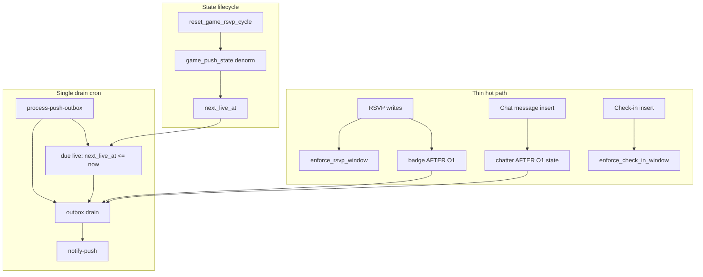
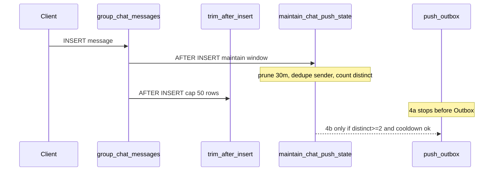

# Incremental push refactor (derisked v2)

Reference: archived spec in [intent-aligned-push-refactor-plan.md](intent-aligned-push-refactor-plan.md), lessons from revert + [scripts/supabase-rollback-push-plan.sql](../scripts/supabase-rollback-push-plan.sql).

## Progress

| Phase | Status | Shipped |
| ----- | ------ | ------- |
| **1** — Chat push removal | **Done** | `8e637d5` — no per-message push; bell “Game alerts”; `notify-chat` removed |
| **2a** — Cancel push + outbox infra | **Done** | `3c7ad9f` — migrations `032`–`034`; [phase-2a-cancel-push-runbook.md](phase-2a-cancel-push-runbook.md) |
| **2b-i** — Enforce hygiene | **Done** | `b9ec2aa` — migration `035` |
| **2b-ii** — Push state lifecycle | **Done** | migration `036`; `npm run verify:2b-ii-push-state` |
| **2b-ii-client** — Scoped client fetch | **Done** | `fetchRsvpsForGame` / `fetchCheckInsForGame`; patch merge in `useAppData` |
| **2b-iii** — Badge enqueue | **Done** | migrations `037`–`038`; `npm run verify:2b-iii` |
| **2b** | **Done** | pregame badge stack |
| **3a** — Phase live push | **Done** | migration `039`; `npm run verify:3a-phase-live` |
| **3b** — Live badge milestones | **Done** | migration `040`; `npm run verify:3b-live-badge` |
| **3c** — Check-in + pregame surge pushes | **Done** | `041`; [phase-3c plan](phase-3c-check-in-pushes-plan.md) |
| **3** — Live pushes *(3a → 3b → 3c)* | **Done** | 3c supersedes 3b live RSVP badges |
| **4** — Chatter *(4a → 4b)* | **In progress** | 4a `042` shipped |
| **5** — Announcements *(5a → 5b)* | Pending | — |
| Group limits *(orthogonal)* | Pending | — |

**Next up:** Phase 4b (chatter enqueue, migration `043`).

## Goals

- Organize by **feature phase** — each phase is **end-to-end testable** before moving on.
- Keep **RSVP and check-in transactions thin**; offload push work to outbox + async drain.
- **Event-based badge push** on RSVP tier upgrade (not badge cron scan).
- **Phase 1** chat removal → **Phase 2** pregame (cancel + badge) → **Phase 3** live → **Phase 4** chatter → **Phase 5** announcements.
- Prefer **event-driven or precomputed-time discovery** over scanning all games/groups; **one drain cron** for delivery only.
- Avoid v1 traps: no `SUM` / `COUNT(DISTINCT)` on hot paths, no push logic on `name`-only updates, no full-`fetchAppData` subscription for announcements.
- **Baseline hygiene (pre-push):** single occurrence computation per enforce write; atomic `game_push_state` reset on cycle rollover; narrow check-in/guest UPDATE triggers.
- **Client hygiene (Phase 2b-ii-client):** replace full `fetchAppData()` after RSVP/check-in with scoped per-game fetch + merge; required before 2b-iii latency gate.

## Push discovery model (one processor)

All features share **one** `process-push-outbox` run every 1–2 min. Each tick:

1. **Drain** queued `push_outbox` rows → `notify-push`
2. **Due live pushes** — `game_push_state.next_live_at <= now()` (indexed, no `is_game_live` scan)
3. *(Optional fallback only)* reconcile badge/chatter state if event path missed a row


| Feature       | Discovery (ideal)                                    | Delivery   |
| ------------- | ---------------------------------------------------- | ---------- |
| Badge         | RSVP AFTER trigger, O(1) headcount delta; latest-milestone coalescing | Drain cron |
| Live excitement | Same RSVP trigger in live window (1.5× / 2× target) | Drain cron |
| Cancel        | `games` status trigger                               | Drain cron |
| Live          | **Precomputed `next_live_at`** due on drain tick     | Drain cron |
| Chatter       | **Chat AFTER INSERT**, O(1) `chat_push_state` update | Drain cron |
| Announcements | Admin RPC                                            | Drain cron |


**Do not** add separate cron jobs per feature. **Do not** use per-game one-shot pg_cron schedules (high ops cost for weekly recurrence + admin edits).

## Hot-path design principles

RSVP and live check-in are tap-and-expect-instant actions. Everything below applies **before** adding badge push.

### What stays on the write path (minimal)


| Path                                            | Allowed work                                                                                          | Why                                      |
| ----------------------------------------------- | ----------------------------------------------------------------------------------------------------- | ---------------------------------------- |
| **RSVP** `enforce_rsvp_window` (BEFORE)         | One `games` row read; **one** `get_current_occurrence_start`; cycle + lock from that timestamp        | Product rules — must block invalid RSVPs |
| **Check-in** `enforce_check_in_window` (BEFORE) | One `games` row read; **one** occurrence; live + cycle from that timestamp                            | Product rules — check-in only while live |
| **Badge push** (AFTER, Phase 2b-iii)            | O(1) `game_push_state` delta; tier compare; **stub** outbox row on upgrade only — **no `games` read** | Event-driven; denormalized state         |
| **Chatter push** (AFTER, Phase 4)               | Bounded `chat_push_state` update; stub outbox only when threshold + cooldown pass                     | No `COUNT(DISTINCT)` per message         |


### What must be offloaded (never on RSVP/check-in/chat send transaction)

- Web Push / `notify-push` calls
- `SUM(1 + plus_ones)` over all `rsvps` per tap
- `COUNT(DISTINCT sender_id)` over `group_chat_messages` per tap
- `is_rsvp_open_for_game` chains when BEFORE enforce already proved pregame
- `is_game_live` scans over all games (use `next_live_at` due check instead)
- **Full push copy** (title/body/tag/url) — materialize on drain, not in triggers
- **Second `games` SELECT** in badge AFTER trigger (denormalize onto `game_push_state` instead)
- Full client `fetchAppData()` after every RSVP/check-in (see Phase 2b-ii-client below)

### Enforce trigger deduplication (migration `035`, Phase 2b-i)

Today `enforce_rsvp_window` calls `get_current_occurrence_start`, then `is_rsvp_locked` which calls it **again**. Check-in does the same via `is_game_live` + a separate cycle compare.

**Refactor both enforce functions** to compute occurrence once and derive rules inline:

```sql
-- RSVP: after loading games row
v_occurrence := get_current_occurrence_start(v_weekday, v_start_time, v_timezone, NOW());
-- cycle stale check: v_stored_cycle IS DISTINCT FROM v_occurrence
-- locked while live: NOW() >= v_occurrence AND NOW() < v_occurrence + INTERVAL '12 hours'

-- Check-in: same v_occurrence
-- live window: NOW() >= v_occurrence AND NOW() < v_occurrence + INTERVAL '3 hours'
-- cycle match: NEW.cycle_at IS DISTINCT FROM v_occurrence → reject
```

Same product rules; fewer function calls. Cools RSVP/check-in **before** badge push lands.

### Trigger hygiene (migration `035_hot_path_triggers.sql`, Phase 2b-i)

**RSVP `rsvps_enforce_window`** — narrow UPDATE firing + deduped occurrence math:

```sql
BEFORE INSERT OR DELETE ON rsvps
BEFORE UPDATE OF plus_ones, bringing_kit, game_id, user_id ON rsvps
```

Skips [renameRsvps](../src/lib/data.js) (`UPDATE name` only), which today re-fires enforce across every row.

**Badge `rsvps_push_badge`** — separate AFTER trigger, headcount columns only:

```sql
AFTER INSERT OR DELETE ON rsvps
AFTER UPDATE OF plus_ones ON rsvps
```

**Check-in** — narrow UPDATE (same name-only problem via [renameRsvps](../src/lib/data.js)):

```sql
BEFORE INSERT OR DELETE ON game_check_ins
BEFORE UPDATE OF plus_ones, bringing_kit, game_id, user_id, cycle_at ON game_check_ins
```

**Guests** — narrow UPDATE on `game_guests` if name-only updates exist. **No push trigger** on check-in or guests; live push uses `next_live_at` on drain tick.

**Chat** (Phase 4) — separate AFTER INSERT trigger on `group_chat_messages` only (see Phase 4).

### `game_push_state` lifecycle (denormalize + atomic cycle reset)

Extend `game_push_state` (PK `game_id`, `cycle_at`) with push-hot fields copied from `games` when the row is created or reset:


| Column            | Purpose                                            |
| ----------------- | -------------------------------------------------- |
| `rsvp_headcount`  | Incremental headcount (O(1) delta)                 |
| `last_badge_milestone` | Highest milestone already **sent or superseded** this cycle (see milestone ladder) |
| `last_phase`      | Live push dedup per cycle                          |
| `next_live_at`    | Precomputed live push time                         |
| `group_id`        | Outbox routing — no `games` read in badge trigger  |
| `target`          | Tier thresholds — no `games` read in badge trigger |
| `game_status`     | Short-circuit badge when `'cancelled'`             |


**Initialize or reset in one place** — extend [reset_game_rsvp_cycle](../supabase/schema.sql) (called from `reset_stale_game_cycles`) to upsert the new-cycle row:

```sql
-- After DELETE rsvps / check-ins / guests and UPDATE games.rsvp_cycle_at
INSERT INTO game_push_state (game_id, cycle_at, group_id, target, game_status,
  rsvp_headcount, last_badge_milestone, last_phase, next_live_at, updated_at)
VALUES (p_game_id, p_cycle, v_group_id, v_target, v_status,
  0, NULL, NULL, p_cycle, NOW())
ON CONFLICT (game_id, cycle_at) DO UPDATE SET
  rsvp_headcount = 0, last_badge_milestone = NULL, last_phase = NULL,
  next_live_at = EXCLUDED.next_live_at, target = EXCLUDED.target,
  game_status = EXCLUDED.game_status, updated_at = NOW();
```

Also refresh `group_id`, `target`, `game_status`, `next_live_at` on `admin_upsert_game` and when status → `cancelled` (clear/skip `next_live_at`).

Avoids lazy-init races on “first RSVP of cycle”; badge trigger only touches `game_push_state` + outbox.

### Incremental headcount (replaces `compute_rsvp_headcount` on hot path)

On each headcount-changing RSVP (AFTER trigger):

- INSERT: `+ (1 + NEW.plus_ones)`
- DELETE: `- (1 + OLD.plus_ones)` (no downgrade push; still update count + `last_badge_milestone`)
- UPDATE `plus_ones`: delta only

Derive milestone from `rsvp_headcount` + denormalized `target` (pregame tiers match [gameBadge.js](../src/utils/gameBadge.js); live tiers extend the ladder below).

### Badge milestone ladder (pregame + live)

Monotonic ranks per cycle — subscriber should only ever **move up** the ladder, never receive downgrade pushes.


| Rank | Milestone ID   | Threshold                         | When eligible                          | Push body (draft)                                              |
| ---- | -------------- | --------------------------------- | -------------------------------------- | -------------------------------------------------------------- |
| 0    | `not`          | below almost                      | —                                      | *(no push)*                                                    |
| 1    | `almost`       | `>= max(1, target - 2)`           | **pregame only** (`NOW() < cycle_at`)  | *(existing almost copy — TBD in materialize)*                  |
| 2    | `go`           | `>= target`                       | **pregame only**                       | *(existing “game on” copy — TBD in materialize)*               |
| 3    | `live_some`    | `>= ceil(target * 1.5)`           | **live window only** (see Phase 3b)    | Game is on with some subs!                                     |
| 4    | `live_full`    | `>= ceil(target * 2)`             | **live window only**                   | Game is on with full sub lines! The game is hot!               |


Live window: `NOW() >= cycle_at AND NOW() < cycle_at + interval '3 hours'` (same window as check-in). Integer thresholds use `ceil` on `target * multiplier`.

**Headcount source:** same `rsvp_headcount` delta as pregame. Note: RSVP INSERT/DELETE is locked during live, so live crossings usually come from `plus_ones` updates or counts already past threshold at live start — Phase 3b should **catch up** on live-window entry if headcount already qualifies (see Phase 3b).

**Early exits (common path):**

- `game_status = 'cancelled'` → return immediately
- Compute `new_milestone` from headcount + phase gate (pregame vs live window)
- If `rank(new_milestone) <= rank(last_badge_milestone)` → update count only, no enqueue
- Enqueue **upgrade only** → stub outbox row (`badge_almost` \| `badge_go` \| `badge_live_some` \| `badge_live_full`)

### Milestone coalescing (latest-only)

If headcount crosses **multiple milestones** before the outbox drains (e.g. `not` → `almost` → `go` in rapid RSVPs, or `go` → `live_some` → `live_full` during live), the subscriber receives **one** push for the **highest** milestone only — never intermediate tiers.

Applies to **badge-family** events only (`badge_almost`, `badge_go`, `badge_live_some`, `badge_live_full`). Does **not** coalesce `phase_live`, `game_cancelled`, chatter, or announcements.

**Implementation (hot path stays O(1)):**

1. **State:** `last_badge_milestone` stores the highest milestone already handled this cycle (sent or superseded).
2. **On enqueue:** `supersede_pending_badge(game_id, new_rank)` — delete or skip-drain any **unprocessed** `push_outbox` rows for the same `game_id` + cycle with lower badge rank before inserting the new stub.
3. **On drain:** if multiple badge rows for the same game survive in one batch, materialize and deliver **max rank only**; mark lower rows skipped.

**Example:** count jumps `not` → `almost` → `go` before drain → user gets **one** `badge_go` push, not `almost` + `go`.

Optional nightly or cron **reconcile** `SUM(rsvps)` vs `rsvp_headcount` (off hot path) if paranoid about drift.

### Thin outbox enqueue (Phase 2a — `032`)

Triggers and RPCs insert a **minimal** `push_outbox` row:

```sql
-- Stub only on write path
(group_id, game_id, event_type, exclude_subscriber_ids)
-- payload JSONB NULL or { "materialize": true }
```

**Materialize** title/body/tag/url in `process-push-outbox` (or `notify-push`) when draining — copy lives in one place (SQL or shared TS), latency does not block taps. Profile on staging; if stub + drain is still heavy, keep copy in SQL but only on drain path.

### Client scoped fetch (Phase 2b-ii-client — required before 2b-iii)

Today [upsertRsvp](../src/lib/data.js) / [upsertCheckIn](../src/lib/data.js) await full [fetchAppData](../src/lib/data.js) (groups, games, **all** RSVPs, check-ins, guests). UI already optimizes locally in [useAppData.js](../src/hooks/useAppData.js) before persist; the refetch often dominates perceived latency.

**2b-ii-client** (client-only PR, no SQL migration) ships scoped fetch so the **2b-iii RSVP latency gate** measures badge enqueue—not a five-table refetch on every tap. See [#### Phase 2b-ii-client](#phase-2b-ii-client--scoped-client-fetch) for scope, E2E, and rollback.

**In scope:** RSVP + check-in write paths; scoped Realtime on `rsvps` / `game_check_ins`.

**Out of scope (still full `fetchAppData()`):** `renameRsvps`, guest writes, bootstrap/refresh, groups/games Realtime.

Do **not** add new full-refetch paths on RSVP/check-in. Announcements (Phase 5) use scoped fetch per plan.

### Async delivery (still cron, not RSVP-blocking)

`process-push-outbox` cron every 2 min drains `push_outbox` → `notify-push`. Badge is **discovered on RSVP**; **delivered** async (typically seconds to ~2 min). Acceptable tradeoff to keep RSVP thin.

**Fallback:** if staging shows RSVP regression after Phase 2b-iii, drop badge enqueue and revert to badge **cron scan** without removing 2b-ii state or outbox infra.

## Feature phases at a glance


| Phase  | Status  | Feature                                             | E2E pass criterion                                                                |
| ------ | ------- | --------------------------------------------------- | --------------------------------------------------------------------------------- |
| **1**  | **Done** | Chat push removal                                   | Send chat → no OS notification; bell still registers subscriptions                |
| **2a** | **Done** | Game cancelled push                                 | Admin cancels game → subscriber gets one push (background)                        |
| **2b** | **Implemented** *(staging E2E pending)* | Pregame badge push *(4 PRs: 2b-i → 2b-ii → 2b-ii-client → 2b-iii)* | RSVP crosses almost/go → one coalesced push per burst (latest milestone only)     |
| **3**  | **Done** | Live game push *(2 PRs: 3a → 3b)*                   | 3a: “Game is live” at start; 3b: 1.5× / 2× headcount excitement pushes in live window |
| **4**  | Pending | Chat chatter push *(2 PRs: 4a → 4b)*                | 2+ senders in 30 min → ≤1 summary push/hour; chat send stays instant              |
| **5**  | Pending | Announcements *(2 PRs: 5a → 5b)*                    | Admin posts → banner on focused game + OS push to subscribers                     |


**Orthogonal (anytime after Phase 2a):** group limits.

### Release order

```text
[✓ 1] → [✓ 2a] → [✓ 2b-i] → [✓ 2b-ii] → [✓ 2b-ii-client] → [2b-iii impl] → 3a → 3b → 4a → 4b → 5a → 5b

                 └─ pregame badge stack ─────────┘   └─ live ─┘   └─ chatter stack ─┘

Orthogonal: group limits anytime after 2a
```

**Migration numbering:** Phase 2a shipped `032`–`034` (outbox, cancel trigger, cron). Phase 2b DB migrations are `035` (2b-i), `036` (2b-ii), `037` (2b-iii), `038` (enqueue overload hotfix). **2b-ii-client** has no migration. Phase 3: `039` (3a live start), `040` (3b live milestones).

### PR sub-phases (isolate risky hot-path changes)

Split **medium-risk** phases so each PR changes **one layer**: hygiene → state → client fetch → enqueue (2b); live start → live milestones (3a → 3b). Do **not** split Phases **1** or **2a** further (already small). Phase **3** splits only into **3a** (scheduled live start) and **3b** (live headcount milestones).


| PR         | Ships                                                                                                            | Risk           | Gate before next PR                                                    |
| ---------- | ---------------------------------------------------------------------------------------------------------------- | -------------- | ---------------------------------------------------------------------- |
| **2b-i**         | `035` — deduped enforce + narrow RSVP/check-in/guest UPDATE triggers                                             | **Low**        | RSVP/check-in latency unchanged or better; `renameRsvps` skips enforce |
| **2b-ii**        | `036` — `game_push_state` denorm + `reset_game_rsvp_cycle` hooks; optional headcount-only AFTER (**no enqueue**) | **Low–Medium** | Cycle reset creates correct rows; headcount matches RSVPs              |
| **2b-ii-client** | *(no migration)* — scoped RSVP/check-in fetch + merge in [data.js](../src/lib/data.js) / [useAppData.js](../src/hooks/useAppData.js) | **Low**        | Network: 1 write + 1 scoped read per tap; two-device same-game sync   |
| **2b-iii**       | `037` — badge AFTER trigger + stub enqueue + milestone coalescing (pregame `almost`/`go` only)                 | **Medium**     | **RSVP latency gate** + pregame badge E2E + coalescing burst test      |
| **2b-iii hotfix** | `038` — drop duplicate `enqueue_push_event` overload; explicit 5-arg calls for `badge_go` / `game_cancelled` | **Low**        | RSVP at `go` threshold (headcount ≥ target) succeeds                    |
| **3a**           | `039` — `next_live_at` due-live step in processor → `phase_live`                                               | **Low**        | One “Game is live” push per cycle                                      |
| **3b**           | `040` — live-window milestone branches (`badge_live_some`, `badge_live_full`) + live-entry catch-up            | **Low–Medium** | 1.5× / 2× pushes; rapid crossing → latest only; check-in path instant  |
| **3c**           | `041` — pregame `rsvp_*` surge + live `checkin_*` milestones; `guest_phase`; drop 3b RSVP-live path          | **Medium**     | `npm run verify:3c-checkin-badge`; redeploy `process-push-outbox`        |
| **4a**           | `042` — `chat_push_state` + AFTER INSERT state-only trigger                                                      | **Low–Medium** | Chat send instant; window state correct                                |
| **4b**           | `043` — enqueue branch on chatter trigger                                                                        | **Medium**     | **Chat latency gate** + chatter E2E                                    |
| **5a**           | `044` — announcements table + banner/composer UI                                                                 | **Low–Medium** | Banner E2E; no push yet                                                |
| **5b**           | `045` — announcement push RPC                                                                                    | **Low**        | Admin post → banner + OS push                                          |


**Dependency rule:** 2b-iii requires **2b-ii** (`game_push_state` exists) **and 2b-ii-client** (scoped fetch so latency gate is meaningful). 2b-i should ship before 2b-iii (isolates enforce regressions). **3b** requires **2b-iii** (badge trigger + coalescing); **3a** can ship before 3b. 4b requires 4a.

## Risk levels


| Phase  | Status  | Risk       | Primary concern                                                         |
| ------ | ------- | ---------- | ----------------------------------------------------------------------- |
| 1      | **Done** | Low–Medium | Stops chat push; deletes `notify-chat`                                  |
| 2a     | **Done** | Low–Medium | First push pipeline + cancel trigger                                    |
| 2b-i   | **Done** | Low        | Enforce refactor — no new push behavior                                 |
| 2b-ii        | **Done** | Low–Medium | State lifecycle — writes on cycle reset, optional headcount maintenance |
| 2b-ii-client | **Done** | Low        | Scoped client fetch — merge per-game RSVP/check-in; no DB changes       |
| 2b-iii       | **Implemented** | Medium     | Badge enqueue on RSVP — **RSVP latency gate** + E2E pending on staging |
| 3a     | **Done** | Low        | `next_live_at` due check on drain (not full-game scan) |
| 3b     | **Done** | Low–Medium | Live headcount milestones on RSVP trigger — same coalescing rules |
| 4a     | **Done** | Low–Medium | Chat state on insert — no notifications yet                             |
| 4b     | Pending | Medium     | Chatter enqueue — **chat send latency gate**                            |
| 5a     | Pending | Low–Medium | Carousel banner UI                                                      |
| 5b     | Pending | Low        | Admin-only announcement push RPC                                        |


## Architecture (v2)




**Key changes:** deduped enforce math; badge reads only `game_push_state`; stub outbox on write; no full-game scans; no `COUNT(DISTINCT)` on chat; **one drain** materializes copy + delivers + due live checks.

---

## Phase 1 — Chat push removal ✅

**Status: Done** (`8e637d5`) · **Risk: Low–Medium**

**Ship:** stop per-message push; rename bell to “Game alerts”; delete `notify-chat`. Subscriptions still register; nothing auto-sends until Phase 2a.

### Changes


| Area   | What                                                                                                                                                                   |
| ------ | ---------------------------------------------------------------------------------------------------------------------------------------------------------------------- |
| Client | Remove `notifyChatPush` from [usePresence.js](../src/hooks/usePresence.js) and [push.js](../src/lib/push.js)                                                           |
| Client | Bell copy + `disc-check-push-changed` in [GroupChatPushButton.jsx](../src/components/games/GroupChatPushButton.jsx), [useChatAlerts.js](../src/hooks/useChatAlerts.js) |
| Edge   | Delete [notify-chat](../supabase/functions/notify-chat/index.ts) from repo + Supabase                                                                                  |


### E2E test

- [ ] Chat works in-app; **no** per-message push
- [ ] Bell shows “Game alerts”; on/off updates `push_subscriptions`
- [ ] RSVP/check-in latency unchanged vs baseline
- [ ] `notify-chat` absent from Supabase

### Rollback

Restore `notifyChatPush` + bell copy; redeploy `notify-chat` + Vercel.

---

## Phase 2 — Pregame status pushes

### Phase 2a — Game cancelled (+ shared push infrastructure) ✅

**Status: Done** (`3c7ad9f`, migrations `032`–`034`) · **Risk: Low–Medium**

**Ship:** `notify-push`, outbox, drain cron, and first auto-push (`game_cancelled`). Check-in path untouched.


| Area   | What                                                                                                                                                                                           |
| ------ | ---------------------------------------------------------------------------------------------------------------------------------------------------------------------------------------------- |
| Edge   | [pushSend.ts](../supabase/functions/_shared/pushSend.ts), [notify-push](../supabase/functions/notify-push/index.ts), [process-push-outbox](../supabase/functions/process-push-outbox/index.ts) |
| DB     | `032_push_outbox.sql` — outbox + stub `enqueue_push_event`                                                                                                                                     |
| DB     | `033_game_cancelled_push.sql` — thin `games` status trigger → stub outbox only                                                                                                                 |
| DB     | `034_push_outbox_cron.sql` — drain cron **materializes copy** then calls `notify-push`                                                                                                         |
| Client | `buildGameDeepLink`, SW gate, deep links, [gameBadge.js](../src/utils/gameBadge.js)                                                                                                            |
| Docs   | [.env.example](../.env.example), [phase-2a-cancel-push-runbook.md](phase-2a-cancel-push-runbook.md)                                                                                            |


#### E2E test

See [phase-2a-cancel-push-runbook.md](phase-2a-cancel-push-runbook.md) for step-by-step verification, SQL queries, and troubleshooting.

- [ ] Manual `notify-push` + manual `enqueue_push_event` work
- [ ] **Admin cancel → push (background)**
- [ ] RSVP/check-in latency unchanged

---

### Phase 2b — Pregame badge (four PRs)

**Ship:** event-based badge via incremental headcount. **No badge cron scan.** Split so enforce hygiene, state lifecycle, and client scoped fetch land before enqueue-on-RSVP.

---

#### Phase 2b-i — Enforce hygiene only ✅

**Status: Done** (`b9ec2aa`, migration `035`) · **Risk: Low**


| Area | What                                                                                                         |
| ---- | ------------------------------------------------------------------------------------------------------------ |
| DB   | Deduped `enforce_rsvp_window` + `enforce_check_in_window` (single occurrence per write)                      |
| DB   | Narrow UPDATE on `rsvps`, `game_check_ins`, `game_guests` (skip name-only [renameRsvps](../src/lib/data.js)) |


**No** `game_push_state` changes. **No** badge trigger. **No** new push behavior.

##### E2E test

- [ ] RSVP/check-in latency unchanged or improved vs baseline
- [ ] `renameRsvps` does **not** fire RSVP or check-in enforce triggers
- [ ] Invalid RSVP/check-in still rejected correctly

##### Rollback

[scripts/supabase-rollback-035-hot-path-triggers.sql](../scripts/supabase-rollback-035-hot-path-triggers.sql)

---

#### Phase 2b-ii — Push state lifecycle (no enqueue) ✅

**Status: Done** (migration `036`) · **Risk: Low–Medium**


| Area | What                                                                                                                       |
| ---- | -------------------------------------------------------------------------------------------------------------------------- |
| DB   | Extend `game_push_state`: `rsvp_headcount`, `group_id`, `target`, `game_status`, `last_badge_milestone` (see lifecycle section) |
| DB   | Atomic upsert in `reset_game_rsvp_cycle`; refresh on `admin_upsert_game` + cancel                                          |
| DB   | Optional: `trg_rsvps_maintain_headcount` AFTER trigger — O(1) delta + `last_badge_milestone` update **only**, no outbox insert  |


##### E2E test

**Automated (Phase 2b-ii):** read-only headcount sync against live Supabase ([`scripts/verify-2b-ii-push-state.mjs`](../scripts/verify-2b-ii-push-state.mjs)).

Prerequisites: migration `036` applied; `.env.local` with `VITE_SUPABASE_URL` + `SUPABASE_SERVICE_ROLE_KEY`.

```bash
# All games with rsvp_cycle_at
npm run verify:2b-ii-push-state

# Single game
VERIFY_GAME_ID=g1 npm run verify:2b-ii-push-state
```

Pass: every game prints `OK … headcount=N` and script exits 0. Fails if current-cycle `game_push_state` row is missing or `rsvp_headcount` ≠ live `SUM(1 + plus_ones)`.

**Manual**

- [ ] Weekly cycle reset / admin save creates or zeros the **current** `game_push_state` row (`rsvp_headcount = 0`, milestones `NULL`); older `cycle_at` rows may keep historical headcounts
- [ ] After RSVP, re-run `npm run verify:2b-ii-push-state` — headcount matches
- [ ] RSVP latency unchanged (headcount maintenance is cheap)

**SQL spot-check** (current cycle only — `actual_headcount` repeats per joined row; compare `push_headcount` where `is_current`):

```sql
SELECT
  gps.cycle_at,
  (gps.cycle_at = g.rsvp_cycle_at) AS is_current,
  gps.rsvp_headcount AS push_headcount,
  CASE WHEN gps.cycle_at = g.rsvp_cycle_at THEN
    (SELECT COALESCE(SUM(1 + plus_ones), 0) FROM rsvps r WHERE r.game_id = g.id)
  END AS actual_headcount
FROM games g
JOIN game_push_state gps ON gps.game_id = g.id
WHERE g.id = 'YOUR_GAME_ID'
ORDER BY gps.cycle_at DESC;
```

##### Rollback

[scripts/supabase-rollback-036-game-push-state.sql](../scripts/supabase-rollback-036-game-push-state.sql)

---

#### Phase 2b-ii-client — Scoped client fetch ✅

**Status: Done** (`caa68bd`) · **Risk: Low** · **Migration:** *(none — client-only PR)*

| Area   | What                                                                                                                                 |
| ------ | ------------------------------------------------------------------------------------------------------------------------------------ |
| Client | `fetchRsvpsForGame`, `fetchCheckInsForGame` in [data.js](../src/lib/data.js); write paths return per-game patches, not `fetchAppData()` |
| Client | `applyGamePatch` merge in [useAppData.js](../src/hooks/useAppData.js); scoped Realtime on `rsvps` / `game_check_ins` (debounced per `game_id`) |
| Client | Unchanged: guest writes, bootstrap `refresh()`, groups/games Realtime → full `fetchAppData()`; `renameRsvps` → 2 writes + local patch only |

##### E2E test

**Code-complete** (shipped in `caa68bd`). **Staging sign-off** still recommended before 2b-iii latency gate:

- [ ] RSVP upsert/cancel feels instant; Network tab shows **one** `rsvps` write + **one** scoped `rsvps?game_id=eq.…` read (not groups/games/check_ins/guests)
- [ ] Check-in/check-out same pattern on `game_check_ins`
- [ ] Device B sees Device A’s RSVP on shared game card (scoped Realtime merge)
- [x] `renameRsvps` still works (2 writes only; local name patch — no `fetchAppData`) — verified in code
- [x] Bootstrap / manual refresh unchanged — verified in code

##### Rollback

Revert [data.js](../src/lib/data.js) + [useAppData.js](../src/hooks/useAppData.js) to `fetchAppData()` on RSVP/check-in writes and full Realtime refresh.

---

#### Phase 2b-iii — Badge enqueue

**Status: Implemented** (migration `037` — staging E2E + latency gate pending) · **Risk: Medium** · **Migration:** `037_badge_push_trigger.sql`

##### Pre-implementation sanity check (2026-06)

Reviewed against `036`, `032`–`034`, [pushMaterialize.ts](../supabase/functions/_shared/pushMaterialize.ts), [gameBadge.js](../src/utils/gameBadge.js), and 2b-ii-client (`caa68bd`). **Plan is sound** — proceed with 2b-iii as scoped below.

| Check | Verdict |
| ----- | ------- |
| Prerequisites (2b-ii state + 2b-ii-client scoped fetch) | **Met** — `game_push_state` + headcount trigger shipped; client hot path no longer full-refetches |
| Hot-path O(1) headcount + milestone compare | **Sound** — tiers match `gameBadge.js` (`almost` = `max(1, target - 2)`, `go` = `target`) |
| Pregame-only scope in 2b-iii; live tiers in 3b | **Sound** — keeps 2b-iii PR medium-risk; avoids live-window edge cases in first enqueue PR |
| Stub outbox + drain materialize | **Sound** — matches cancel push pattern; copy stays off RSVP transaction |
| Milestone coalescing (latest-only) | **Required** — not implemented yet; must ship in `037` (see implementation notes) |
| Website / client integrity | **OK** — no client changes required; RSVP enforce (035) unchanged; scoped fetch isolates latency gate |

**Implementation notes (optimize without integrity loss):**

1. **Extend `maintain_rsvp_push_headcount()`** in `037` — do **not** add a second AFTER trigger on `rsvps`. One function: headcount delta (already in `036`) + pregame milestone compare + conditional `enqueue_push_event`. Avoids double trigger invocation and duplicate `games` reads.
2. **`games` read honesty** — `036` already does one indexed `SELECT` from `games` per headcount-changing RSVP to resolve `rsvp_cycle_at`. 2b-iii should add **no second** `games` read. Latency gate: confirm total stays at one PK lookup (or refactor to `game_push_state` JOIN `games` once and reuse `target` / `game_status` / `group_id` from denorm).
3. **`last_badge_milestone`** — column exists but is not updated in `036`; `037` must set it on upgrade (and when superseding), not on downgrade/cancel-only count changes.
4. **`supersede_pending_badge(game_id, new_rank)`** — implement on enqueue: delete or mark skipped unprocessed `push_outbox` badge rows for same `game_id` with lower rank **before** inserting stub. Add **drain-side safety net** in [process-push-outbox](../supabase/functions/process-push-outbox/index.ts): per batch, for badge-family `event_type`s, deliver max rank per `game_id` only.
5. **`enqueue_push_event` from trigger** — same `SECURITY DEFINER` pattern as [033_game_cancelled_push.sql](../supabase/migrations/033_game_cancelled_push.sql); pregame gate: `game_status <> 'cancelled'` and `NOW() < cycle_at` (occurrence / `rsvp_cycle_at`).
6. **Edge** — add `badge_almost` / `badge_go` to [pushMaterialize.ts](../supabase/functions/_shared/pushMaterialize.ts) (currently only `game_cancelled`). Tag: `disc-check-badge-{gameId}` per archived spec.
7. **Rollback** — drop enqueue + supersede helper + milestone updates from maintain function; headcount-only path from `036` remains.

**Deferred to later phases** (not missing — scoped out of 2b-iii):

| Item | Phase | Notes |
| ---- | ----- | ----- |
| `phase_live` enqueue at scheduled start | **3a** | `next_live_at` due-live step in drain; separate from badge family |
| `badge_live_some` / `badge_live_full` SQL enqueue | **3b** | Live-window branches on same RSVP trigger; materialize bodies |
| Live-entry catch-up (headcount already ≥ 1.5×/2× at live start) | **3b** | Hook from 3a `last_phase := 'live'` or first live-window headcount eval |
| Nightly headcount reconcile | **Optional** | Orthogonal integrity backstop |

**Handled in 2b-iii without SQL downgrade:**

- **`last_badge_milestone` stays monotonic** on RSVP cancel (no column downgrade in trigger). Pending outbox rows that no longer match headcount/phase are skipped by **drain stale check** (computed milestone from `rsvp_headcount` + `target`). Re-upgrade to same tier same cycle still does not re-enqueue (`v_new_rank <= v_last_rank`) — by design.
- **Live-tier stale logic** ships in [badgePush.ts](../supabase/functions/_shared/badgePush.ts) ahead of 3b so live rows drain correctly once 3b enqueues them.

| Area   | What                                                                                                               |
| ------ | ------------------------------------------------------------------------------------------------------------------------------------ |
| DB     | [037_badge_push_trigger.sql](../supabase/migrations/037_badge_push_trigger.sql) — extend `maintain_rsvp_push_headcount`; `supersede_pending_badge`; helpers `badge_milestone_rank`, `compute_pregame_badge_milestone`; optional stub `payload` on `badge_almost` (`headcount_at_enqueue`, `target_at_enqueue`) |
| Edge   | [pushMaterialize.ts](../supabase/functions/_shared/pushMaterialize.ts) — `badge_almost`, `badge_go`; [process-push-outbox](../supabase/functions/process-push-outbox/index.ts) — batch coalesce, stale skip (fail-closed on stale-read errors), delivery retry (max 12 attempts) |
| Client | **Requires 2b-ii-client** (`caa68bd`) — no client changes in this PR                                   |

**Deploy:** apply `037` + `038` on staging → redeploy `process-push-outbox` edge function → run E2E + latency gate below.

**Hotfix `038`:** `037` added a 5-arg `enqueue_push_event` without dropping the `032` 4-arg overload — RSVP at `go` (headcount ≥ target) failed with `function enqueue_push_event is not unique`. `038` drops the old overload and uses explicit 5-arg calls for `badge_go` and `game_cancelled`.

**Delivery retry:** drain leaves `processed_at` null when all subscription sends fail; stores `payload.attempts` and retries on next cron tick (~2 min per cron tick, not back-to-back). Rows with `attempts >= 12` are abandoned (marked processed). No subscribers (`attempted === 0`) counts as success. **Stale badge rows** (cancelled game, outside pregame/live window, wrong phase for event type, or row tier ≠ **current computed milestone** from `rsvp_headcount` + `target` — pregame `almost`/`go`, live `live_some`/`live_full`) are marked processed without send. Stale-read DB errors fail **closed** (skip send, mark processed).

**Verify:** `npm run verify:2b-iii-badge-outbox` — lists unprocessed badge rows; exits 1 if any are stale. Run **after** at least one drain tick (or invoke `process-push-outbox` manually) so stale rows are already cleared; a non-zero exit right after enqueue may mean “wait for drain,” not a deploy failure.

##### RSVP latency gate (required before prod)

On staging, compare **before/after** 2b-iii:

- [ ] RSVP upsert/cancel UI feels instant (subjective + no new errors)
- [ ] Check-in tap latency unchanged
- [ ] Badge path adds **no second** `games` SELECT beyond the existing headcount maintain lookup (one PK read total)

##### E2E test

- [ ] **RSVP crosses almost or go → one badge push** (after outbox drain)
- [ ] **Rapid burst** `not` → `almost` → `go` before drain → **one** `go` push (coalescing)
- [ ] No badge push when milestone unchanged (extra RSVP at same tier)
- [ ] No pregame badge push during live/ended/cancelled game
- [ ] No duplicate push same milestone/cycle

##### Rollback

[scripts/supabase-rollback-037-badge-push.sql](../scripts/supabase-rollback-037-badge-push.sql) — headcount-only maintain, drop badge helpers, clear `last_badge_milestone`, delete unprocessed badge outbox rows. Fallback: badge cron scan on processor without removing outbox.

**Phase 2 complete** when 2a + 2b-i/ii/ii-client/iii E2E and **2b-iii** latency gate pass — then set `completed_phases` to include `2b-iii` and `next` to `3a`.

---

## Phase 3 — Live game pushes (two PRs)

**Ship:** (3a) scheduled “Game is live” at start; (3b) excitement pushes when headcount crosses **1.5×** and **2×** target during the live window. Both use existing drain cron — **not** `is_game_live()` scan of all games, **not** per-game pg_cron jobs, **not** on check-in writes.

**Requires:** 2b-iii (badge trigger + milestone coalescing). 3b extends the same RSVP AFTER trigger with live-window gates.

### How `next_live_at` is set

Write `game_push_state.next_live_at = get_current_occurrence_start(weekday, start_time, timezone)` when:

- **Cycle reset** — `reset_game_rsvp_cycle` upserts new-cycle `game_push_state` (see lifecycle section)
- Game created/updated ([admin_upsert_game](../supabase/schema.sql))
- After a live push fires → schedule **next** occurrence for the following cycle
- Status → `cancelled` → clear or skip `next_live_at` on current-cycle row

---

#### Phase 3a — “Game is live” at start

**Status: Done** (migration `039`) · **Risk: Low** · **Migration:** `039_phase_live_scheduled.sql`

**Deferred from 2b-iii:** `phase_live` is intentionally not enqueued in `037` — pregame badge stack stays isolated. Drain coalesce/stale/retry from 2b-iii applies to `phase_live` only where relevant (`phase_live` is not badge-family; no milestone coalesce).

**Feeds 3b:** optional live-entry hook after `last_phase := 'live'` to evaluate live badge catch-up (see 3b).

### Drain tick (inside `process-push-outbox`)

```sql
-- Pseudocode: indexed lookup, not scan all games
WHERE next_live_at <= now()
  AND last_phase IS DISTINCT FROM 'live'
  AND cycle_at = current_cycle_for_game
→ stub enqueue `phase_live` (copy materialized on drain)
→ last_phase := 'live'
-- optional hook for 3b: evaluate live milestone catch-up if headcount already >= 1.5x/2x
```


| Area | What                                                                                                                              |
| ---- | --------------------------------------------------------------------------------------------------------------------------------- |
| DB   | [039_phase_live_scheduled.sql](../supabase/migrations/039_phase_live_scheduled.sql) — `enqueue_due_phase_live_events()` RPC (indexed `next_live_at` lookup) |
| Edge | [process-push-outbox](../supabase/functions/process-push-outbox/index.ts) — call RPC before outbox drain; [pushMaterialize.ts](../supabase/functions/_shared/pushMaterialize.ts) — `phase_live` copy |

**Deploy:** apply `039` → redeploy `process-push-outbox` → `npm run verify:3a-phase-live`.

Lag is at most one drain interval (~2 min). **DB work per tick is O(due games)** not O(all open games).

##### E2E test

- [ ] At scheduled start → one “Game is live” push per cycle
- [ ] Admin changes `start_time` → `next_live_at` updates; push follows new time
- [ ] Cancelled game → no live push
- [ ] Check-in during live window still instant
- [ ] Deep link `?game=` works

##### Rollback

Drop `next_live_at` logic from processor; remove schedule hooks.

---

#### Phase 3b — Live headcount excitement pushes

**Status: Done** (migration `040`) · **Risk: Low–Medium** · **Migration:** `040_live_badge_milestones.sql`

**Deferred from 2b-iii** (edge already shipped; 3b adds SQL enqueue + copy):

| Already in 2b-iii | 3b still to ship |
| ----------------- | ---------------- |
| Drain badge coalesce (`winningBadgeRowIds`) | Live-window branches in `maintain_rsvp_push_headcount` |
| Stale skip for live tiers (`badgePush.ts` computed milestone + phase gate) | `enqueue_push_event` for `badge_live_some` / `badge_live_full` |
| `supersede_pending_badge` includes live event types | Live-entry catch-up when headcount already ≥ 1.5×/2× at live start |
| Delivery retry / abandon after 12 attempts | [pushMaterialize.ts](../supabase/functions/_shared/pushMaterialize.ts) — `badge_live_some`, `badge_live_full` bodies |

| Area | What                                                                                                                                 |
| ---- | ------------------------------------------------------------------------------------------------------------------------------------ |
| DB   | Extend badge AFTER trigger: when in **live window** (`NOW() >= cycle_at AND NOW() < cycle_at + 3h`), evaluate `live_some` (`ceil(target * 1.5)`) and `live_full` (`ceil(target * 2)`) |
| DB   | **Live-entry catch-up:** when `last_phase` becomes `live` (3a) or on first headcount eval in live window, enqueue highest uncrossed live milestone if headcount already qualifies |
| DB   | Reuse `supersede_pending_badge` + drain coalesce — rapid `live_some` + `live_full` before drain → **one** `live_full` push          |
| Edge | Materialize only — coalesce/stale/retry unchanged from 2b-iii                                                                        |

**Copy:**

- `badge_live_some` — “Game is on with some subs!”
- `badge_live_full` — “Game is on with full sub lines! The game is hot!”

**Deploy:** apply `040` → **redeploy `process-push-outbox`** (adds `badge_live_some` / `badge_live_full` materialize) → `npm run verify:3b-live-badge`. Without the redeploy, live rows enqueue but drain skips them as unknown event types.

##### E2E test

- [x] Live catch-up at `live_full` threshold (`try_enqueue_live_badge_upgrade` RPC)
- [x] `live_some` enqueue when headcount at 1.5×
- [x] Upgrade `live_some` → `live_full` supersedes pending `live_some`
- [x] No duplicate enqueue when milestone already recorded
- [ ] During live window, headcount crosses 1.5× via RSVP/plus_ones → one `badge_live_some` push (after drain)
- [ ] During live window, headcount crosses 2× → one `badge_live_full` push (after drain)
- [ ] `phase_live` and live milestone pushes can both occur same cycle (separate event types)
- [ ] Check-in tap latency unchanged

##### Rollback

[scripts/supabase-rollback-040-live-badge.sql](../scripts/supabase-rollback-040-live-badge.sql) — drop live-milestone branches; keep 3a `phase_live`.

**Superseded by 3c** — do not ship 3b-only behavior on new environments; use `041` instead.

---

#### Phase 3c — Check-in milestones + pregame surge

**Status: Implemented** (migration `041`, local) · **Risk: Medium** · **Migration:** `041_checkin_badge_milestones.sql`

**Replaces 3b:** live 1.5× / 2× excitement now tracks **check-in headcount** (check-ins + plus-ones + live walk-ins), not locked RSVP count. **Adds** pregame 1.5× / 2× (`rsvp_surge_some` / `rsvp_surge_full`) on RSVP + pregame named guests during the RSVP window.

| Phase | Headcount | Events |
| ----- | --------- | ------ |
| Pregame | `rsvp_headcount + pregame_guest_count` | `rsvp_almost` → `rsvp_go` → `rsvp_surge_some` → `rsvp_surge_full` |
| Live | `checkin_headcount` | `checkin_almost` → `checkin_go` → `checkin_live_some` → `checkin_live_full` |

Renames pregame `badge_*` → `rsvp_*`. Separate coalescing per family (`last_badge_milestone` vs `last_checkin_badge_milestone`). Pregame named guests via `game_guests.guest_phase = 'pregame'` (add after RSVP).

**Live-entry catch-up:** `enqueue_due_phase_live_events` calls `try_enqueue_checkin_badge_upgrade` after `phase_live` when check-in headcount already qualifies (mirrors retired 3b RSVP catch-up, but on check-in counters).

**DB guest guards:** `enforce_guest_window` requires ≥1 RSVP before pregame guest insert and ≥1 check-in before live walk-in insert (game-level; client still enforces per-user RSVP/check-in).

**Deploy:** apply `041` → **redeploy `process-push-outbox`** → `npm run verify:3c-checkin-badge` (+ `verify:2b-iii` for pregame almost/go; `verify:2b-ii-push-state` for counter reconcile).

##### Rollback

[scripts/supabase-rollback-041-checkin-badge.sql](../scripts/supabase-rollback-041-checkin-badge.sql) — restores 040 RSVP-live-window behavior; drops check-in triggers.

---

## Phase 4 — Chat chatter summary push (two PRs)

**Implementation plan:** [phase-4a-chat-push-state-plan.md](phase-4a-chat-push-state-plan.md)

**Ship:** event-driven discovery on message insert — **no** group-wide cron scan, **no** `COUNT(DISTINCT)` over `group_chat_messages` on the hot path.

### Design review (4a) — soundness, performance, integrity

**Verdict:** Splitting **4a (state only)** from **4b (enqueue)** remains the right shape — same pattern as 2b-ii → 2b-iii. The incremental `chat_push_state` approach still satisfies cross-cutting hot-path rules and fits the existing insert path in [`chatMessages.js`](../src/lib/chatMessages.js) (single `INSERT`, no client push hook).

| Concern | Assessment |
| ------- | ---------- |
| **Performance** | One `chat_push_state` row upsert per message — O(1) I/O, bounded in-memory work. No scan of `group_chat_messages`. Coexists with existing `trim_group_chat_messages_after_insert` (trim stays table-maintenance only). |
| **Integrity** | **Do not cap raw events** (50 messages from one sender is fine; 50 events with 2 senders could evict the first sender and under-count). **Dedupe by `sender_id`**: upsert `{sender_id, at}`; repeat messages refresh `at` only. Cap **distinct senders** (e.g. 20) after prune, dropping oldest `at`. Recompute `distinct_sender_count` from the array after prune (≤20 iterations). |
| **Concurrency** | `SELECT … FOR UPDATE` on `chat_push_state` inside `SECURITY DEFINER` trigger function serializes per-group bursts. |
| **4a scope** | Create full table including `last_push_at` (NULL, unused until 4b). **No** `push_outbox` writes, **no** `last_push_at` updates in 4a. |
| **4b readiness** | Cooldown + enqueue live in the **same** trigger function behind `distinct >= 2` fast-path exit; set `last_push_at` only when enqueueing. Materialize `chat_chatter` copy on drain in [`pushMaterialize.ts`](../supabase/functions/_shared/pushMaterialize.ts). |
| **Doc hygiene** | Next migration after `041` is **`042`** (4a), not `037`/`041` — those numbers are taken. |



### `chat_push_state` (per `group_id`) — shared by 4a + 4b

**Table (migration `042`):**

| Column | Purpose |
| ------ | ------- |
| `group_id` | PK, FK → `groups` |
| `window_senders` | JSONB array of `{sender_id, at}` — **one entry per sender** in the rolling window |
| `distinct_sender_count` | Cached count after each maintain (recomputed, not increment-only) |
| `last_push_at` | Cooldown anchor for 4b; untouched in 4a |
| `updated_at` | Audit |

**`maintain_chat_push_state(p_group_id, p_sender_id)`** on each `group_chat_messages` INSERT:

1. Upsert row; `FOR UPDATE` the `chat_push_state` row
2. Prune entries with `at < now() - 30 minutes`
3. If `p_sender_id` already in array → update its `at`; else append (then enforce max distinct senders cap by dropping oldest `at`)
4. Set `distinct_sender_count` from array length
5. **Fast path (4a + 4b):** if `distinct_sender_count < 2` → return
6. **4b only:** if `last_push_at` is NULL or `> 1 hour` ago → `enqueue_push_event('chat_chatter', …)` + set `last_push_at = now()`

Trigger: `AFTER INSERT ON group_chat_messages` only (never UPDATE/DELETE). Name e.g. `group_chat_messages_maintain_push_state` — separate from trim trigger.

---

#### Phase 4a — Chat state only (no push)

**Risk: Low–Medium** · **Migration:** `042_chat_push_state.sql`


| Area | What                                                                                       |
| ---- | ------------------------------------------------------------------------------------------ |
| DB   | `chat_push_state` table + `maintain_chat_push_state` with steps 1–5 only — **no outbox, no `last_push_at` write** |
| Edge | None (4a is DB-only)                                                                       |
| Verify | `npm run verify:4a-chat-push-state` — latency smoke + distinct-window assertions       |


##### E2E test

- [ ] Send message feels instant vs baseline
- [ ] No OS push of any kind
- [ ] One sender × many messages → `distinct_sender_count = 1`
- [ ] Two senders within 30 min → `distinct_sender_count = 2`
- [ ] After 31 min idle, prune drops stale senders

##### Rollback

`scripts/supabase-rollback-042-chat-push-state.sql` — add with 4a impl; drop trigger + function; keep or drop table.

---

#### Phase 4b — Chatter enqueue

**Risk: Medium** · **Migration:** `043_chat_chatter_enqueue.sql`


| Area | What                                                                                                                     |
| ---- | ------------------------------------------------------------------------------------------------------------------------ |
| DB   | Enable step 6 in `maintain_chat_push_state` (enqueue + `last_push_at`)                                                   |
| Edge | `chat_chatter` case in [`pushMaterialize.ts`](../supabase/functions/_shared/pushMaterialize.ts); redeploy `process-push-outbox` |


**Optional fallback:** processor reconcile for missed groups (off hot path).

##### Chat latency gate (required before prod)

- [ ] Send message still feels instant vs baseline
- [ ] No per-message OS push

##### E2E test

- [ ] 2+ distinct senders in 30 min → ≤1 summary push/hour
- [ ] Single sender → no chatter push
- [ ] Cooldown respected across bursts

##### Rollback

Remove enqueue branch from trigger; 4a state maintenance remains.

**Phase 4 complete** when 4a + 4b E2E and **4b** latency gate pass.

---

## Phase 5 — Announcements (two PRs)

---

#### Phase 5a — Banner UI

**Risk: Low–Medium** · **Migration:** `043_game_announcements.sql`


| Area   | What                                                                                                                                            |
| ------ | ----------------------------------------------------------------------------------------------------------------------------------------------- |
| DB     | `game_announcements` table + Realtime publication                                                                                               |
| Client | Focused-slide banner + composer in [GroupGamesScreen.jsx](../src/screens/GroupGamesScreen.jsx); scoped fetch — no 7th full-refetch subscription |


##### E2E test

- [ ] Admin post → banner appears on focused game slide
- [ ] No carousel regressions; **no** OS push yet

##### Rollback

Drop table + UI.

---

#### Phase 5b — Announcement push

**Risk: Low** · **Migration:** `044_announcement_push.sql`


| Area | What                                                            |
| ---- | --------------------------------------------------------------- |
| DB   | `admin_post_game_announcement` RPC → stub outbox `announcement` |


##### E2E test

- [ ] Admin post → banner + OS push

##### Rollback

Drop RPC enqueue; banner from 5a remains.

**Phase 5 complete** when 5a + 5b E2E pass.

---

## Orthogonal — Group limits

**Risk: Low–Medium** — anytime after Phase 2a.


| Area | What                        |
| ---- | --------------------------- |
| DB   | `045_group_game_limits.sql` |


---

## Orthogonal — Client post-write fetch (RSVP / check-in)

**Risk: Low** — anytime after Phase 1; **recommended before Phase 2b-iii** so RSVP latency gates measure the real user path.


| Area   | What                                                                                                                                          |
| ------ | --------------------------------------------------------------------------------------------------------------------------------------------- |
| Client | [data.js](../src/lib/data.js) — `upsertRsvp`, `cancelRsvp`, `upsertCheckIn`, `cancelCheckIn` return scoped data or void; caller applies patch |
| Client | [useAppData.js](../src/hooks/useAppData.js) — keep optimistic local update; merge Realtime deltas; avoid full `fetchAppData()` on every tap   |


#### E2E test

- [ ] RSVP/check-in UI still correct for other users via Realtime
- [ ] No regression when offline / Realtime delayed (define fallback: single-game refetch or retry)

#### Rollback

Restore `return fetchAppData()` on write helpers.

---

## Cross-cutting rules

1. **Do not start the next PR/sub-phase** until that PR’s E2E passes; **2b-iii** and **4b** additionally require latency gates on staging.
2. **Hot path rule:** triggers on `rsvps`, `game_check_ins`, or `group_chat_messages` must be O(1) or bounded — never full-table aggregates.
3. **Enforce rule:** one `get_current_occurrence_start` per enforce invocation — no nested `is_rsvp_locked` / `is_game_live` recompute.
4. **State rule:** `game_push_state` is the single source for badge hot path; reset atomically on cycle rollover; denormalize `group_id`, `target`, `game_status`.
5. **Outbox rule:** stub row on write; materialize push copy on drain — never block taps on string formatting; badge-family rows **coalesce to latest milestone** when multiple tiers cross before drain (pregame and live).
6. **Discovery rule:** use events or precomputed `next_*_at` due checks — not scans of all games/groups.
7. **One drain cron** for delivery + due live; no per-feature cron jobs.
8. **Name-only UPDATE** must not fire enforce or push triggers (RSVP, check-in, guests).
9. **Per-phase rollback SQL** alongside forward migrations.
10. **Staging Supabase** required before Phase 2a; **2b-ii-client** required before **2b-iii**; **latency gates** for **2b-iii** (RSVP) and **4b** (chat).
11. **Sub-phase rule:** one layer per PR — hygiene, then state, then client scoped fetch, then enqueue — for medium-risk hot paths.

## Migration / rollback map


| PR / phase     | Status  | Migration           | Rollback                                                              |
| -------------- | ------- | ------------------- | --------------------------------------------------------------------- |
| 1              | **Done** | *(client + edge)*   | Restore `notifyChatPush` + redeploy `notify-chat`                     |
| 2a             | **Done** | `032`, `033`, `034` | `scripts/supabase-rollback-032-push-outbox.sql` + drop cancel trigger |
| 2b-i           | **Done** | `035`               | [scripts/supabase-rollback-035-hot-path-triggers.sql](../scripts/supabase-rollback-035-hot-path-triggers.sql) |
| 2b-ii          | **Done** | `036`               | [scripts/supabase-rollback-036-game-push-state.sql](../scripts/supabase-rollback-036-game-push-state.sql) |
| 2b-ii-client   | **Done** | *(none)* `caa68bd` | Revert [data.js](../src/lib/data.js) + [useAppData.js](../src/hooks/useAppData.js) to full fetch |
| 2b-iii         | **Implemented** | `037`               | [scripts/supabase-rollback-037-badge-push.sql](../scripts/supabase-rollback-037-badge-push.sql) |
| 2b-iii hotfix  | **Done** | `038`               | Re-apply `037` overload mistake manually if rolled back               |
| 3a             | **Done** | `039`         | [scripts/supabase-rollback-039-phase-live.sql](../scripts/supabase-rollback-039-phase-live.sql) |
| 3b             | **Done** | `040`               | [scripts/supabase-rollback-040-live-badge.sql](../scripts/supabase-rollback-040-live-badge.sql) |
| 3c             | **Done** | `041`               | [scripts/supabase-rollback-041-checkin-badge.sql](../scripts/supabase-rollback-041-checkin-badge.sql) |
| 4a             | **Done** | `042`               | [scripts/supabase-rollback-042-chat-push-state.sql](../scripts/supabase-rollback-042-chat-push-state.sql) |
| 4b             | Pending | `043`               | Remove enqueue branch from `maintain_chat_push_state`               |
| 5a             | Pending | `044`               | Drop `game_announcements` + UI                                        |
| 5b             | Pending | `045`               | Drop announcement RPC enqueue                                         |
| Group limits   | Pending | `046`               | Drop constraint + revert RPC                                          |


Use **030+** (026–029 in remote history). One migration file per deployable sub-phase where possible.

## Out of scope

- `phase_starting_soon` push
- Badge downgrade push on RSVP cancel
- Separate push per intermediate milestone when a higher milestone is also crossed before drain (coalescing sends latest only)
- Push triggers on `game_check_ins` (live uses `next_live_at`, not check-in)
- Per-game one-shot pg_cron schedules
- Full-game `is_game_live` / badge scans on drain tick (except optional off-path reconcile)
- `game_calls` / host override

