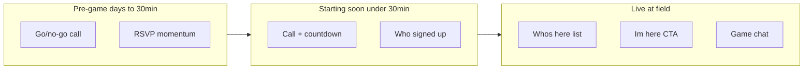
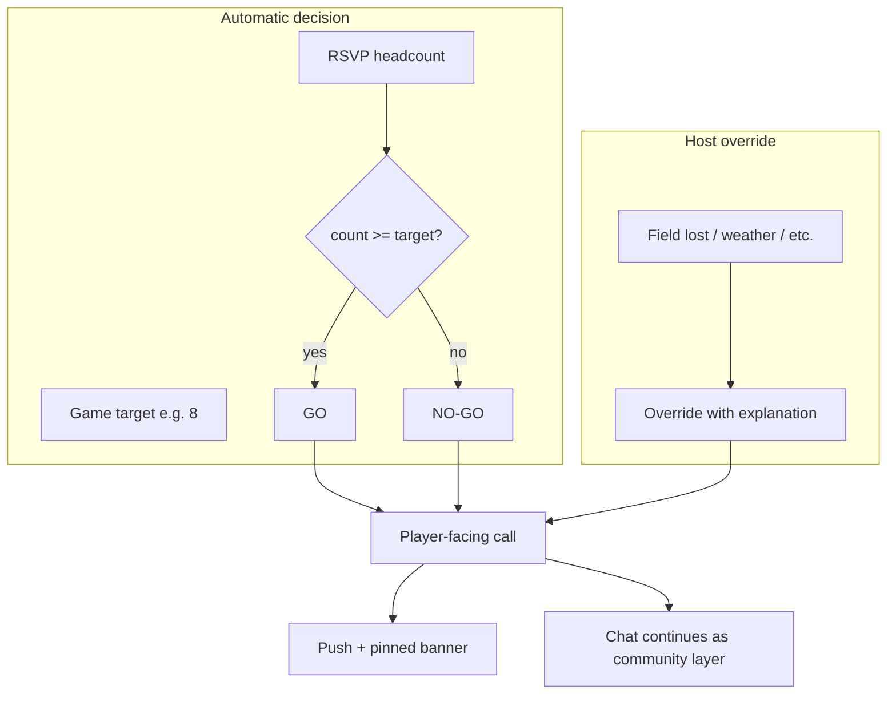

# DiscCheck design refresh — intent-first plan

## Assessment: does the site stay focused on the original intent?

**Partially.** The engineering matches the core problem (RSVP headcount, weekly recurring games, live check-in, realtime updates). The **product story and hierarchy** have drifted toward a polished RSVP dashboard with chat bolted on, rather than a **host coordination + player encouragement** tool.

| Your intent | Current state | Gap |
|-------------|---------------|-----|
| Automatic go/no-go from target count | [`StatusBadge.jsx`](src/components/games/StatusBadge.jsx) computes GAME ON / ALMOST / NOT YET from `count >= target` | Works, but labels are terse and **not explained**; `getCommitPressureCopy()` in [`commitCopy.js`](src/utils/commitCopy.js) (`Need N more for a go`) is **never surfaced** |
| Host override for external reasons | Admin can set `games.status = 'cancelled'` only ([`GameFormModal.jsx`](src/components/games/GameFormModal.jsx)) | No override when count says GO; no **reason/explanation** field; cancel reads as permanent game status, not “this week’s call” |
| Stop chasing numbers via email/text | Realtime RSVPs + name chips + toasts | No **deadline**, no **broadcast** when status flips, push only for chat ([`GameChatPushButton.jsx`](src/components/games/GameChatPushButton.jsx)) |
| Multiple weekly recurring games | Strong: [`schema.sql`](supabase/schema.sql) + [`gameSchedule.js`](src/utils/gameSchedule.js) | Landing works; **single-game auto-redirect** ([`GamesLandingScreen.jsx`](src/screens/GamesLandingScreen.jsx) L32–36) skips any group-wide context |
| Welcoming chat/banter/encouragement | Chat + presence cursors ([`usePresence.js`](src/hooks/usePresence.js), [`PresenceLayer.jsx`](src/components/presence/PresenceLayer.jsx)) | Chat is generic; cursor mode adds complexity with little value — **remove**; keep thread + `ChatBar` only |
| Host broadcasts crucial announcements | Chat only | **No pinned/host message** distinct from banter |
| Intuitive for all backgrounds | Design tokens exist ([`DESIGN.md`](DESIGN.md)) but jargon labels (GAME ON, ALMOST, NOT YET) and dual chat modes (cursor vs thread) add cognitive load | Need **plain language**, one chat pattern, consistent components |

**Copy drift:** PWA manifest in [`vite.config.js`](vite.config.js) says “disc golf”; README and game types are ultimate/goaltimate.

**Verdict:** The bones are right — especially the **compact layout** ([`GameCommitStrip`](src/components/games/GameCommitStrip.jsx) + [`GameChatThread`](src/components/presence/GameChatThread.jsx) + [`ChatBar`](src/components/presence/ChatBar.jsx)) and **live check-in** ([`LivePickupPanel`](src/components/games/LivePickupPanel.jsx), “I'm here” in [`GameDetailActions`](src/components/games/GameDetailActions.jsx)). What’s missing is making the UI **phase-aware on phone**, **design-system consistent**, and **understandable without tech literacy**.

**Audience:** People of all backgrounds who share an interest in playing frisbee — not developers, not power users. Copy and UI patterns should assume zero app literacy.

**Mobile traffic assumption:** Design **compact layout first** (viewports &lt;768px per [`DESIGN.md`](DESIGN.md)); wide/desktop is an enhancement, not the primary comp.

---

## Design north star

**One primary question per game phase** — the UI shifts as start time approaches (people check more often closer to game time):

| Phase | When | Primary question | Hero UI (mobile) |
|-------|------|------------------|------------------|
| **Pre-game** | Days → ~30 min before start | Is this week’s game on? | Call panel + RSVP count + Count me in |
| **Starting soon** | Within [`STARTING_SOON_MS`](src/utils/gameSchedule.js) (30 min) | Still on? Anyone else coming? | Call panel + countdown + who signed up |
| **Live** | Start → 3h after ([`GAME_LIVE_MS`](src/constants/gameSchedule.js)) | Who’s already here? | **Who’s here** + **I'm here** CTA + **chat** |
| **Ended** | After live window | How’d it go? | Attended count (read-only) |

**Winter / in-car use case (live phase):** A player parked and waiting should be able to (1) tap **I'm here** once, (2) see who else has checked in without expanding panels, (3) chat from the pinned [`ChatBar`](src/components/presence/ChatBar.jsx) — **without leaving the car**. Chat is not a nice-to-have here; it’s how people coordinate arrival (“I'm in the north lot”, “Need 2 more before we walk over”).





---

## Design system as a product requirement

The existing system in [`DESIGN.md`](DESIGN.md) is solid — tokens, semantic theme roles, shared UI components. The refresh treats it as **non-negotiable infrastructure**, not polish at the end.

### Principles for techy and non-techy users alike

1. **Plain language over jargon** — Pair badge shorthand with a sentence humans read first:
   - Not just “NOT YET” → “**Not enough players yet** — need 2 more (8 to play)”
   - Not just “GAME ON” → “**This week’s game is on** — 8 signed up”
   - Buttons stay action verbs: “Count me in”, “I'm here”, “Cancel” (already good)

2. **One obvious action per screen** — Single primary CTA ([`Button`](src/components/ui/Button.jsx) `primary` + `block`); secondary actions visually quieter. Never two competing primary buttons.

3. **Reuse before invent** — New surfaces (`CallPanel`, `AnnouncementBanner`, `HostCallModal`) must compose existing primitives:
   - `.surface` cards, [`MetaRow`](src/components/ui/MetaRow.jsx), [`ProgressBar`](src/components/games/ProgressBar.jsx), [`ModalShell`](src/components/ui/ModalShell.jsx), [`ChipList`](src/components/ui/ChipList.jsx)
   - Colors via `--status-go-*`, `--call-*`, `--announcement-*` tokens — no one-off hex in components

4. **Predictable layout rhythm** — Same vertical stack on every game view: **status → details → people → action → chat**. Phase changes *emphasis*, not structure.

5. **Generous touch targets** — Phone-first: full-width CTAs, `--space-*` padding on interactive rows, body text ≥ `--font-body` (16px at lg, 13px compact minimum per tokens — consider bumping compact body to 14px if readability testing warrants it).

6. **Accessible by default** — Semantic headings (`h1`/`h2`), `aria-label` on icon buttons, status conveyed with text + color (not color alone). Extend [`DESIGN.md`](DESIGN.md) with an **intent checklist** section.

### New shared components (add to design system)

| Component | Purpose | Built from |
|-----------|---------|------------|
| `CallPanel` | This week’s go/no-go + host override + plain-language subline | `.surface`, status tokens, `getCommitPressureCopy()` |
| `AnnouncementBanner` | Pinned host broadcast (field change, weather note) | `.surface`, `--announcement-*` tokens |
| `GamePhaseShell` | Wraps compact vs wide detail; owns phase-based default expansion | Existing `GameCommitStrip` / `GameCard` |

Document these in [`DESIGN.md`](DESIGN.md) under “Game-specific layout” before implementing ad-hoc markup.

---

## Chat model: thread + ChatBar only (cursor mode removed)

**Decision:** Remove cursor speech-bubble chat entirely. One pattern on every viewport — scrollable [`GameChatThread`](src/components/presence/GameChatThread.jsx) + pinned [`ChatBar`](src/components/presence/ChatBar.jsx). Aligns with phone-first coordination and reduces cognitive load for non-technical users.

### What gets removed in Phase A

| File / area | Change |
|-------------|--------|
| [`PresenceLayer.jsx`](src/components/presence/PresenceLayer.jsx) | Delete component |
| [`App.jsx`](src/App.jsx) | Remove `PresenceLayer` mount; drop global keyboard capture for cursor chat |
| [`usePresence.js`](src/hooks/usePresence.js) | Remove cursor tracking, `broadcast("cursor")`, `chat_draft` positioning, ephemeral 3s bubble TTL; keep thread message send/receive + watching peers |
| [`useBreakpoint.js`](src/hooks/useBreakpoint.js) | Remove `isChatCursor`; keep `isWide` / `isCompact` only |
| [`breakpoints.js`](src/constants/breakpoints.js) | Remove `MQ_CHAT_CURSOR`, `BP_CHAT_CURSOR_MIN`, `MQ_CHAT_THREAD` if unused |
| [`constants/presence.js`](src/constants/presence.js) | Remove `getPresenceMode()` cursor branch |
| [`ChatBar.jsx`](src/components/presence/ChatBar.jsx) | Remove `isChatCursor` props/branches; always thread input |
| [`GameDetailScreen.jsx`](src/screens/GameDetailScreen.jsx) | Always render chat thread (remove `!isChatCursor` guard); show thread on wide layout beside `GameCard` |
| [`theme.js`](src/styles/theme.js) | Remove `.presence-cursor*`, `.speech-bubble*` styles |
| [`DESIGN.md`](DESIGN.md) | Replace dual chat table with single thread pattern |

**Keep:** “N watching” cluster ([`WatchingCluster`](src/components/presence/WatchingCluster.jsx)) if still useful for social proof — decoupled from cursor UI.

### Wide layout chat (≥768px)

[`GameCard`](src/components/games/GameCard.jsx) + chat thread side-by-side or below card — same UX as compact, more horizontal space. No type-anywhere keyboard listener.

---

## Information architecture refresh

### 1. Landing (`/`)

**Today:** Header + game cards only; no explainer.

**Refresh:**
- Add a compact **group intro strip** (1–2 sentences): what DiscCheck is, how go/no-go works, “all skill levels welcome.”
- Each [`GameListItem`](src/components/games/GameListItem.jsx) card leads with **This week’s call** in plain language (not badge-only), then count, then schedule.
- **Remove or soften single-game auto-redirect** — show landing briefly with wayfinding, or a dismissible “You have one game →” link instead of hard `replace` navigation.

### 2. Game detail (`/games/:id`) — phase-aware, mobile-first

The compact shell in [`GameDetailScreen.jsx`](src/screens/GameDetailScreen.jsx) is already the right structure (commit strip + thread + pinned chat bar). Refresh **what’s inside** and **default expansion** per phase.

#### Pre-game & starting soon

Reorder [`GameCommitStrip`](src/components/games/GameCommitStrip.jsx) / [`GameDetailHeader`](src/components/games/GameDetailHeader.jsx):

1. **`CallPanel`** (new shared component) — dominant block with plain-language headline + optional badge
2. **Countdown** — surface more prominently in starting-soon phase (`game-detail-panel--starting-soon`)
3. **Progress bar** + signed-up chips
4. **Primary CTA** — Count me in / Cancel

#### Live phase (priority shift on phone)

When `isGameLive` is true, **flip the hierarchy**:

1. **Who’s here** — always visible ([`LivePickupPanel`](src/components/games/LivePickupPanel.jsx))
   - Lead copy: “3 here · waiting on 2 more signed up”
2. **I'm here** CTA — pinned at bottom; one tap
3. **Chat thread** — fills viewport; labeled “Game chat”
   - Live empty-state: “In your car? Tap I'm here, then say hi.”
4. **`CallPanel`** collapses to compact status line during live

#### Wide layout (768px+, secondary)

[`GameCard`](src/components/games/GameCard.jsx) for layout density on laptop + **same thread chat** as mobile. Coordination UI identical — same `CallPanel`, same CTAs, same plain language.

### 3. Host tools (admin)

Extend admin UX beyond binary Cancel in [`GameFormModal.jsx`](src/components/games/GameFormModal.jsx):

- **“Post this week’s call”** — confirm automatic / override with required explanation
- **“Broadcast announcement”** — pinned message separate from banter
- Host controls use same [`ModalShell`](src/components/ui/ModalShell.jsx) + [`Field`](src/components/ui/Field.jsx) patterns as player-facing modals

---

## Data model additions

Extend [`supabase/schema.sql`](supabase/schema.sql) (new migration):

```sql
game_calls (
  game_id, cycle_at,
  decision TEXT CHECK (decision IN ('auto', 'go', 'no_go')),
  override_reason TEXT,
  posted_by TEXT,
  posted_at TIMESTAMPTZ
)

game_announcements (
  id, game_id, cycle_at,
  message TEXT NOT NULL,
  pinned BOOLEAN DEFAULT true,
  posted_by, posted_at
)
```

**Client resolution** (new `src/utils/gameCall.js`): host override → else automatic from count vs target.

---

## Notifications

| Event | Who gets push |
|-------|----------------|
| Automatic flip to GO | RSVPs + watchers with push enabled |
| Host override posted | Same |
| Pinned announcement | Same |
| Chat message | Existing behavior |

Rename “Chat notifications” UX to **“Game alerts”** — clearer for non-technical users.

---

## Community / welcoming layer (lightweight, intent-aligned)

| Touchpoint | Change |
|------------|--------|
| First visit | [`SignUpModal.jsx`](src/components/auth/SignUpModal.jsx) — “Pickup frisbee — all levels welcome. Just your first name.” |
| After RSVP | “You’re in! Say hi in chat or invite a friend.” |
| ALMOST state | “Almost there — need 1 more. Know someone who’d play?” |
| Empty chat (pre-game) | “Who’s in tonight?” / “First time? Ask anything.” |
| Empty chat (live) | “In the lot? Say hi.” / “Waiting on others — chat here.” |
| Live, not checked in | Subline under I'm here: “Let others know you've arrived” |

Warmth through **copy and timing**, not feature sprawl.

---

## Visual / token adjustments

- New semantic roles: `--call-go-*`, `--call-no-go-*`, `--call-override-*`, `--announcement-*`
- `CallPanel` uses `--font-display` for headline, `--font-body` for explanation
- Fix PWA description: “Weekly pickup ultimate RSVPs, go/no-go calls, and game chat.”
- Update [`DESIGN.md`](DESIGN.md) with: phase layout rules, chat model decision, inclusivity checklist

---

## What to keep unchanged

- Weekly schedule + 12h RSVP cycle
- RSVP / check-in / plus-ones / kit flows
- Supabase Realtime for RSVPs
- Multi-game list + sorting
- Token/theme architecture
- Open RLS model (trusted pickup group)

---

## Suggested implementation phases

### Phase A — Intent + design system (no backend)
- `CallPanel` component + plain-language copy; surface `getCommitPressureCopy`
- Mobile phase layouts (live hierarchy)
- Landing intro + card reorder
- Sign-up welcome + phase-specific chat prompts
- Fix disc golf → ultimate copy; soften single-game redirect
- PWA install nudge on compact landing
- **Remove cursor chat mode** (see table above)
- Extend [`DESIGN.md`](DESIGN.md) with intent checklist + new components

### Phase B — Host override + announcements
- DB migration + RPCs
- `AnnouncementBanner`, host modals (design-system compliant)
- Realtime subscription

### Phase C — Alerts + polish
- Push for call/announcement events (starting-soon + live weighted)
- Optional RSVP deadline + countdown
- Call panel tokens; optional “Alex is here” check-in push (toggle)

---

## Success checks

1. Host on phone → automatic call in plain language in **&lt;2 seconds**
2. Host override with reason in **&lt;30 seconds**
3. Player gets push when call changes — no email/text chase
4. **Non-technical newcomer** understands go/no-go from landing + join alone (no badge decoding)
5. **Live / in-car:** check in + chat in **&lt;10 seconds**, one-handed
6. **Starting soon:** countdown + headcount above the fold within 30 min of start
7. Chat = **parking lot**, not scoreboard
8. **Design system:** every new UI uses shared components/tokens — no one-off patterns in PR review
9. **One chat pattern** everywhere — thread + `ChatBar`; no cursor speech bubbles

---

## Migrations needed?

**Split by phase** — not everything requires the database.

| Phase | Migrations? | What |
|-------|-------------|------|
| **A** (UI, cursor removal, copy, call panel from headcount) | **No** | Frontend-only; uses existing `games`, `rsvps`, `check_ins`, `chat_messages` |
| **B** (host override + announcements) | **Yes** | New migration e.g. `024_game_calls_and_announcements.sql` in [`db/migrations/`](db/migrations/) + mirror in [`supabase/migrations/`](supabase/migrations/); update [`supabase/schema.sql`](supabase/schema.sql); admin RPCs for post/clear call and announcements; RLS policies; Realtime publication for new tables |
| **C** (push for calls/announcements) | **Maybe** | Edge function changes ([`supabase/functions/notify-chat/`](supabase/functions/notify-chat/)) — no new tables if reusing `push_subscriptions`; optional `rsvp_deadline` column only if that feature ships |

**Phase A PR is safe to preview against production Supabase** — no schema changes, same env vars.

**Phase B PR** needs the migration applied somewhere before host override UI works:
- Run migration on your Supabase project (SQL Editor or CLI), or
- Use a **staging Supabase project** for preview deployments (recommended if you want to avoid touching prod schema mid-review)

Existing pattern: numbered files through `023_game_chat_messages.sql` in both `db/migrations/` and `supabase/migrations/`.

---

## Preview via MR/PR (side-by-side)

**Yes — recommended approach:** one feature branch + pull request with **Vercel preview deployment**.

| Surface | Current | Refresh |
|---------|---------|---------|
| Production | `main` → your live Vercel URL | unchanged while reviewing |
| Preview | — | PR branch → Vercel **Preview** URL (automatic on push if GitHub + Vercel connected) |

Open both on your phone/desktop and compare directly.

### Suggested PR split (easier review + safer preview)

1. **PR 1 — Phase A** (`refresh/intent-phase-a`): cursor removal, `CallPanel`, mobile phases, copy — **no migrations**, full visual refresh previewable immediately
2. **PR 2 — Phase B** (`refresh/host-calls`): migration + host override + announcements — stack on PR 1 or merge A first
3. **PR 3 — Phase C** (`refresh/alerts`): push + deadline polish — optional follow-up

Single mega-PR is possible but harder to review; Phase A alone delivers most of the visible refresh.

### Local side-by-side (without Vercel)

```bash
# Terminal 1 — current main
git worktree add ../disc-check-main main
cd ../disc-check-main && npm run dev   # e.g. localhost:5173

# Terminal 2 — refresh branch
cd disc-check && git checkout refresh/intent-phase-a && npm run dev -- --port 5174
```

### To create the MR

When you’re ready to execute: create branch `refresh/intent-phase-a`, implement Phase A, push, `gh pr create` — Vercel attaches a preview link to the PR description. Say **“go ahead and implement Phase A”** (or the full plan) to start.
