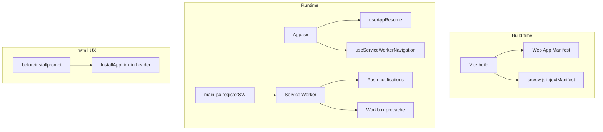

# PWA support

Reference for how DiscCheck works as a Progressive Web App: manifest, service worker, install flow, push notifications, and mobile/PWA-specific runtime behavior.

**Source of truth:** `vite.config.js`, `src/sw.js`, `src/main.jsx`, `src/utils/pwaInstall.js`, `src/lib/push.js`, `index.html`.

---

## 1. Architecture overview



DiscCheck is a Vite + React SPA deployed to Vercel. PWA support is layered on top via **vite-plugin-pwa** with a **custom service worker** (`injectManifest` strategy). The app works in a normal browser tab; installation adds standalone display, home-screen icon, and (on supported platforms) reliable push.

---

## 2. Build and web app manifest

Configured in `vite.config.js` via `VitePWA`:

| Setting | Value | Effect |
|---------|--------|--------|
| `strategies` | `"injectManifest"` | Custom SW at `src/sw.js`; Workbox injects precache manifest at build |
| `registerType` | `"autoUpdate"` | New builds update the SW when safe |
| `injectRegister` | `null` | Registration is manual in `src/main.jsx` |
| `filename` | `sw.js` | Output service worker filename |
| `display` | `"standalone"` | No browser chrome when installed |
| `orientation` | `"any"` | Portrait or landscape |
| `scope` / `start_url` | `/` | Installed app opens at site root |
| `theme_color` / `background_color` | `#0a0a0a` | Splash / status bar (overridden at runtime for light theme) |

**Icons** (referenced in manifest, served from build output):

- `pwa-192x192.png`
- `pwa-512x512.png` (also `purpose: "maskable"`)
- `icon.svg`, `apple-touch-icon.png` (`includeAssets`)

**Precache globs:** `**/*.{js,css,html,ico,png,svg,woff2}`

---

## 3. Service worker registration

`src/main.jsx` calls `registerSW` from `virtual:pwa-register` when **any** of:

1. **Production** — `import.meta.env.PROD`
2. **Local SW testing** — `VITE_ENABLE_SW=true` in `.env.local`
3. **Ngrok tunnel** — hostname includes `"ngrok"` (for device push testing)

```javascript
const shouldRegisterServiceWorker =
  import.meta.env.PROD ||
  import.meta.env.VITE_ENABLE_SW === "true" ||
  host.includes("ngrok");
```

**Dev default:** SW is **off** unless `VITE_ENABLE_SW=true`. See `.env.example`.

**Update behavior:** `onNeedRefresh` reloads the page when a new SW is ready — immediately if visible, or on next `visibilitychange` to `visible`.

---

## 4. Service worker responsibilities (`src/sw.js`)

| Feature | Behavior |
|---------|----------|
| **Precaching** | Workbox `precacheAndRoute(self.__WB_MANIFEST)` — caches built shell assets |
| **Cache cleanup** | `cleanupOutdatedCaches()` on activate |
| **Push** | `push` event → parse JSON payload → `showNotification` |
| **Notification click** | Focus existing client, `navigate` or `postMessage`, else `openWindow` |
| **Subscription change** | `pushsubscriptionchange` → `postMessage({ type: "push-subscription-change" })` to all clients |
| **Controlled activate** | `skipWaiting()` only on explicit `SKIP_WAITING` message from page |

**Install / activate:** Does not call `skipWaiting()` on install — avoids leaving a backgrounded PWA on stale assets mid-session.

**Notification payload fields:** `title`, `body`, `tag`, `url`, `groupId`. Icons use `/pwa-192x192.png`.

---

## 5. App ↔ service worker messaging

`src/hooks/useServiceWorkerNavigation.js` (wired in `App.jsx`):

| Message type | App action |
|--------------|------------|
| `notification-open` | React Router `navigate(pathname)` from notification `url` |
| `push-subscription-change` | Calls `resyncGroupChatPushSubscription()` for current group |

Push resync re-registers the browser subscription with Supabase when the SW detects a subscription rotation.

---

## 6. Install to home screen

### Prompt capture

`src/utils/pwaInstallPrompt.js` runs **before React mounts** (`initPwaInstallPromptCapture()` in `main.jsx`):

- Listens for `beforeinstallprompt` → `preventDefault()` → stores event
- Clears on `appinstalled`
- Pub/sub so `usePwaInstall` never misses an early prompt

### Install UI

`src/components/layout/InstallAppLink.jsx` — rendered in `AppHeader`:

- **Chrome / Android:** calls native `promptInstall()` → `deferredPrompt.prompt()`
- **iOS Safari:** no native prompt → modal with Share → Add to Home Screen steps
- Hidden when already installed or installing

### Standalone detection

`src/utils/pwaInstall.js` — `isStandaloneDisplay()`:

```javascript
window.matchMedia("(display-mode: standalone)").matches ||
window.matchMedia("(display-mode: fullscreen)").matches ||
window.navigator.standalone === true  // legacy iOS
```

Also exports `isIosDevice()`, `isAndroidDevice()`, `canOfferIosInstall()` (iOS + not standalone).

---

## 7. HTML and mobile shell (`index.html`)

| Meta / link | Purpose |
|-------------|---------|
| `viewport-fit=cover` | Notch / home indicator; enables `env(safe-area-inset-*)` |
| `interactive-widget=resizes-content` | Virtual keyboard resizes layout (not overlay-only) |
| `theme-color` | Browser / status bar color |
| `apple-mobile-web-app-capable` | iOS standalone mode |
| `apple-mobile-web-app-status-bar-style` | Status bar appearance |
| `apple-mobile-web-app-title` | Home screen label |
| `apple-touch-icon` | iOS home screen icon |
| Inline theme script | Reads `disc_theme` from localStorage; sets initial bg/text and meta before paint |

---

## 8. Layout tokens for installed apps

`src/styles/tokens.js`:

```javascript
"--safe-area-top": "env(safe-area-inset-top, 0px)",
"--safe-area-bottom": "env(safe-area-inset-bottom, 0px)",
"--safe-area-left": "env(safe-area-inset-left, 0px)",
"--safe-area-right": "env(safe-area-inset-right, 0px)",
"--app-height": "100dvh",
```

`src/styles/theme.js` applies safe-area padding to shell, header, chat bar anchor, and related layout. `useAppResume` overwrites `--app-height` with `visualViewport.height` for accurate PWA viewport sizing.

---

## 9. PWA runtime hooks

### `useAppResume` (`src/hooks/useAppResume.js`)

Used in `App.jsx`. Addresses mobile/PWA viewport and resume issues:

- **`syncAppHeight()`** — sets `--app-height` from `visualViewport` (fallback `innerHeight`)
- **`recoverPaint()`** — brief `translateZ(0)` nudge on `.app-shell` after resume
- **`visibilitychange`** → recover when tab/app becomes visible
- **`pageshow`** with `event.persisted` → full reload (BFCache)
- **Android + standalone:** extra `focus` listener for resume recovery

### `useServiceWorkerNavigation`

See section 5.

---

## 10. Web Push (PWA-gated features)

`src/lib/push.js` + `src/sw.js` + Supabase edge function `notify-chat`.

### Support checks (`getWebPushSupportState`)

Requires:

- `VITE_VAPID_PUBLIC_KEY` configured (not placeholder)
- `serviceWorker` + `PushManager` in browser
- **iOS:** must be **installed** (`isStandaloneDisplay()`); Safari tab alone is not enough

### Chat push bell

`canShowChatPushBell()` — bell UI only when **standalone + push supported**.

`GroupChatPushButton.jsx` uses this; iOS installed app gets additional UX copy.

### Subscription flow

1. User toggles bell → `Notification.requestPermission()`
2. `navigator.serviceWorker.ready` → `pushManager.subscribe()` with VAPID key
3. Row stored in Supabase `push_subscriptions`
4. Chat send → client calls `notify-chat` edge function → SW `push` → system notification
5. Sender's own endpoint excluded to avoid self-notifications

---

## 11. Deployment

`vercel.json`:

```json
{ "rewrites": [{ "source": "/(.*)", "destination": "/index.html" }] }
```

SPA fallback ensures client-side routes work when:

- Opening installed PWA at `/`
- Navigating from notification deep links
- Refreshing on `/groups/:id`

Build: `npm run build` → `dist/` with generated `manifest.webmanifest`, SW, and precache manifest.

---

## 12. Local development and testing

| Task | Command / config |
|------|-------------------|
| Normal dev | `npm run dev` — SW **off** |
| SW + push locally | Set `VITE_ENABLE_SW=true` in `.env.local` |
| Test on physical device | `npm run dev:ngrok` — SW auto-enables on ngrok host |
| VAPID keys | `npx web-push generate-vapid-keys` → `VITE_VAPID_PUBLIC_KEY` + edge function secrets |

Push also requires Supabase edge function secrets (`VAPID_PRIVATE_KEY`, etc.) — see `.env.example`.

---

## 13. What PWA does *not* provide

- **No offline-first data** — games, RSVPs, chat require network; SW precaches the app shell only
- **Install is optional** — core app works in browser tabs
- **Push is not universal** — desktop browsers vary; iOS requires home screen install
- **No home-screen badge counts** — notifications are banners only (badge logic removed)

---

## 14. File index

| Concern | File(s) |
|---------|---------|
| Manifest + build | `vite.config.js` |
| SW registration | `src/main.jsx` |
| SW logic | `src/sw.js` |
| Install prompt capture | `src/utils/pwaInstallPrompt.js` |
| Install hook + UI | `src/hooks/usePwaInstall.js`, `src/components/layout/InstallAppLink.jsx` |
| Standalone / platform | `src/utils/pwaInstall.js` |
| Push gating + subscribe | `src/lib/push.js`, `src/components/games/GroupChatPushButton.jsx` |
| Notification → route | `src/sw.js`, `src/hooks/useServiceWorkerNavigation.js` |
| Resume / viewport | `src/hooks/useAppResume.js`, `src/styles/tokens.js`, `src/styles/theme.js` |
| Mobile HTML shell | `index.html` |
| Deploy | `vercel.json` |
| Env vars | `.env.example` |

---

## 15. Related docs

- [`docs/walkthrough-overlay-mechanics.md`](walkthrough-overlay-mechanics.md) — UX walkthrough overlay (separate from PWA, but runs in installed app)
- [`README.md`](../README.md) — project setup and Supabase/Vercel deploy
