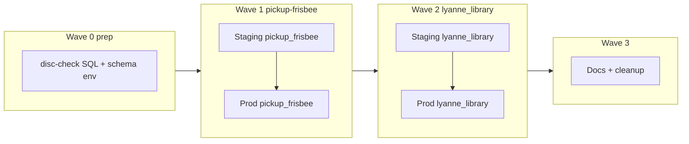
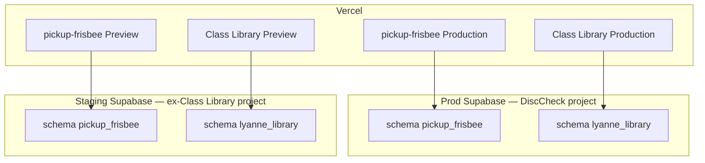

# Two-project Supabase migration

Consolidate **production** on the DiscCheck Supabase project (one Postgres schema per app) and **staging** on the ex–Class Library project. Migrate **pickup-frisbee first**, then **lyanne_library**. Both apps are wiped and re-seeded — no row migration.

Related repos:

| App | Repo | Schema |
|-----|------|--------|
| pickup-frisbee | this repo (`disc-check`) | `pickup_frisbee` |
| Class Library | `class-library` | `lyanne_library` |

---

## Progress

| Wave | Status | Notes |
|------|--------|-------|
| **0** — Repo prep | **Done** | `schema.sql` → `pickup_frisbee`; client + seed schema env; cron renames in migrations |
| **1a** — Staging database | **Done** | `iunqmpxp` — `pickup_frisbee` schema, seed, edge functions, crons |
| **1b** — Vercel Preview | **Manual step** | Set Preview env in [Vercel dashboard](https://vercel.com/achang0406s-projects/disc-check/settings/environment-variables) (CLI requires a feature branch) |
| **2** — lyanne_library staging → prod | Pending | After 1–2 stable days on prod |
| **3** — Docs + regression | Pending | |

---

## Strategy: one app at a time

Do **not** apply both schemas or cut over both Vercel Production apps in one window.

**Why sequential:**

- pickup-frisbee is harder (Realtime, RPCs, edge functions, pg_cron).
- lyanne_library is Postgres-only.
- Class Library **stays on its current Supabase project** until pickup-frisbee is stable on prod (Wave 2).



| Wave | Scope | Prod downtime |
|------|-------|---------------|
| **0** | disc-check repo only | None |
| **1** | pickup-frisbee only | pickup-frisbee prod (steps 1d–1f) |
| **2** | lyanne_library only | class-library prod (steps 2d–2e) |
| **3** | Docs + regression | None |

---

## Data policy

| App | Prod data | Approach |
|-----|-----------|----------|
| pickup-frisbee | Little to none — **wipe OK** | Fresh `pickup_frisbee` schema + `npm run db:seed` |
| Class Library | No users — **wipe OK** | Fresh `lyanne_library` schema + seed in `class-library` |

No `pg_dump`, no `ALTER TABLE … SET SCHEMA`, no row migration. Schema definitions live in git; re-seed anytime.

Optional: export prod hub backup before Wave 1d if you want a safety net — not required for data retention.

---

## Schema naming

| Use | Do not use |
|-----|------------|
| `pickup_frisbee` | `pickup-frisbee`, `disc-check`, `disc_check` |
| `lyanne_library` | `class_library`, `class-library` |

Postgres schema names cannot contain hyphens. App display names stay kebab-case.

---

## Supabase projects

| Project | Ref | Role |
|---------|-----|------|
| **DiscCheck** | `mczxxonwvsztbrqmjzlu` | **Prod hub** — edge functions, pg_cron, vault |
| **Class Library** | `iunqmpxpwhybqyfxcsdt` | **Staging** after Wave 1a; library prod until Wave 2e |

### During migration

| When | Prod hub (`mczxxonw`) | Class Library project (`iunqmpxp`) |
|------|----------------------|-----------------------------------|
| Before Wave 1 | disc-check in `public` | class-library in `public` (library prod) |
| After Wave 1 | `pickup_frisbee` | unchanged — still library prod |
| After Wave 2 | `pickup_frisbee` + `lyanne_library` | staging only — both schemas |

### Target end state



| | Prod hub | Staging project |
|--|----------|-----------------|
| pickup-frisbee | `pickup_frisbee` + seed | `pickup_frisbee` + test seed |
| Class Library | `lyanne_library` + seed | `lyanne_library` + test seed |
| Vercel Production | Prod hub URL + `VITE_SUPABASE_DB_SCHEMA` per app | — |
| Vercel Preview | — | Staging URL + same schema names |

---

## Wave 0 — Prep (disc-check repo; no deploy) ✓

**Goal:** SQL and client ready for `pickup_frisbee`. Class Library unchanged.

### Shipped in repo

- [`supabase/schema.sql`](../supabase/schema.sql) — full app in `pickup_frisbee` schema (tables, functions, RLS, Realtime, grants)
- [`src/lib/supabase.js`](../src/lib/supabase.js) — `VITE_SUPABASE_DB_SCHEMA` (defaults to `public` until cutover)
- [`scripts/seed.mjs`](../scripts/seed.mjs) + [`scripts/supabase-client.mjs`](../scripts/supabase-client.mjs) — schema-aware service client
- [`.env.example`](../.env.example) — documents schema env vars
- [`supabase/config.toml`](../supabase/config.toml) — exposes `pickup_frisbee` locally
- Cron migrations renamed/prepared: [`034`](../supabase/migrations/034_push_outbox_cron.sql), [`017`](../supabase/migrations/017_server_cycle_reset_twelve_hours.sql), [`049`](../supabase/migrations/049_activity_retention.sql)

### Client pattern

```javascript
createClient(url, anonKey, {
  db: { schema: import.meta.env.VITE_SUPABASE_DB_SCHEMA || "public" },
});
```

| App | When to set `VITE_SUPABASE_DB_SCHEMA` |
|-----|--------------------------------------|
| disc-check (this repo) | Wave 1 Preview + Production |
| class-library | Wave 2 Preview + Production |

### Exit criteria

- [x] Refactored SQL in git
- [x] Client and seed read schema env
- [x] Code pushed to `main` (commit `6aa2469`)
- [ ] SQL applies cleanly on staging — **Wave 1a** (no remote Supabase migration required for Wave 0; prod remains on `public`)

---

## Wave 1 — pickup-frisbee (staging → prod)

**Goal:** pickup-frisbee on shared staging and prod hub. Class Library prod **unchanged** on `iunqmpxp`.

### 1a — Staging database

**Where:** Class Library project `iunqmpxpwhybqyfxcsdt`

1. Full DB reset (library prod data on this project is wiped — accepted; brief library outage until Wave 2).
2. Run [`supabase/schema.sql`](../supabase/schema.sql) in SQL Editor (schema + objects created in one script).
3. **Dashboard → API → Exposed schemas:** add `pickup_frisbee`.
4. Seed:
   ```bash
   # .env.local → staging URL, service role, VITE_SUPABASE_DB_SCHEMA=pickup_frisbee
   npm run db:seed
   ```
5. Deploy edge functions (see [Edge functions and pg_cron](#edge-functions-and-pg_cron)).
6. Run cron SQL with **staging** project URL:
   ```sql
   SELECT set_config('pickup_frisbee.supabase_url', 'https://iunqmpxpwhybqyfxcsdt.supabase.co', false);
   ```
   Then run migrations `017`, `034`, `049` (or equivalent cron setup).
7. Confirm vault secret `service_role_key` on staging.
8. Optional: separate VAPID keys for staging push.

### 1b — Vercel Preview (disc-check)

> **Action needed:** Set Preview env vars in the [Vercel dashboard](https://vercel.com/achang0406s-projects/disc-check/settings/environment-variables) (Preview target, all branches). The CLI requires a non-`main` Git branch for Preview-scoped vars.

| Variable | Value |
|----------|-------|
| `VITE_SUPABASE_URL` | `https://iunqmpxpwhybqyfxcsdt.supabase.co` |
| `VITE_SUPABASE_ANON_KEY` | Staging anon key (Supabase → stage apps → Settings → API) |
| `VITE_SUPABASE_DB_SCHEMA` | `pickup_frisbee` |

**Development** env (for `vercel dev`) points at staging with `pickup_frisbee`.

Never reuse Production URL for Preview.

### 1c — Smoke test Preview

- [ ] Seeded groups/games visible
- [ ] Realtime (RSVP live update)
- [ ] RPCs, chat, admin flows
- [ ] Push optional (staging VAPID)

### 1d — Prod hub database

**Where:** DiscCheck project `mczxxonwvsztbrqmjzlu`

**Maintenance window — pickup-frisbee prod only.**

1. Drop disc-check app objects in **`public` only** (tables, functions, triggers, Realtime entries — not `auth`, `storage`, extensions).
2. Run [`supabase/schema.sql`](../supabase/schema.sql).
3. **API → Exposed schemas:** add `pickup_frisbee`.
4. Seed prod with `VITE_SUPABASE_DB_SCHEMA=pickup_frisbee`.

Do **not** full-reset the prod database — preserves vault secrets and platform config.

### 1e — Prod edge functions + cron

Run in the **same session as 1d** if push must not gap:

1. Unschedule old `disc-check-*` cron jobs.
2. Schedule `pickup_frisbee_*` jobs (see cron table below).
3. Redeploy edge functions with `db: { schema: "pickup_frisbee" }`.
4. Confirm vault `service_role_key` and cron URLs point at prod hub.

### 1f — Vercel Production (disc-check)

| Variable | Value |
|----------|-------|
| `VITE_SUPABASE_URL` | Prod hub URL |
| `VITE_SUPABASE_ANON_KEY` | Prod hub anon key |
| `VITE_SUPABASE_DB_SCHEMA` | `pickup_frisbee` |

Deploy. Do **not** change class-library Production yet.

### 1g — Smoke test prod + keep-alive

- [ ] Full pickup-frisbee checklist on prod
- [ ] No leftover disc-check app tables in `public` on prod hub
- [ ] Push + cron (if enabled)
- [ ] Start **weekly staging keep-alive** ([`.github/workflows/supabase-keepalive.yml`](../.github/workflows/supabase-keepalive.yml) — free tier pauses after 7 days without API traffic)

**Wave 1 exit:** pickup-frisbee stable on prod and Preview; library prod still on `iunqmpxp` `public`.

---

## Wave 2 — lyanne_library (staging → prod)

**Prerequisite:** Wave 1 stable 1–2 days.

**Goal:** library on shared hub; ex-library project becomes staging-only for both apps.

Work happens in the **`class-library`** repo unless noted.

### Prep — class-library repo

1. Create `supabase/migrations/004_lyanne_library_schema.sql` — `lyanne_library.*` from migrations `001`–`003`.
2. Add `VITE_SUPABASE_DB_SCHEMA` to client, seed, `.env.example`.

### 2a — Staging: add library schema

**Where:** staging project (`pickup_frisbee` already present)

1. Apply `004_lyanne_library_schema.sql`.
2. Expose `lyanne_library` in API settings.
3. Seed with `VITE_SUPABASE_DB_SCHEMA=lyanne_library`.

### 2b — Vercel Preview (class-library)

| Variable | Value |
|----------|-------|
| `VITE_SUPABASE_URL` | Staging project URL |
| `VITE_SUPABASE_ANON_KEY` | Staging anon key |
| `VITE_SUPABASE_DB_SCHEMA` | `lyanne_library` |

### 2c — Smoke test Preview

- [ ] Seeded books visible
- [ ] Kiosk + teacher flows

### 2d — Prod hub: add library schema

**Maintenance window — class-library prod only (minutes).**

1. Apply `004_lyanne_library_schema.sql` on prod hub.
2. Expose `lyanne_library` in API settings.
3. Seed prod with `VITE_SUPABASE_DB_SCHEMA=lyanne_library`.

**Do not touch `pickup_frisbee`.**

### 2e — Vercel Production (class-library)

| Variable | Value |
|----------|-------|
| `VITE_SUPABASE_URL` | Prod hub URL (same as pickup-frisbee) |
| `VITE_SUPABASE_ANON_KEY` | Prod hub anon key (same) |
| `VITE_SUPABASE_DB_SCHEMA` | `lyanne_library` |

### 2f — Smoke test prod

- [ ] Library on shared hub
- [ ] pickup-frisbee regression pass

### 2g — Staging-only ex-library project

Old `public` library data on `iunqmpxp` is gone by design. That project is now **shared staging** for both apps.

**Wave 2 exit:** both apps on prod hub; both Previews on staging project.

---

## Wave 3 — Docs + decommission

- Update READMEs and `.env.example` in both repos
- Confirm prod hub `public` has no stray disc-check app tables
- Update local dev docs (`.env.local` URLs)
- Full regression: prod + Preview for both apps
- Keep staging keep-alive active

---

## Edge functions and pg_cron

**Pickup-frisbee only** — deploy in Wave **1a** (staging) and **1e** (prod). `lyanne_library` needs no edge functions or crons today.

Schemas isolate **data**; crons and edge functions are **project-level**. Service clients inside functions must set:

```typescript
createClient(url, serviceKey, { db: { schema: "pickup_frisbee" } });
```

### Edge function rename (recommended)

| Current | Suggested deploy folder |
|---------|-------------------------|
| `notify-push` | `pickup-frisbee-notify-push/` |
| `process-push-outbox` | `pickup-frisbee-process-push-outbox/` |

Shared TS → `supabase/functions/_shared/pickup_frisbee/`. Update cron URLs if function paths change.

Skipping renames is acceptable; old paths keep working after redeploy.

### pg_cron job names

| Legacy name | New name |
|-------------|----------|
| `disc-check-process-push-outbox` | `pickup_frisbee_process_push_outbox` |
| `disc-check-reset-stale-cycles` | `pickup_frisbee_reset_stale_cycles` |
| `disc-check-prune-activity-retention` | `pickup_frisbee_prune_activity_retention` |

Cron SQL lives in [`supabase/migrations/`](../supabase/migrations/) (`017`, `034`, `049`). Set project URL before running on each environment:

```sql
SELECT set_config('pickup_frisbee.supabase_url', 'https://YOUR_REF.supabase.co', false);
```

### Recommended repo layout (future)

```text
supabase/functions/
├── _shared/pickup_frisbee/
├── pickup-frisbee-notify-push/
└── pickup-frisbee-process-push-outbox/

supabase/cron/pickup_frisbee/
├── 034_push_outbox_cron.sql
├── 017_reset_stale_cycles.sql
└── 049_activity_retention.sql
```

---

## Future extraction (pickup-frisbee → dedicated project)

Schema-per-app is deliberately reversible:

```bash
pg_dump --schema=pickup_frisbee --no-owner --no-acl … > pickup_frisbee.sql
```

After move: update Vercel URL + keys; keep `VITE_SUPABASE_DB_SCHEMA=pickup_frisbee`. `lyanne_library` stays on the shared hub.

| Signal | Action |
|--------|--------|
| pickup-frisbee noisy; library fine | Extract pickup to own project |
| Whole hub tight on 500 MB | Extract heavy app or self-host |
| One project enough | Upgrade Supabase plan first |

---

## Risks by wave

### Wave 0

| Risk | Mitigation |
|------|------------|
| Incomplete SQL refactor | Grep `public.` / `search_path = public`; test on staging before Wave 1d |
| Missed Realtime / RPC names | Checklist every `ALTER PUBLICATION` and RPC |

**User impact:** None (repo-only).

### Wave 1

| Risk | Mitigation |
|------|------------|
| Dropping wrong object in `public` on prod | Scripted drop list from app tables only; never `DROP SCHEMA public` |
| Wave 1a reset affects library prod on same project | No users / wipe OK — brief library outage until Wave 2 |
| Preview points at prod | Preview-only Vercel env vars |
| Edge/cron gap after 1d | Run 1d + 1e same session |
| Staging pauses after 7 days | Weekly keep-alive after 1a |
| Old `disc-check-*` crons fire on dropped tables | Unschedule before or right after drop |

**User impact:** pickup-frisbee prod down during 1d–1f.

### Wave 2

| Risk | Mitigation |
|------|------------|
| Library schema grants/RLS wrong | Smoke test Preview before prod cutover |
| Prod hub apply breaks pickup | Only add `lyanne_library` |
| Missing `VITE_SUPABASE_DB_SCHEMA` on class-library | Set all three Vercel vars |

**User impact:** class-library prod down during 2d–2e only.

### Cross-wave

| Risk | Mitigation |
|------|------------|
| Free tier 500 MB shared | Monitor size; extract if one app grows |
| Prod hub pause (7 days no API) | DiscCheck traffic + keep-alive |
| One leaked anon key hits both schemas | Accepted at personal scale; tighten RLS later |

---

## Quick reference

| Task | Command / file |
|------|----------------|
| Apply schema (fresh) | [`supabase/schema.sql`](../supabase/schema.sql) |
| Seed | `npm run db:seed` with `VITE_SUPABASE_DB_SCHEMA=pickup_frisbee` |
| Local schema config | [`supabase/config.toml`](../supabase/config.toml) |
| Staging keep-alive | [`.github/workflows/supabase-keepalive.yml`](../.github/workflows/supabase-keepalive.yml) |

**Next step:** Wave **1a** — reset staging project and apply `pickup_frisbee` schema.
