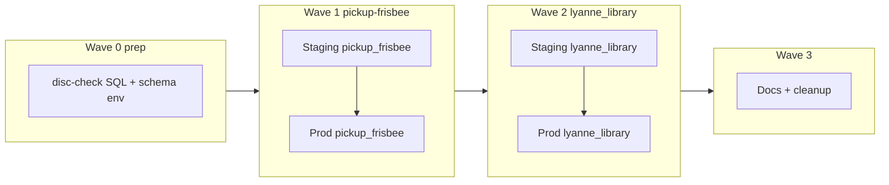
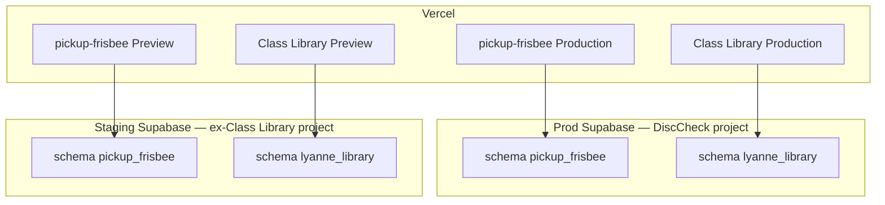

# Two-project Supabase migration

Consolidate **production** on the DiscCheck Supabase project (one Postgres schema per app) and **staging** on the ex–Class Library project. Migrate **pickup-frisbee first**, then **lyanne_library**. Both apps are wiped and re-seeded — no row migration.

Related repos:


| App            | Repo                     | Schema           |
| -------------- | ------------------------ | ---------------- |
| pickup-frisbee | this repo (`disc-check`) | `pickup_frisbee` |
| Class Library  | `class-library`          | `lyanne_library` |


---

## Progress


| Wave                                  | Status   | Notes                                                                                    |
| ------------------------------------- | -------- | ---------------------------------------------------------------------------------------- |
| **0** — Repo prep                     | **Done** | `schema.sql` → `pickup_frisbee`; client + seed schema env; cron renames in migrations    |
| **1a** — Staging database             | **Done** | `iunqmpxp` — `pickup_frisbee` schema, seed, edge functions, crons                        |
| **1b** — Vercel Preview               | **Done** | Preview → staging URL, staging anon, `pickup_frisbee`; verified in latest Preview bundle |
| **1c** — Preview smoke test           | **Done** | Groups/games, Realtime, RPCs, chat, admin on staging Preview                           |
| **1d** — Prod add `pickup_frisbee`    | **Done** | `mczxxonw` — schema applied, API exposed, seeded; `public` untouched                   |
| **1e** — Pre-cutover prod validation  | **Done** | PostgREST, RPC, RSVP, chat, Realtime pub on prod `pickup_frisbee`; live prod on `public` |
| **1f** — Cutover window               | **Done** | Production on `pickup_frisbee`; edge v13/v5 + `pickup_frisbee_*` crons on prod hub       |
| **1g** — Post-cutover smoke test      | **Done** | Production bundle + API smoke (groups, RPC, RSVP, chat, push drain) on `pickup_frisbee` |
| **1h** — Drop legacy `public` objects | **Done** | 13 legacy tables + app functions removed from prod hub `public`; Realtime pub cleanup   |
| **1i** — Staging keep-alive           | **Done** | Weekly workflow + staging secrets; pings `pickup_frisbee` schema                         |
| **2 prep** — class-library repo       | **Done** | `004_lyanne_library_schema.sql` + schema-aware client/seed/scripts                       |
| **2a** — Staging library schema       | **Done** | `lyanne_library` on `iunqmpxp` alongside `pickup_frisbee`; API exposed; seeded           |
| **2b** — Vercel Preview (library)     | **Done** | Preview → staging URL + `lyanne_library` schema env                                      |
| **2c** — Preview smoke test (library) | **Done** | PostgREST books/borrowers on staging `lyanne_library` (Preview deploy on next git push)  |
| **2d** — Prod add `lyanne_library`    | **Done** | Additive apply on prod hub; API exposed; seeded                                          |
| **2e** — Vercel Production (library)  | **Done** | Production → prod hub + `lyanne_library`; deployed class-library.vercel.app            |
| **2f** — Smoke test prod (library)    | **Done** | Books + checkout on prod hub; pickup-frisbee groups regression OK                        |
| **2g** — Staging-only ex-library      | **Done** | `iunqmpxp` hosts `pickup_frisbee` + `lyanne_library`; prod hub hosts both app schemas    |
| **3** — Docs + regression             | Pending  | READMEs, `.env.example`, full prod + Preview regression, keep-alive active             |


---

## Strategy: one app at a time

Do **not** apply both schemas or cut over both Vercel Production apps in one window.

**Why sequential:**

- pickup-frisbee is harder (Realtime, RPCs, edge functions, pg_cron).
- lyanne_library is Postgres-only.
- Class Library **stays on its current Supabase project** until pickup-frisbee is stable on prod (Wave 2).




| Wave  | Scope                | Prod downtime                     |
| ----- | -------------------- | --------------------------------- |
| **0** | disc-check repo only | None                              |
| **1** | pickup-frisbee only  | Brief downtime at **1f cutover** only; 1d–1e and 1h are zero-downtime |
| **2** | lyanne_library only  | class-library prod (steps 2d–2e)  |
| **3** | Docs + regression    | None                              |


---

## Data policy


| App            | Prod data                    | Approach                                                |
| -------------- | ---------------------------- | ------------------------------------------------------- |
| pickup-frisbee | Little to none — **wipe OK** | Fresh `pickup_frisbee` schema + `npm run db:seed`       |
| Class Library  | No users — **wipe OK**       | Fresh `lyanne_library` schema + seed in `class-library` |


No `pg_dump`, no `ALTER TABLE … SET SCHEMA`, no row migration. Schema definitions live in git; re-seed anytime.

Optional: export prod hub backup before Wave 1d if you want a safety net — not required for data retention.

---

## Schema naming


| Use              | Do not use                                   |
| ---------------- | -------------------------------------------- |
| `pickup_frisbee` | `pickup-frisbee`, `disc-check`, `disc_check` |
| `lyanne_library` | `class_library`, `class-library`             |


Postgres schema names cannot contain hyphens. App display names stay kebab-case.

---

## Supabase projects


| Project           | Ref                    | Role                                                  |
| ----------------- | ---------------------- | ----------------------------------------------------- |
| **DiscCheck**     | `mczxxonwvsztbrqmjzlu` | **Prod hub** — edge functions, pg_cron, vault         |
| **Class Library** | `iunqmpxpwhybqyfxcsdt` | **Staging** after Wave 1a; library prod until Wave 2e |


### During migration


| When          | Prod hub (`mczxxonw`)                                      | Class Library project (`iunqmpxp`)       |
| ------------- | ---------------------------------------------------------- | ---------------------------------------- |
| Before Wave 1 | disc-check in `public`                                     | class-library in `public` (library prod) |
| After 1d–1e   | `public` (live) + `pickup_frisbee` (validated, not live)   | staging: `pickup_frisbee`                |
| After 1f–1g   | `pickup_frisbee` (live) + `public` (legacy, unused)        | staging: `pickup_frisbee`                |
| After 1h      | `pickup_frisbee` only (legacy `public` app objects dropped) | staging: `pickup_frisbee`                |
| After Wave 2  | `pickup_frisbee` + `lyanne_library`                        | staging only — both schemas              |


### Target end state




|                   | Prod hub                                         | Staging project                 |
| ----------------- | ------------------------------------------------ | ------------------------------- |
| pickup-frisbee    | `pickup_frisbee` + seed                          | `pickup_frisbee` + test seed    |
| Class Library     | `lyanne_library` + seed                          | `lyanne_library` + test seed    |
| Vercel Production | Prod hub URL + `VITE_SUPABASE_DB_SCHEMA` per app | —                               |
| Vercel Preview    | —                                                | Staging URL + same schema names |


---

## Wave 0 — Prep (disc-check repo; no deploy) ✓

**Goal:** SQL and client ready for `pickup_frisbee`. Class Library unchanged.

### Shipped in repo

- `[supabase/schema.sql](../supabase/schema.sql)` — full app in `pickup_frisbee` schema (tables, functions, RLS, Realtime, grants)
- `[src/lib/supabase.js](../src/lib/supabase.js)` — `VITE_SUPABASE_DB_SCHEMA` (defaults to `public` until cutover)
- `[scripts/seed.mjs](../scripts/seed.mjs)` + `[scripts/supabase-client.mjs](../scripts/supabase-client.mjs)` — schema-aware service client
- `[.env.example](../.env.example)` — documents schema env vars
- `[supabase/config.toml](../supabase/config.toml)` — exposes `pickup_frisbee` locally
- Cron migrations renamed/prepared: `[034](../supabase/migrations/034_push_outbox_cron.sql)`, `[017](../supabase/migrations/017_server_cycle_reset_twelve_hours.sql)`, `[049](../supabase/migrations/049_activity_retention.sql)`

### Client pattern

```javascript
createClient(url, anonKey, {
  db: { schema: import.meta.env.VITE_SUPABASE_DB_SCHEMA || "public" },
});
```


| App                    | When to set `VITE_SUPABASE_DB_SCHEMA` |
| ---------------------- | ------------------------------------- |
| disc-check (this repo) | Wave 1 Preview + Production           |
| class-library          | Wave 2 Preview + Production           |


### Exit criteria

- [x] Refactored SQL in git
- [x] Client and seed read schema env
- [x] Code pushed to `main` (commit `6aa2469`)
- [ ] SQL applies cleanly on staging — **Wave 1a** (no remote Supabase migration required for Wave 0; prod remains on `public`)

---

## Wave 1 — pickup-frisbee (staging → prod)

**Goal:** pickup-frisbee on shared staging and prod hub. Class Library prod **unchanged** on `iunqmpxp`.

### 1a — Staging database

**Where:** Class Library project `iunqmpxpwhybqyfxcsdt`

1. Full DB reset (library prod data on this project is wiped — accepted; brief library outage until Wave 2).
2. Run `[supabase/schema.sql](../supabase/schema.sql)` in SQL Editor (schema + objects created in one script).
3. **Dashboard → API → Exposed schemas:** add `pickup_frisbee`.
4. Seed:
  ```bash
   # .env.local → staging URL, service role, VITE_SUPABASE_DB_SCHEMA=pickup_frisbee
   npm run db:seed
  ```
5. Deploy edge functions (see [Edge functions and pg_cron](#edge-functions-and-pg_cron)).
6. Run cron SQL with **staging** project URL:
  ```sql
   SELECT set_config('pickup_frisbee.supabase_url', 'https://iunqmpxpwhybqyfxcsdt.supabase.co', false);
  ```
   Then run migrations `017`, `034`, `049` (or equivalent cron setup).
7. Confirm vault secret `service_role_key` on staging.
8. Optional: separate VAPID keys for staging push.

### 1b — Vercel Preview (disc-check) — **Done**


| Variable                  | Value                                                     |
| ------------------------- | --------------------------------------------------------- |
| `VITE_SUPABASE_URL`       | `https://iunqmpxpwhybqyfxcsdt.supabase.co`                |
| `VITE_SUPABASE_ANON_KEY`  | Staging anon key (Supabase → stage apps → Settings → API) |
| `VITE_SUPABASE_DB_SCHEMA` | `pickup_frisbee`                                          |


**Development** env (for `vercel dev`) points at staging with `pickup_frisbee`.

Never reuse Production URL for Preview.

### 1c — Smoke test Preview — **Done**

- [x] Seeded groups/games visible
- [x] Realtime (RSVP live update)
- [x] RPCs, chat, admin flows
- [ ] Push optional (staging VAPID)

**Prod cutover pattern (1d–1i):** add `pickup_frisbee` alongside live `public` → validate on prod hub → cut over Vercel + edge + cron → smoke test → drop legacy `public` app objects only after confirmed stable.

### 1d — Prod hub: add `pickup_frisbee` (no drop) — **Done**

**Where:** DiscCheck project `mczxxonwvsztbrqmjzlu`

**No maintenance window.** Live prod continues on `public`.

1. Run `[supabase/schema.sql](../supabase/schema.sql)` in SQL Editor (**additive only** — creates `pickup_frisbee`; leaves `public` untouched).
2. **Dashboard → API → Exposed schemas:** add `pickup_frisbee` (keep `public` exposed).
3. Seed prod against the new schema:
  ```bash
   # .env.prod.local → prod hub URL, service role, VITE_SUPABASE_DB_SCHEMA=pickup_frisbee
   npm run db:seed
  ```
4. Do **not** unschedule old `disc-check-*` cron jobs.
5. Do **not** redeploy prod edge functions yet.
6. Do **not** change Vercel Production env.

Do **not** full-reset the prod database — preserves vault secrets and platform config.

**Rollback:** Drop `pickup_frisbee` schema if apply was wrong (only before cutover in 1f).

**Applied:** 2026-06-22 via `supabase db push` (migration `20260622184328_wave_1d_pickup_frisbee_schema.sql`) + `supabase config push` (API schemas). Seeded `default` / Kirkland Disc + `g1`.

### 1e — Pre-cutover prod validation — **Done**

**Where:** prod hub, schema `pickup_frisbee` only

**No maintenance window.** Live users still on `public`.

Validate the same checklist as [§1c](#1c--smoke-test-preview--done), but against the **prod ref** without touching Vercel Production:

- [x] PostgREST with `Accept-Profile: pickup_frisbee` → seeded groups/games
- [x] Realtime publication includes `pickup_frisbee` tables (rsvps, games, groups, chat, etc.)
- [x] RPC `verify_group_admin`
- [x] RSVP insert/delete
- [x] Chat insert/delete
- [x] Live `public` prod unchanged (Kirkland Goaltimate still served)
- [x] Push infra deferred to **1g** (edge/cron cut over in **1f**)

**Exit gate:** All required checks pass before starting 1f. If not, fix SQL/seed and re-run; `public` prod unaffected.

### 1f — Cutover window

**Maintenance window — pickup-frisbee prod only (minutes).**

Run in a **single session**, in order:

1. **Vercel Production** — set and deploy:


| Variable                  | Value             |
| ------------------------- | ----------------- |
| `VITE_SUPABASE_URL`       | Prod hub URL      |
| `VITE_SUPABASE_ANON_KEY`  | Prod hub anon key |
| `VITE_SUPABASE_DB_SCHEMA` | `pickup_frisbee`  |


2. **Edge functions:** redeploy `pickup-frisbee-notify-push` + `pickup-frisbee-process-push-outbox` (schema default `pickup_frisbee` in code).
3. **pg_cron:** unschedule old `disc-check-*` jobs; schedule `pickup_frisbee_*` jobs (prod URL) via `[034](../supabase/migrations/034_push_outbox_cron.sql)` or prod equivalent of `[scripts/staging-cron-setup.sql](../scripts/staging-cron-setup.sql)`.
4. Confirm vault `service_role_key` and cron URLs point at prod hub.

Deploy. Do **not** change class-library Production yet.

**Applied:** 2026-06-17 — Vercel Production `VITE_SUPABASE_DB_SCHEMA=pickup_frisbee`; edge `notify-push` v5 + `process-push-outbox` v13 (schema default `pickup_frisbee` in code; CLI cannot set `SUPABASE_DB_SCHEMA` secret); crons via `[scripts/prod-cron-setup.sql](../scripts/prod-cron-setup.sql)`. Manual `process-push-outbox` invoke OK. Push subscriptions: 0 in `pickup_frisbee` (2 legacy in `public`) — users re-toggle bell after cutover.

**Rollback (while `public` still exists):** Revert Vercel Production schema env to unset/`public`, redeploy edge with `SUPABASE_DB_SCHEMA=public`, reschedule old crons.

### 1g — Post-cutover smoke test — **Done**

- [x] Production bundle: `mczxxonw` URL + `pickup_frisbee` schema on pickupfrisbee.com
- [x] PostgREST groups/games on prod `pickup_frisbee`
- [x] RPC `verify_group_admin`
- [x] RSVP insert/delete
- [x] Chat insert/delete
- [x] `process-push-outbox` invoke OK (empty outbox)
- [x] Crons: `pickup_frisbee_*` only (no `disc-check-*`)

**Applied:** 2026-06-22. Push delivery still requires users to re-toggle bell (0 subs in `pickup_frisbee` at cutover).

### 1h — Drop legacy `public` app objects — **Done**

**Where:** prod hub

**No user-facing downtime** if cutover is stable (app no longer reads `public`).

1. Confirm Production has used `pickup_frisbee` successfully (1g + optional soak).
2. Unschedule any remaining `disc-check-*` crons (if not already done in 1f).
3. Drop disc-check app objects in **`public` only** (tables, functions, triggers, Realtime entries — not `auth`, `storage`, extensions). **Never** `DROP SCHEMA public`.
4. Verify: no stray disc-check app tables remain in `public`.

**Rollback after 1h:** Not possible without backup — only run after confidence is high.

**Applied:** 2026-06-22 via `[scripts/prod-drop-public-app-objects.sql](../scripts/prod-drop-public-app-objects.sql)`. Verified: zero app tables in `public`; Realtime pub lists `pickup_frisbee` only; prod API still serves Kirkland Disc.

### 1i — Keep-alive — **Done**

- [x] Weekly staging keep-alive (`[.github/workflows/supabase-keepalive-stage.yml](../.github/workflows/supabase-keepalive-stage.yml)`) — pings `pickup_frisbee` with `Accept-Profile`
- [x] GitHub secrets `SUPABASE_URL` / `SUPABASE_ANON_KEY` → staging project (`iunqmpxp`)

**Wave 1 exit:** pickup-frisbee stable on prod and Preview; legacy disc-check objects removed from prod hub `public`.

---

## Wave 2 — lyanne_library (staging → prod)

**Prerequisite:** Wave 1 stable 1–2 days.

**Goal:** library on shared hub; ex-library project becomes staging-only for both apps.

Work happens in the **class-library** repo unless noted.

### Prep — class-library repo — **Done**

1. `supabase/migrations/004_lyanne_library_schema.sql` — `lyanne_library.*` from migrations `001`–`003` + table grants.
2. `VITE_SUPABASE_DB_SCHEMA` in client, seed, backfill scripts, `.env.example`, `scripts/supabase-client.mjs`.

### 2a — Staging: add library schema — **Done**

**Applied:** 2026-06-22 on `iunqmpxp` — schema + grants; `supabase config push` exposes `lyanne_library`; seeded 4 books + 6 borrowers.

### 2b — Vercel Preview (class-library) — **Done**

Preview env: staging URL, staging anon, `VITE_SUPABASE_DB_SCHEMA=lyanne_library`.

### 2c — Smoke test Preview — **Done**

- [x] Seeded books visible via PostgREST (`Accept-Profile: lyanne_library`) on staging
- [x] Borrowers readable on staging
- [ ] Full kiosk UI on Preview — verify after next class-library git deploy triggers Preview

### 2d — Prod hub: add library schema — **Done**

**Applied:** 2026-06-22 on `mczxxonw` — additive `lyanne_library`; API exposed; seeded.

### 2e — Vercel Production (class-library) — **Done**

Production env: prod hub URL, prod anon, `lyanne_library`. Deployed to class-library.vercel.app.

### 2f — Smoke test prod — **Done**

- [x] Books on prod `lyanne_library` (PostgREST)
- [x] Checkout insert on prod hub
- [x] Production bundle: `mczxxonw` + `lyanne_library`
- [x] pickup-frisbee prod groups regression

### 2g — Staging-only ex-library project — **Done**

`iunqmpxp` is shared staging: `pickup_frisbee` + `lyanne_library`. Legacy library `public` tables were removed in Wave 1a.

**Wave 2 exit:** both apps on prod hub; both Previews target staging project.

---

## Wave 3 — Docs + decommission

- Update READMEs and `.env.example` in both repos
- Confirm prod hub `public` has no stray disc-check app tables (after Wave **1h**)
- Update local dev docs (`.env.local` URLs)
- Full regression: prod + Preview for both apps
- Keep staging keep-alive active

---

## Edge functions and pg_cron

**Pickup-frisbee only** — deploy in Wave **1a** (staging) and **1f** (prod cutover). `lyanne_library` needs no edge functions or crons today.

During **1d–1e**, prod edge functions and crons stay on `public`. Do not redeploy prod edge until **1f** or push/cron would target the wrong schema while users still read `public`.

Schemas isolate **data**; crons and edge functions are **project-level**. Service clients inside functions must set:

```typescript
createClient(url, serviceKey, { db: { schema: "pickup_frisbee" } });
```

### Edge function rename — **Done**


| Legacy slug           | Deploy folder / URL slug                |
| --------------------- | --------------------------------------- |
| `notify-push`         | `pickup-frisbee-notify-push/`           |
| `process-push-outbox` | `pickup-frisbee-process-push-outbox/`   |


Deployed on **staging** (`iunqmpxp`) and **prod hub** (`mczxxonw`); legacy unprefixed functions deleted. Cron jobs call `/functions/v1/pickup-frisbee-process-push-outbox`.

Shared TS remains in `supabase/functions/_shared/` (not nested under `pickup_frisbee/` — optional future cleanup).

### pg_cron job names


| Legacy name                           | New name                                  |
| ------------------------------------- | ----------------------------------------- |
| `disc-check-process-push-outbox`      | `pickup_frisbee_process_push_outbox`      |
| `disc-check-reset-stale-cycles`       | `pickup_frisbee_reset_stale_cycles`       |
| `disc-check-prune-activity-retention` | `pickup_frisbee_prune_activity_retention` |


Cron SQL lives in `[supabase/migrations/](../supabase/migrations/)` (`017`, `034`, `049`). Set project URL before running on each environment:

```sql
SELECT set_config('pickup_frisbee.supabase_url', 'https://YOUR_REF.supabase.co', false);
```

### Recommended repo layout (future)

```text
supabase/functions/
├── _shared/pickup_frisbee/
├── pickup-frisbee-notify-push/
└── pickup-frisbee-process-push-outbox/

supabase/cron/pickup_frisbee/
├── 034_push_outbox_cron.sql
├── 017_reset_stale_cycles.sql
└── 049_activity_retention.sql
```

---

## Future extraction (pickup-frisbee → dedicated project)

Schema-per-app is deliberately reversible:

```bash
pg_dump --schema=pickup_frisbee --no-owner --no-acl … > pickup_frisbee.sql
```

After move: update Vercel URL + keys; keep `VITE_SUPABASE_DB_SCHEMA=pickup_frisbee`. `lyanne_library` stays on the shared hub.


| Signal                             | Action                         |
| ---------------------------------- | ------------------------------ |
| pickup-frisbee noisy; library fine | Extract pickup to own project  |
| Whole hub tight on 500 MB          | Extract heavy app or self-host |
| One project enough                 | Upgrade Supabase plan first    |


---

## Risks by wave

### Wave 0


| Risk                        | Mitigation                                                              |
| --------------------------- | ----------------------------------------------------------------------- |
| Incomplete SQL refactor     | Grep `public.` / `search_path = public`; test on staging before Wave 1d |
| Missed Realtime / RPC names | Checklist every `ALTER PUBLICATION` and RPC                             |


**User impact:** None (repo-only).

### Wave 1


| Risk                                               | Mitigation                                                                 |
| -------------------------------------------------- | -------------------------------------------------------------------------- |
| Dropping wrong object in `public` on prod          | Drop only in **1h** after cutover confirmed; scripted list; never `DROP SCHEMA public` |
| Parallel schemas on prod hub (1d–1g)               | Do not switch edge/cron/Vercel until **1f**; live prod stays on `public` until then |
| Wave 1a reset affects library prod on same project | No users / wipe OK — brief library outage until Wave 2                     |
| Preview points at prod                             | Preview-only Vercel env vars                                               |
| Edge/cron gap after 1f                             | Run Vercel flip, edge redeploy, and cron switch in same **1f** session     |
| Staging pauses after 7 days                        | Weekly keep-alive after 1a                                                 |
| Old `disc-check-*` crons fire on dropped tables    | Unschedule in **1f**; drop `public` objects only in **1h**                 |


**User impact:** pickup-frisbee prod down briefly during **1f cutover** only.

### Wave 2


| Risk                                               | Mitigation                             |
| -------------------------------------------------- | -------------------------------------- |
| Library schema grants/RLS wrong                    | Smoke test Preview before prod cutover |
| Prod hub apply breaks pickup                       | Only add `lyanne_library`              |
| Missing `VITE_SUPABASE_DB_SCHEMA` on class-library | Set all three Vercel vars              |


**User impact:** class-library prod down during 2d–2e only.

### Cross-wave


| Risk                                  | Mitigation                                    |
| ------------------------------------- | --------------------------------------------- |
| Free tier 500 MB shared               | Monitor size; extract if one app grows        |
| Prod hub pause (7 days no API)        | DiscCheck traffic + keep-alive                |
| One leaked anon key hits both schemas | Accepted at personal scale; tighten RLS later |


---

## Quick reference


| Task                 | Command / file                                                                            |
| -------------------- | ----------------------------------------------------------------------------------------- |
| Apply schema (fresh) | `[supabase/schema.sql](../supabase/schema.sql)`                                           |
| Seed                 | `npm run db:seed` with `VITE_SUPABASE_DB_SCHEMA=pickup_frisbee`                           |
| Local schema config  | `[supabase/config.toml](../supabase/config.toml)`                                         |
| Staging keep-alive   | `[.github/workflows/supabase-keepalive-stage.yml](../.github/workflows/supabase-keepalive-stage.yml)` |


**Next step:** Wave **3** — READMEs, `.env.example` cleanup, full prod + Preview regression for both apps.