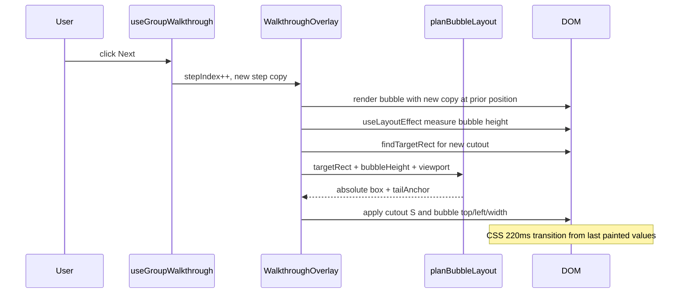

# Walkthrough overlay mechanics

Reference for how the group UX walkthrough cutout (spotlight) and step modal (bubble) are measured, positioned, and animated.

**Source of truth:** `src/components/walkthrough/WalkthroughOverlay.jsx`, walkthrough styles in `src/styles/theme.js`, step definitions in `src/constants/walkthrough.js`.

---

## 1. System overview

The walkthrough renders once per group when `useGroupWalkthrough` activates (first visit with games present). `GroupGamesScreen` mounts `WalkthroughOverlay` with the current step from `WALKTHROUGH_STEPS`.

Two layers share the viewport but are **not parent/child** and **not mechanically linked during animation**:

| Layer | DOM | Role |
|-------|-----|------|
| Scrim + cutout | Full-screen SVG + mask | Dims the page; transparent hole over target |
| Step modal | `position: fixed` div (`.walkthrough-bubble`) | Title, body, Back/Next |

Both are portaled to the app root via `getPortalTarget()`.

```
┌──────────────────────────────────────────── viewport ────┐
│  ████████████████ scrim (78% black) ████████████████████ │
│  ████┌──────────────┐███████████████████████████████████ │
│  ████│   cutout     │  ← SVG mask hole (spotlight)      │
│  ████└──────────────┘                                   │
│       ┌─────────────────┐                               │
│       │  step modal     │  ← fixed bubble + CSS tail    │
│       │  (Next / Back)  │                               │
│       └─────────────────┘                               │
└──────────────────────────────────────────────────────────┘
```

**Measurement pipeline:**

1. Find DOM node: `[data-walkthrough-target="…"]`
2. `getBoundingClientRect()` → target rect `R`
3. Derive spotlight `S` (cutout) and bubble layout `B` (modal) from `R`
4. On step change or scroll/resize, re-run measurement and let CSS transition from old → new values

---

## 2. Coordinate system and constants

All layout uses **viewport coordinates** (pixels from the top-left of the visual viewport), as returned by `getBoundingClientRect()`.

| Symbol / constant | Value | Meaning |
|-------------------|-------|---------|
| `P` (`DEFAULT_SPOTLIGHT_PAD`) | 8 | Default padding around target for cutout |
| `step.spotlightPad` | 4 | Tighter pad for chat + status steps |
| `BUBBLE_GAP` | 18 | Gap between cutout edge and modal |
| `VIEWPORT_PAD` | 12 | Minimum margin from screen edges |
| Max modal width | `min(340, innerWidth − 24)` | Bubble width cap |
| Tail clamp | 28 px | Min distance from modal left/right for pointer |
| `SETTLE_MS` | 220 | Delayed remeasure after step change |
| Transition duration | 0.22 s | Cutout + modal CSS transitions |
| Scrim opacity | 0.78 | `rgba(0, 0, 0, 0.78)` |
| Cutout corner radius | 10 | SVG `rx` / `ry` |

---

## 3. Target measurement

**Function:** `findTargetRect(step)`

- Reads `step.target` and optional `step.fallbackTarget`
- Returns the first matching element with `width > 0` and `height > 0`
- If nothing valid, overlay shows full scrim only (no hole, no bubble)

### Step → DOM anchors

| Step | `target` key | Element |
|------|--------------|---------|
| 1 — How a game works | `game-card` | `GameCommitCard` (carousel slide 0) |
| 2 — Bring friends | `walk-ins` | `GameDetailActions` panel (extras + CTA) |
| 3 — Rally the group | `chat-bar` | `ChatBar` composer field |
| 4 — Watch go/no-go | `game-status` | Status badge in `GameDetailHeader` |

Tour anchors are only present when `walkthroughAnchorActive` is true on the first carousel slide (`WALKTHROUGH_GAME_SLIDE_INDEX = 0`).

### Target rect `R`

From DOMRect:

- `R.left`, `R.top` — top-left of border box
- `R.width`, `R.height` — size
- `R.right = R.left + R.width`
- `R.bottom = R.top + R.height`
- `R.centerX = R.left + R.width / 2`

---

## 4. Cutout math (spotlight)

Given target rect `R` and pad `P` (from step or default):

```
S.x      = R.left − P
S.y      = R.top − P
S.width  = R.width + 2P
S.height = R.height + 2P
```

Edges:

```
S.left   = S.x
S.top    = S.y
S.right  = S.x + S.width  = R.right + P
S.bottom = S.y + S.height = R.bottom + P
```

Rendered as an SVG `<rect fill="black">` inside a mask. In SVG masks, **black = fully transparent** in the masked result, so this rect punches the hole through the scrim.

The scrim is a full-viewport rectangle with `mask="url(#…)"` applied.

---

## 5. Modal math (bubble layout)

**Function:** `planBubbleLayout(R, P, bubbleHeight)` → `{ width, left, top, placement, tailX }`

`bubbleHeight` comes from `bubbleRef.getBoundingClientRect().height` after the step copy renders (see §14.6). `top` is **always** the visual top edge of the modal box.

### 5.1 Horizontal position and width

```
bubbleWidth = min(340, window.innerWidth − 2 × VIEWPORT_PAD)

idealLeft = R.centerX − bubbleWidth / 2

bubble.left = clamp(idealLeft, VIEWPORT_PAD, innerWidth − VIEWPORT_PAD − bubbleWidth)
```

Center the modal on the target; clamp so the box stays on screen.

### 5.2 Tail horizontal offset

```
tailX = clamp(R.centerX − bubble.left, 28, bubbleWidth − 28)
```

`tailX` is the distance from the modal’s **left edge** to the pointer center. When the modal is clamped sideways, the tail shifts so it still points at `R.centerX`.

Exposed to CSS as `--walkthrough-tail-x`.

### 5.3 Above vs below

Placement uses measured modal height and available viewport space:

```
gapTop    = R.bottom + P + BUBBLE_GAP
fitsBelow = gapTop + bubbleHeight ≤ innerHeight − VIEWPORT_PAD
```

- **`fitsBelow`** — modal sits under the cutout; `placement: "below"` (tail on modal top edge, points up).
- **Otherwise** — modal sits above the cutout; `placement: "above"` (tail on modal bottom edge, points down).
- Targets near the bottom of the screen (chat) usually fail `fitsBelow`.
- Mid-card targets (game card, walk-ins) usually pass `fitsBelow`.

### 5.4 Vertical position

**Below** (`placement: "below"`):

```
bubble.top = min(gapTop, innerHeight − VIEWPORT_PAD − bubbleHeight)
```

`top` is the **top edge** of the modal box. No CSS transform.

**Above** (`placement: "above"`):

```
bubble.top = max(VIEWPORT_PAD, (R.top − P) − BUBBLE_GAP − bubbleHeight)
```

`top` is still the **top edge** of the modal box. The tail attaches to the bottom edge via CSS (`walkthrough-bubble--above`); no `translateY(−100%)`.

### 5.5 Gap between cutout and modal

When placement is **below**:

```
cutout bottom = R.bottom + P
modal top     = R.bottom + P + BUBBLE_GAP   (before viewport clamp)

visual gap    = BUBBLE_GAP (18 px) in the ideal case
```

When placement is **above**:

```
cutout top    = R.top − P
modal top     = cutout top − BUBBLE_GAP − bubbleHeight

modal bottom  ≈ cutout top − BUBBLE_GAP

visual gap    ≈ BUBBLE_GAP (18 px)
```

---

## 6. Layout diagrams

### Below placement

```
        ┌─────────────────┐
        │     cutout      │  S.top .. S.bottom
        └────────┬────────┘
                 │ BUBBLE_GAP (18)
            ▲    │
            │    ▼
        ┌─────────────────┐
        │      modal      │  bubble.top = top edge
        └─────────────────┘
```

Tail (`::before`) sits at `top: −24px`, points **up** toward cutout.

### Above placement

```
        ┌─────────────────┐
        │      modal      │  top = cutout top − BUBBLE_GAP − bubbleHeight
        └────────┬────────┘
                 │ BUBBLE_GAP
        ┌────────▼────────┐
        │     cutout      │
        └─────────────────┘
```

Tail sits at `bottom: −24px`, points **down** toward cutout.

---

## 7. Tail pointer (CSS only)

The pointer is not computed in JS beyond `tailX`. Triangles use `::before` (fill) and `::after` (border ring):

- `left: var(--walkthrough-tail-x); transform: translateX(−50%)`
- **Below:** `top: −24px`, upward triangle
- **Above:** `bottom: −24px`, downward triangle

Vertical tail offset (~24 px) is fixed in CSS, not derived from `BUBBLE_GAP`.

---

## 8. Relationship between cutout and modal

**At rest (no transition):** Both are computed from the same `R` and `P`, so the 18 px gap and tail aim are consistent.

**During step change:** There is **no shared anchor**. On `stepIndex` change:

1. `measureLayout()` runs immediately
2. React sets **final** new `S` and **final** new `B` in one update
3. CSS interpolates from the **previous painted** values to the new values over 220 ms

The modal does **not** follow the animated cutout frame-by-frame. It animates toward the new step’s formula independently.

---

## 9. Transition physics

### 9.1 CSS (theme.js)

**Cutout** (`.walkthrough-scrim__spotlight`):

```
transition: x 0.22s ease, y 0.22s ease, width 0.22s ease, height 0.22s ease;
```

**Modal** (`.walkthrough-bubble`):

```
transition: top 0.22s ease, left 0.22s ease, width 0.22s ease;
```

`transform` is not used for placement and is not transitioned.

All four spotlight attributes morph **simultaneously**. That produces a combined move + resize (often perceived as “collapse” when height shrinks a lot).

### 9.2 Interpolation model

For each animated scalar property `v` (e.g. `S.x`, `bubble.top`):

```
v(t) = v_start + (v_end − v_start) × ease(t)    t ∈ [0, 1], duration 220 ms
```

`ease` is the browser’s default cubic-bezier for the `ease` keyword.

Cutout and modal each run their own lerp with **different start/end pairs**. There is no constraint like “modal.top = S.bottom + GAP” during `t ∈ (0, 1)`.

### 9.3 Step transitions (2→3, 3→4)

Previously, placement flips (`below` ↔ `above`) animated `top` and `transform: translateY(−100%)` together, which made the visual box bounce away from the destination mid-animation.

**Fix (shipped):** `planBubbleLayout` always sets `top` to the visual top edge; `placement` only controls which edge the tail attaches to and **snaps** at t=0. See [§14](#14-transition-redesign-implemented).

Remaining transition character:

1. **Large Δheight and Δy** — walk-ins (tall) → chat bar (short, low on screen)
2. **Parallel morph** — cutout height shrinking while modal moves on a separate path
3. **220 ms remeasure** — `SETTLE_MS` timer can nudge positions if the DOM settled (carousel, fonts); skipped when layout delta &lt; 1 px

---

## 10. Remeasure lifecycle

| Trigger | Behavior |
|---------|----------|
| Step change | `measureLayout()` at t=0, t=220 ms, t=450 ms |
| Scroll (capture) | Debounced via `requestAnimationFrame` |
| Window resize | Updates viewport size + remeasure |
| `ResizeObserver` | Watches current step target element(s) |

**Fallback:** `displayLayout = layout ?? lastLayoutRef.current` keeps the last good bubble/cutout if the target temporarily has zero size.

**Blocked during experiments:** Any future “morph phase” state machine should skip remeasure while `phase !== steady` to avoid mid-animation jumps.

---

## 11. State and rendering notes

- `layout` holds `{ rect, bubble }`; spotlight is derived at render from `rect` and current `spotlightPad`
- Step **content** (title, body, dots) comes from the `step` prop and updates immediately on step change
- Bubble **position** updates in `useLayoutEffect` after new copy renders and height is measured (§14.6)
- Focus moves to the Next button when `layout` or `stepIndex` changes
- Escape calls `onSkip` (marks walkthrough complete in localStorage)

---

## 12. Tuning cheat sheet

Ideas for future polish (not all implemented):

| Goal | Approach |
|------|----------|
| Stop cutout “collapse” look | Transition only `x`/`y`; snap `width`/`height` |
| Staged cutout morph | Phase 1: partial or full `x`/`y`; phase 2: `width`/`height` |
| Collapse toward modal | Animate cutout to bubble tail anchor, then expand to new target |
| Reduce modal bounce | **Shipped:** unified absolute positioning + tail-anchor snap — see [§14](#14-transition-redesign-implemented) |
| Avoid double-hit at 220 ms | Skip remeasure if values unchanged or morph in progress |
| Keep modal glued to cutout | Derive bubble position from **animated** `S(t)` each frame |

---

## 13. File index

| File | Responsibility |
|------|----------------|
| `src/components/walkthrough/WalkthroughOverlay.jsx` | Measure, layout math, portal render |
| `src/styles/theme.js` | Scrim, cutout transitions, bubble, tail CSS |
| `src/constants/walkthrough.js` | Step copy, targets, `spotlightPad` overrides |
| `src/hooks/useGroupWalkthrough.js` | Step index, completion, localStorage |
| `src/screens/GroupGamesScreen.jsx` | Mount overlay, tour anchors on slide 0 |

---

## 14. Transition redesign (implemented)

**Status:** Implemented. See `planBubbleLayout` in `WalkthroughOverlay.jsx`.

### 14.1 Motivation

Step transitions **2→3** (walk-ins → chat bar) and **3→4** (chat bar → game status) produce a visible modal **bounce**. A quick test locking the modal to always-below placement eliminated most bounce, confirming the root cause:

- **Above** placement uses `top` as a bottom anchor plus `transform: translateY(-100%)` (§5.4).
- CSS transitions animate `top` and `transform` simultaneously (§9.1).
- The **visual** box can move away from the destination mid-animation even though each property eases smoothly.

The bounce is **not** caused by cutout and modal animating independently. Parallel 220 ms transitions are fine when the modal uses a single coordinate system.

### 14.2 Current vs proposed

| Concern | Current | Proposed |
|---------|---------|----------|
| Vertical position | `placement: "below"` → `top` = top edge; `"above"` → `top` = bottom anchor + `translateY(-100%)` | `top` is **always** the visual top edge of the modal box |
| Placement decision | `spaceBelow ≥ 200` or `spaceBelow ≥ spaceAbove` (no modal height) | `fitsBelow` using measured `bubbleHeight` |
| Tail direction | Tied to `placement` class (`--below` / `--above`) | `tailAnchor` snaps at t=0; presentation only |
| Step change animation | `top`, `left`, `width`, `transform` all transition | `top`, `left`, `width` transition; `transform` removed |
| Modal content | Updates immediately on step change | Same — updates immediately; height measured from new copy |

### 14.3 Design principles

1. **One coordinate system** — `top` is always the modal’s visual top edge; no `translateY(-100%)` for placement.
2. **Separation of concerns** — layout (absolute box on screen) vs presentation (which edge the tail attaches to).
3. **Copy-first measurement** — on step change, render next step copy immediately, measure new bubble height, then compute final screen coordinates.
4. **Parallel animation** — cutout and modal still transition independently over 220 ms on comparable scalar properties.

### 14.4 Orchestrator workflow

The layout planner lives inside `WalkthroughOverlay` (no new React layer). `useGroupWalkthrough` continues to own step index only.



**Numbered steps:**

1. User clicks Next → `stepIndex` advances; title, body, and dots update immediately.
2. Measure next target → cutout `S` from `findTargetRect(step)` (unchanged from §4).
3. `useLayoutEffect` reads `bubbleRef.getBoundingClientRect().height` **after** new copy is in the DOM. Bubble width is fixed (`min(340, …)`), so height is stable regardless of the prior `top`.
4. `planBubbleLayout(R, P, bubbleHeight)` returns `{ left, top, width, tailX, tailAnchor }`.
5. Cutout SVG attrs and bubble `top` / `left` / `width` update in one commit. `tailAnchor` maps to existing `--below` / `--above` classes and **snaps** at t=0. Both layers CSS-transition over 220 ms from the last painted values.

The modal does not need to know its relative placement to the cutout for **positioning** — it only receives absolute screen coordinates. The tail flip is cosmetic: the pointer aims toward the cutout from whichever modal edge is closer.

### 14.5 Layout formulas (`planBubbleLayout`)

Replaces `getBubbleLayout` placement logic (§5.3–5.4). Cutout math (§4) is unchanged.

**Horizontal** — unchanged from §5.1–5.2:

```
bubbleWidth = min(340, innerWidth − 2 × VIEWPORT_PAD)
bubble.left = clamp(R.centerX − bubbleWidth/2, VIEWPORT_PAD, innerWidth − VIEWPORT_PAD − bubbleWidth)
tailX       = clamp(R.centerX − bubble.left, 28, bubbleWidth − 28)
```

**Vertical** — always absolute top edge. Given cutout edges `S` (from §4) and measured `bubbleHeight`:

```
gapTop    = S.bottom + BUBBLE_GAP
fitsBelow = gapTop + bubbleHeight ≤ innerHeight − VIEWPORT_PAD

if fitsBelow:
  top        = min(gapTop, innerHeight − VIEWPORT_PAD − bubbleHeight)
  tailAnchor = "top"      → class walkthrough-bubble--below (tail on modal top, points up)
else:
  top        = max(VIEWPORT_PAD, S.top − BUBBLE_GAP − bubbleHeight)
  tailAnchor = "bottom"   → class walkthrough-bubble--above (tail on modal bottom, points down)
```

**Mapping `tailAnchor` to existing CSS:** Reuse current class names for minimal churn. `--below` means the tail sits on the modal’s top edge (modal is below cutout). `--above` means the tail sits on the modal’s bottom edge (modal is above cutout). Only the **meaning of `top`** changes: always visual top edge, never a transform-adjusted anchor.

#### Below cutout (tailAnchor = top)

```
        ┌─────────────────┐
        │     cutout      │  S.top .. S.bottom
        └────────┬────────┘
                 │ BUBBLE_GAP (18)
            ▲    │
            │    ▼
        ┌─────────────────┐
        │      modal      │  top = gapTop (visual top edge)
        └─────────────────┘
```

#### Above cutout (tailAnchor = bottom)

```
        ┌─────────────────┐
        │      modal      │  top = S.top − BUBBLE_GAP − bubbleHeight
        └────────┬────────┘
                 │ BUBBLE_GAP
        ┌────────▼────────┐
        │     cutout      │
        └─────────────────┘
```

### 14.6 Measurement pipeline (copy-first + `useLayoutEffect`)

**Current:** `measureLayout()` runs in `useEffect` on step change (after paint). Placement does not account for bubble height.

**Proposed two-pass (same frame, before paint):**

```
Click Next
  → render pass 1: new copy, bubble still at prior top/left (from lastLayoutRef)
  → useLayoutEffect:
       bubbleHeight = bubbleRef.getBoundingClientRect().height
       nextLayout   = planBubbleLayout(findTargetRect(step), pad, bubbleHeight)
       setLayout(nextLayout)
  → render pass 2: new copy, new top/left/width
  → browser paints
```

CSS transition still works: the last **painted** frame had `top: P_old`. After `useLayoutEffect`, the DOM gets `top: P_new` before the next paint. The browser interpolates from the previous frame’s computed value over 220 ms. Copy can change in the same commit; only position properties animate.

**Shift from `useEffect` to `useLayoutEffect`** for height-based placement on `stepIndex` / `step.id`. Scroll, resize, and `ResizeObserver` remeasures can remain on `requestAnimationFrame` / `useEffect`.

### 14.7 Transition rules (animate vs snap)

| Property | On step change |
|----------|----------------|
| Step copy (title, body, dots) | Immediate |
| Cutout `x`, `y`, `width`, `height` | CSS transition 220 ms |
| Modal `top`, `left`, `width` | CSS transition 220 ms |
| `tailAnchor` / `--below` / `--above` | Snap at t=0 (presentation only) |
| `transform` on `.walkthrough-bubble` | Removed from inline style and from CSS transition rule |

### 14.8 Edge cases

| Case | Handling |
|------|----------|
| **First step mount** | No prior bubble height. `useLayoutEffect` measures on first render; first step may not animate in (acceptable). |
| **Chat step (step 3)** | `fitsBelow` is false → modal above cutout. May clamp `top` to `VIEWPORT_PAD`; `tailX` clamp (§5.2) handles horizontal skew. |
| **Viewport clamp** | `top` clamped so `top + bubbleHeight ≤ innerHeight − VIEWPORT_PAD` when below; `top ≥ VIEWPORT_PAD` when above. |
| **Height change during 220 ms** | Step copy is fixed during transition; height should be stable. `SETTLE_MS` remeasure at 220 ms may nudge `top` if fonts/carousel settle — defer remeasure until transition completes or skip if delta &lt; 1 px. |
| **Back navigation** | Same pipeline: new copy → measure height → plan layout → transition from last painted position. |

### 14.9 Decisions (review resolved)

1. **Placement heuristic** — Use `fitsBelow` with measured height only (200 px proxy removed).
2. **Lock bubble height during transition** — Not implemented; settle remeasure skips updates when layout delta &lt; 1 px.
3. **Settle remeasure timing** — `SETTLE_MS` (220 ms) and carousel (450 ms) timers unchanged; `layoutsNearlyEqual` avoids double-hit nudges.

### 14.10 Implementation checklist (completed)

| File | Change |
|------|--------|
| `src/components/walkthrough/WalkthroughOverlay.jsx` | Rename `getBubbleLayout` → `planBubbleLayout(rect, pad, bubbleHeight)`; add `bubbleRef`; `useLayoutEffect` measure pass on step change; remove `transform` from `bubbleStyle`; map `tailAnchor` → `--below` / `--above` classes |
| `src/styles/theme.js` | Remove `transform` from `.walkthrough-bubble` transition |
| `docs/walkthrough-overlay-mechanics.md` | §5, §9, §14 updated |

**No changes** to `src/constants/walkthrough.js`, `src/hooks/useGroupWalkthrough.js`, or `src/screens/GroupGamesScreen.jsx`.

**Out of scope for this fix:** staged cutout morph, snapping cutout `width`/`height`, gluing modal to animated `S(t)` each frame (see §12 for optional future polish).

